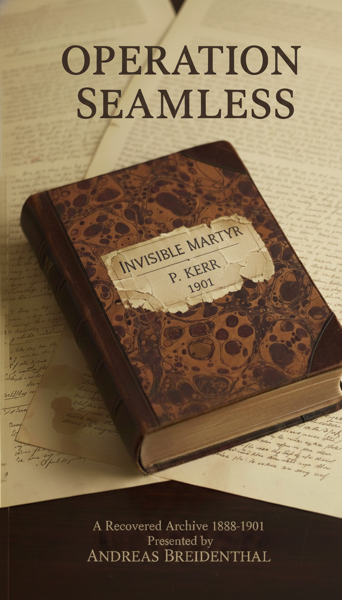

# Operation Seamless

**A Recovered Archive, 1888–1901**

Presented by Andreas Breidenthal

## About This Work

*Operation Seamless* is a work of fiction presented as a recovered
Victorian archive. It gathers letters, reports, and personal testimonies
surrounding a violent incident in Bishopsgate in 1888 — and the covert
effort to erase it from history. Blending historical detail with
invented voices, the book explores how silence, secrecy, and missing
records shape what we believe to be true. Every document is imagined,
yet grounded in real streets, institutions, and archival practices. What
begins as a fragmentary record becomes a story of erasure, obsession,
and the fragile seams of history.

## Foreword

**Presented by Andreas Breidenthal**

Between 2021 and 2025, three separate caches of late Victorian documents
were recovered during renovation works at properties in Aldgate, West
Ham, and Chigwell. Each was concealed deliberately. Each was discovered
by chance.

The materials include first-person testimonies, internal memoranda,
press clippings, private correspondence, and institutional analyses.
They reference individuals absent from surviving registries, and events
not recorded in official archives. Yet the physical characteristics —
ink, paper, handwriting, and concealment methods — are consistent with
the period they claim to represent.

The collection has been transcribed and presented here in the order the
materials were discovered. This sequence is deliberate. It reflects the
unfolding of a narrative — not through storytelling, but through
archival recovery.

I make no claims about the authenticity of the events described. The
documents speak for themselves. Their internal consistency, their
interlocking detail, and their quiet precision invite close reading.

I invite you to approach this collection as you would any historical
archive:  
With care. With curiosity. And with an awareness that the record is
never complete.

## Archivist’s Note

**Reference Code:** BGI/ALD/2021/037  
**Title:** *The Aldgate Manuscript*  
**Date(s):** c. April–May 1889 (creation); 9 April 2021 (accession)  
**Level of Description:** Item  
**Extent and Medium:** 4 leaves; handwritten in iron gall ink on laid
paper

### Acquisition Details

- **Date of Acquisition:** 9 April 2021

- **Source:** Recovered during renovation works at 47 Aldgate High
  Street, London EC3

- **Method:** Discovered behind a false panel in a disused coal cellar

- **Accession Number:** BGI/ALD/2021/037

### Provenance

Recovered from a concealed compartment at 47 Aldgate High Street, a late
Victorian commercial property formerly associated with the wine and
spirit trade. Located with a wooden crate marked “C. Hill & Co.” and a
folded receipt dated 1887 bearing the name “T. A. Davies.” No prior
record of archival deposit or private collection was associated with the
property.

### Physical Description

- **Format:** Four unlined quarto leaves

- **Dimensions:** Approx. 25 × 20 cm

- **Materials:** Laid paper; iron gall ink

- **Condition:** Moderate foxing; edge wear; minor brittleness; ink
  stable but oxidised; final page signed “Thomas Alexander Davies” and
  bearing the discovery address

### Scope and Content

First-person narrative attributed to Thomas Alexander Davies, written
approximately six months after events dated 25 November 1888 in
Bishopsgate. Describes a violent incident involving individuals named PC
James Thomas Reeve, Sergeant Arthur Melrose, and Clara Fenwick, and
mentions retired Chief Inspector Percival Kerr. The manuscript refers to
contemporary press coverage. Physical and geographical references are
consistent with the period; the historical claims are unverified.

### Biographical / Historical Note

Thomas Alexander Davies appears in late Victorian electoral registers
and parish rate books as tenant of 47 Aldgate High Street from 1888. A
notice in the *London Gazette* (21 July 1908) records commercial
activity under the style “Christopher Hill, Wine and Spirit Merchant.”
These records confirm residence and trading identity associated with the
address.

### Conservation and Handling

- Air-dried and stabilised under controlled conditions following
  recovery

- Housed in an acid-free folder within a humidity-controlled unit

- Full transcript prepared; high-resolution digital imaging in progress

- Handle with nitrile gloves; support cradle recommended during
  consultation

### Access and Use

- **Access:** Open for research under supervised conditions

- **Restrictions:** No forensic testing undertaken; further analysis may
  be required to confirm origin and authorship

- **Reproduction:** Subject to Bishopsgate Institute permissions and
  copyright policy

## The Aldgate Manuscript (transcript)

I have kept this to myself for six months, believing it best not spoken.
But I find I can no longer bear the silence.

I was present on the night PC Reeve and Sergeant Melrose lost their
lives. The accounts given in the papers do not reflect what occurred.

The London Gazette called it “a shocking discovery.” The Evening
Standard said, “Jack the Ripper was unmasked — a police constable all
along.”

I heard of it from customers the following morning.

“Reeve found dead. Stabbed. Lost his mind.”

“Melrose tried to stop him.”

“He carved his initials into her — J.T.R. — same as his name.”

“He signed it. Jack the Ripper.”

I did not speak of it, neither to the police nor to others. My reasons
for silence are explained below.

I witnessed the events directly. The man responsible was Percival Kerr,
formerly Chief Inspector.

I am certain of what I saw. The circumstances of my presence are set out
below.

At the time, certain details appeared unusual. It later became clear
that the scene had been arranged to implicate PC Reeve.

I was engaged in unlawful activity at the time and would not have been
considered a credible witness by the authorities.

My presence at the location was deliberate, owing to criminal intent.

On the evening of Sunday, 25 November 1888, after the public houses had
closed and the streets were quiet, I went out intending to steal. The
fog was thick over Bishopsgate. My destination was the Magpie, a public
house on New Street, just off the main road.

The street was formerly called Hand Alley. Though renamed, the old name
remained in common use.

I came in from Bishopsgate, climbed the wall, and positioned myself on
the ledge above the front of the building, level with the first storey.
I had brought an iron tool to break in through a window.

Before I began, I heard footsteps at the far end of the alley. I
remained still. The person did not pass beneath me but halted near the
corner.

The alley bends sharply at that point, with the Magpie situated on the
corner. I moved along the ledge to get a better view.

From the ledge, I saw PC Reeve standing beside the body of Clara
Fenwick. He was holding a lantern. I knew him by sight, having seen him
on patrol before. The woman was unfamiliar to me at the time.

He placed the lantern on the ground and knelt beside the woman. At some
point, he took up the locket.

He appeared to be examining the woman’s injuries and comparing them to
the engravings on the locket. I could not see clearly from my position,
but reports the next day described the wounds in detail.

The exact sequence is unclear. At one point, Reeve reached for her arm
and drew back holding a severed hand.

This is how he came to be in possession of the hand.

The scene appeared staged. The location, formerly known as Hand Alley,
may have been chosen intentionally.

Sergeant Melrose arrived at the scene unexpectedly. I did not observe
his approach, and Reeve appeared startled.

I did not see Melrose take the lantern, but only one was recovered,
broken, the next morning. He was holding it when he stepped back after
seeing the severed hand.

He fell, and the lantern struck the cobbles and broke. The flame went
out, and the alley was left in darkness.

I recall clearly that a voice was heard shortly after the lantern broke.
It was unfamiliar and came without warning.

At the time, I did not know who had spoken, but it was soon evident that
the man was Percival Kerr, formerly Chief Inspector.

He lit a candle, and I recognised him by his appearance, which matched
the likeness published in the papers upon his retirement.

It appeared he had been present throughout. He stood calmly and did not
intervene.

Reeve spoke his name aloud, confirming his identity. Melrose also
addressed him directly after regaining composure.

Reeve and Kerr spoke briefly, and their voices were raised.

The words later reported by the young witness, found by police in Rose
Alley the next morning, were likely spoken during this exchange.

This detail was noted in the incident report and repeated in most of the
papers.

The scene became disorderly. Kerr may have drawn a blade. The candle was
extinguished during the struggle, and I could see little thereafter.

I cannot state the exact sequence of events that followed. However, I
did observe Kerr standing over the bodies of Reeve and Melrose.

After Kerr left, I also departed. I did not attempt to determine whether
either man was still alive.

I returned to the shop, secured the door, and went to my room. I
remained awake, thinking of what I had seen.

In the morning, I heard movement downstairs. News of the incident had
begun to circulate.

Customers and passers-by spoke of it — fragments of conversation
overheard throughout the day.

I knew the published accounts were inaccurate, but I was a thief,
present unlawfully at the scene.

Had I approached the authorities, suspicion would likely have fallen on
me. I possessed no evidence and therefore remained silent.

I have not forgotten what occurred: Reeve accused in error, Melrose
killed while intervening, and Kerr leaving the scene unchallenged.

I did not speak at the time and do not expect to be believed now. But
silence has become more difficult to bear than the risk of disbelief. I
am unable to present this account in person, and so I leave it to be
found after I am gone, in the hope that it may correct the record.

Thomas Alexander Davies

47 Aldgate High Street, London

## Beyond the Fog:

**A Critical Analysis of The Aldgate Manuscript and Its Claims of 1888**

### Author Information

Dr Charlotte Sablier  
*Senior Research Fellow in Forensic Manuscript Studies  
*Institute of Historical Research, University of London

### Abstract

This article presents a critical examination of *The Aldgate Manuscript*
(BGI/ALD/2021/037), a handwritten document recovered in 2021 from a
concealed location at 47 Aldgate High Street, London. Purporting to be a
first-person account from 1888, the manuscript describes a violent
incident involving several named individuals, allegedly connected to the
Jack the Ripper case. Through palaeographic and contextual analysis, the
study evaluates the credibility of the author, Thomas Alexander Davies,
who admits to criminal activity at the time of the events. While the
manuscript’s physical characteristics, the author’s identity, and the
location described are verifiable, no corroborating historical records
exist for the named persons or the incident itself. The absence of
supporting evidence, combined with the manuscript’s retrospective
nature, invites caution. Though its authenticity remains uncertain, the
document is retained for its archival value and potential relevance to
broader studies of Victorian urban narratives and unofficial testimony.

### Keywords

- Victorian archives

- Jack the Ripper

- forensic palaeography

- unofficial testimony

### Introduction

In April 2021, a handwritten manuscript was recovered from a concealed
compartment within a disused coal cellar at 47 Aldgate High Street,
London. Now catalogued as BGI/ALD/2021/037 and referred to as *The
Aldgate Manuscript*, the document purports to be a first-person account
written in 1888 by Thomas Alexander Davies, a resident of the property
at the time. The manuscript describes a violent incident involving three
named police officers and a woman, allegedly connected to the Jack the
Ripper case. Its discovery raises questions about the reliability of
historical narratives, the role of unofficial testimony, and the
challenges of authenticating undocumented claims.

This study applies forensic palaeographic and contextual methods to
assess the manuscript’s credibility and historical value. Particular
attention is given to the verifiability of the individuals and events
described, the physical characteristics of the document, and its
alignment — or lack thereof — with known archival records. The analysis
proceeds through a structured examination of provenance, content, and
corroborative evidence, concluding with a cautious assessment of the
manuscript’s authenticity and its potential contribution to Victorian
archival studies.

### Provenance and Physical Description

*The Aldgate Manuscript* (BGI/ALD/2021/037) was recovered in April 2021
during renovation works at 47 Aldgate High Street, London EC3 — a late
Victorian commercial property formerly associated with the wine and
spirit trade. The document was discovered concealed behind a false panel
in a disused coal cellar, accompanied by a wooden crate marked “C. Hill
& Co.” and a folded receipt dated 1887 bearing the name “T. A. Davies.”
These contextual artefacts support the manuscript’s claimed origin and
authorship.

The manuscript comprises four leaves of unlined quarto paper,
handwritten in iron gall ink. The paper exhibits foxing, edge wear, and
minor brittleness consistent with late 19th-century materials. The
handwriting is cursive and stylistically appropriate for the period. The
final page is signed “Thomas Alexander Davies” and includes the address
of the property where it was found.

Notably, the manuscript’s concealment aligns with the author’s stated
intention to have the account discovered only after his death. This
deliberate act lends internal consistency to the narrative and supports
the authenticity of the document as a historical artefact. However, the
veracity of the events described within remains subject to scrutiny and
is addressed in subsequent sections.

Following recovery, the document was air-dried and stabilised under
controlled conditions. It is currently housed in an acid-free folder
within a humidity-controlled unit. A full transcript has been prepared,
and high-resolution digital imaging is in progress.

### Contextual and Historical Background

The manuscript is dated to approximately April or May 1889, placing it
several months after the final known Whitechapel murder attributed to
Jack the Ripper. While the immediate panic of late 1888 had begun to
ease, public fascination with the case persisted, sustained by ongoing
press speculation and sensational reporting. The events described in
*The Aldgate Manuscript* are said to have occurred on 25 November 1888
in Bishopsgate, within the jurisdiction of the City of London Police, a
force distinct from the Metropolitan Police and responsible for policing
the historic square mile of London City.

The manuscript references contemporary newspapers, including The London
Gazette and The Evening Standard, which allegedly mischaracterised the
incident and implicated PC Reeve as the perpetrator. However, no
archival records confirm the existence of Reeve, Melrose, Kerr, or Clara
Fenwick, nor do police or press reports from the period corroborate the
described events.

Despite this, the manuscript’s description of the physical setting is
notably precise and verifiable. The Magpie public house, still in
operation today at 12 New Street, is accurately located just off
Bishopsgate. The manuscript describes a sharp bend in the alley and a
ledge above the pub’s entrance — both features consistent with the
building’s actual structure. It also references Rose Alley, a documented
passage in late 19th-century maps that connected Bishopsgate to New
Street. The mention of a young witness found in Rose Alley the following
morning aligns with the alley’s historical location and function.

These accurate geographic details lend weight to the author’s
familiarity with the area and suggest a degree of authenticity in the
setting, even if the events themselves remain unverified.

The author, Thomas Alexander Davies, positions himself as a reluctant
witness, motivated by guilt and a desire to correct the historical
record. His account reflects broader themes of mistrust in official
narratives and the marginalisation of unofficial voices. While the
manuscript aligns with the urban geography and social conditions of
late-Victorian London, its historical claims remain unsupported by
external documentation.

### Document Content and Internal Analysis

The manuscript presents a first-person account by Thomas Alexander
Davies, describing events allegedly witnessed on the night of 25
November 1888. The narrative is structured as a retrospective
confession, written approximately six months after the incident, and
intended to be discovered posthumously. Davies claims to have observed
the deaths of PC Reeve and Sergeant Melrose, and to have witnessed Chief
Inspector Percival Kerr at the scene, implicating him as the true
perpetrator.

The account is detailed and internally consistent, with a clear sequence
of events: Davies’s intention to unlawfully enter the Magpie public
house, his position on a ledge above the entrance, the arrival of Reeve,
then Melrose, and the subsequent appearance of Chief Inspector Kerr. The
manuscript references specific locations — New Street (formerly Hand
Alley) and Rose Alley — all of which are historically verifiable and
described with notable precision. The physical layout of the alley, the
bend near the Magpie, and the ledge above the door are all consistent
with the actual geography of the area.

Stylistically, the manuscript is restrained and avoids sensationalism.
The tone is reflective and confessional, with Davies acknowledging his
criminal intent and lack of credibility as a witness. He expresses
uncertainty about the exact sequence of events, particularly during the
final moments of the struggle, and refrains from making definitive
claims about the fates of Reeve and Melrose. The inclusion of press
quotations and references to public reaction adds contextual texture,
though these sources are not independently verifiable.

The manuscript’s internal logic — including the concealment of the
document and the stated intention to have it discovered after the
author’s death — aligns with its physical recovery. However, the
narrative contains several unverifiable elements, including the
identities and actions of the named individuals, and the alleged
incident itself. These limitations are addressed in subsequent sections.

### Corroboration and Comparative Evidence

Efforts to corroborate the events described in *The Aldgate Manuscript*
have yielded limited results. No archival records confirm the existence
of PC Reeve, Sergeant Melrose, Chief Inspector Percival Kerr, or Clara
Fenwick, nor is there any documented incident matching the account
provided by Thomas Alexander Davies. Searches of police rosters, press
archives, and institutional records from late 1888 and early 1889 reveal
no references to the individuals or the alleged confrontation in
Bishopsgate.

The manuscript’s references to newspaper coverage — including The London
Gazette and The Evening Standard — are not supported by surviving
editions from the period. No articles have been found that describe a
violent incident implicating a police constable or involving initials
carved into a victim, as claimed in the text. The absence of such
coverage is notable given the sensational nature of the alleged events
and the press’s documented appetite for Ripper-related stories during
this time.

However, the manuscript’s geographic details are strongly corroborated.
The Magpie public house remains in operation at 12 New Street, and its
architectural features — including the ledge above the entrance and the
sharp bend in the alley — match the description provided. Historical
maps confirm the existence of Rose Alley, which connected Bishopsgate to
New Street and was in use during the late 19th century. These accurate
spatial references suggest that the author was intimately familiar with
the area, lending credibility to the setting if not to the events
themselves.

No other known examples of Thomas Alexander Davies’s handwriting have
been located, preventing direct authorship verification. However,
palaeographic comparison with other documents from the same period
indicates that the handwriting style, ink, and paper are consistent with
materials produced in the late 1880s. While this supports the
manuscript’s claimed date of composition, it does not confirm the truth
of its contents.

No comparative documents have been identified that support the
manuscript’s claims. The absence of corroborating testimony,
institutional records, or forensic evidence limits the ability to
authenticate the narrative. Nonetheless, the manuscript’s internal
consistency, geographic accuracy, and material plausibility warrant its
retention for further study.

### Interpretation and Implications

If taken at face value, *The Aldgate Manuscript* presents a striking
reinterpretation of a Ripper-era incident, shifting culpability from a
serving constable to a retired senior officer and suggesting a
deliberate attempt to mislead both the public and the authorities. The
account implies a staged crime scene, a manipulated narrative, and a
failure of institutional accountability — themes that resonate with
broader concerns about Victorian policing and the reliability of
official records.

However, the absence of corroborating evidence for the named individuals
and the incident itself significantly limits the manuscript’s historical
reliability. The author’s admission of criminal intent and his stated
intent for his witness testimony to remain unknown until after his death
further complicate the credibility of the account. While the
manuscript’s physical characteristics and geographic accuracy support
its plausibility as a period document, they do not confirm the truth of
its claims.

The implications of the manuscript lie less in its factual content than
in its potential to illuminate the margins of historical record-keeping.
It raises questions about how unofficial testimony is preserved, how
silence and concealment shape historical memory, and how archival
discoveries can challenge or complicate accepted narratives. The
document may also contribute to studies of urban folklore, post-Ripper
public discourse, and the psychology of witness testimony.

Given the lack of external verification, the manuscript cannot be
authenticated as a reliable historical source. Nonetheless, its internal
coherence, material plausibility, and evocative narrative justify its
retention for further archival study and comparative research.

### Conclusion

*The Aldgate Manuscript* presents a compelling and internally coherent
account of a purported incident in late 1888, written by a named
individual whose residence and geographic references are verifiable. The
manuscript’s physical characteristics, palaeographic features, and
contextual details support its plausibility as a late Victorian
document. However, its historical claims — including the identities of
the individuals involved and the events described — remain
uncorroborated by any known archival, press, or institutional records.

The author’s decision to conceal the manuscript, and his stated intent
for his witness testimony to remain unknown until after his death, adds
a layer of complexity to its interpretation. While the narrative is
restrained and reflective, its lack of external validation limits its
reliability as a historical source.

In the light of these findings, the manuscript cannot be authenticated
as a factual account of the events it describes. Nonetheless, its
material integrity, geographic precision, and thematic relevance justify
its retention within the archive. Further research may yet clarify
aspects of its origin or context, but for now, it remains a document of
interest rather than of confirmed historical significance.

### Endnotes

1.  *The Aldgate Manuscript*, BGI/ALD/2021/037, Bishopsgate Institute
    Archives.

2.  The Magpie public house, 12 New Street, Bishopsgate, London EC2, is
    listed in trade directories from the early 19th century and remains
    in operation.

3.  Historical maps from the late 19th century confirm the existence of
    Rose Alley, connecting Bishopsgate to New Street.

4.  No records of PC Reeve, Sergeant Melrose, Chief Inspector Percival
    Kerr, or Clara Fenwick have been located in police rosters or press
    archives from 1888–1889.

5.  Palaeographic comparison conducted with samples from the British
    Library’s Victorian manuscript collection.

6.  For discussion of unofficial testimony in Victorian archives, see:
    Carolyn Steedman, Dust: The Archive and Cultural History (Manchester
    University Press, 2001).

7.  For an overview of City of London Police jurisdiction, see: Clive
    Emsley, The English Police: A Political and Social History (Longman,
    1996).

### Bibliography

- Bishopsgate Institute Archives. *The Aldgate Manuscript*, Accession
  No. BGI/ALD/2021/037.

- British Library. Victorian Manuscript Collection, Palaeographic
  Reference Samples.

- Emsley, Clive. The English Police: A Political and Social History.
  London: Longman, 1996.

- Steedman, Carolyn. Dust: The Archive and Cultural History. Manchester:
  Manchester University Press, 2001

- Ordnance Survey Maps, London Sheet 7 (1887). National Library of
  Scotland Map Collection.

- London Post Office Directory (1888). Historical Directories
  Collection, University of Leicester.

- The London Gazette, November–December 1888 editions.

- The Evening Standard, November–December 1888 editions.

## Archivist’s Note

**Reference Code:** BGI/SWF/2023/041  
**Title:** *Swift’s Account and Document Cache*  
**Date(s):** c. 1888–1901 (creation); 18 August 2023 (accession)  
**Level of Description:** Collection  
**Extent and Medium:** 10 items; mixed media (manuscript,
correspondence, official forms, newsprint)

### Acquisition Details

- **Date of Acquisition:** 18 August 2023

- **Source:** Recovered during renovation works at 60 Tower Hamlets
  Road, West Ham E13

- **Method:** Discovered within a purpose-built cavity beneath the
  understair cupboard; bundle wrapped in waxed cloth and bound with
  twine

- **Accession Number:** BGI/SWF/2023/041

### Provenance

Recovered from a late Victorian residential property at 60 Tower Hamlets
Road, West Ham. Materials were concealed within a constructed void
beneath the stairwell. No prior record of archival deposit or private
collection was associated with the property.

### Physical Description

**Contents:**

- *Swift’s Account* — 42-page first-person manuscript attributed
  internally to Henry Swift

- Nine supplementary documents:

- Draft outline of “Operation Seamless”

- Unsent draft letter addressed to James Harvey

- Incident report (City of London Police)

- Internal memorandum (Bishopsgate Division)

- Newspaper clipping (*The Illustrated Police News*)

- Erasure targets list

- Personal notebook extract

- Retrieval progress log (fragment)

- Carte blanche letter (Home Office)

**Materials:** Medium-weight laid paper; onion-skin paper; newsprint;
inks include iron gall and carbon pencil

**Condition:** Foxing, edge wear, creasing; some items show water damage
and brittle edges; multiple hands evident

### Scope and Content

Collection comprising a first-person narrative attributed to Henry Swift
and nine associated documents dated between November 1888 and late 1901.
The materials refer to recordkeeping practices, institutional access,
and an operation termed “Operation Seamless.” The narrative recounts the
author’s early life, presence near an incident in Bishopsgate on 25
November 1888, and subsequent attempts to locate records and
individuals. Physical characteristics and institutional references are
consistent with the period; the historical claims are unverified.

### Biographical / Historical Note

No verified record for Henry Swift has been located in surviving census
or civil registers. The manuscript describes the author as a foundling
who later worked as a junior clerk at the General Register Office. The
collection references James Harvey, a City of London Police constable
recorded as dismissed in July 1889, and Dr Thomas Bond, whose death in
1901 is documented.

### Conservation and Handling

- Stabilised and air-dried under controlled conditions following
  recovery

- Housed in acid-free folders within a humidity-controlled unit

- Full transcript prepared; high-resolution digital imaging in progress

- Handle with nitrile gloves; support cradle recommended for the
  manuscript

### Access and Use

- **Access:** Open for research under supervised conditions

- **Restrictions:** No forensic testing undertaken; further analysis may
  be required to confirm origin and authorship

- **Reproduction:** Subject to Bishopsgate Institute permissions and
  copyright policy

## Swift’s Account (transcript)

### 1. My Early Years

I do not know the name I was given at birth, nor the face of the woman
who bore me. They told me I arrived at the parish workhouse in London
sometime in the winter of 1881, swaddled in a blanket too fine for the
place and too clean for the story they told. No one claimed me. No one
came back. I was entered into the ledger as “Boy, Approx. Age: 0,” and
that was the last time anyone tried to define me.

The workhouse was not cruel in the way stories often say. It was worse —
it was indifferent. The walls were damp, the food was grey, and the days
were measured not in hours but in chores. I scrubbed floors before I
could read, carried coal before I could write, and learned silence
before I learned speech. Names were not used unless necessary. I was
called “boy,” “you,” or “that one.” I answered to all of them.

I remember the smell of boiled cabbage more vividly than any lullaby. I
remember the cracked tiles in the corridor, the way the light never
quite reached the corners, and the sound of coughing in the dormitory at
night. I remember Clara — older than me, sharper than me, and always
watching. She never spoke to me, but once she gave me half a crust of
bread when I was too weak to stand. I never forgot her face.

I do not know what made me run. Perhaps it was the cold. Perhaps it was
the silence. Perhaps it was the way the matron looked at me one morning
— not with cruelty, but with weariness, as if I were already fading. I
was seven years old. I had no plan. I simply walked out during the
midday bustle, slipped through the gate behind a delivery cart, and kept
walking until the buildings changed, and the air smelled different.

I found myself in Whitechapel.

It was louder there. Dirtier. But it was alive. The streets were narrow
and crooked, the people fast and forgetful. I learned quickly: how to
sleep in alleys, how to steal bread without being seen, how to vanish
when the constable turned the corner. I became a shadow. A watcher. I
spoke to no one. I trusted no one. I survived.

And then came the night of 25 November 1888.

### 2. The Night of Terror

I remember that night more clearly than any other. The air was sharp,
the kind that bites through threadbare sleeves and settles in your
bones. I had found shelter in Rose Alley — a narrow, crooked passage
behind a row of shuttered shops. It wasn’t much, but it was dry, and the
alcove near the wall was just deep enough to curl into.

I didn’t sleep.

Something in the air felt wrong. The silence wasn’t peaceful — it was
waiting.

Then I heard voices.

They were harsh, broken — the sounds of a struggle: boots scraping,
metal clattering, someone gasping for breath.

Then one voice rose above the other. It was wild, almost frantic.

“I… I, Jay Thompson Rivers…” The words came in a rush, as if the man
were trying to prove something — something about being a policeman.

Then, shouted — clear and terrible: “I am Jack the Ripper!”

I didn’t move. I couldn’t. I was frozen in that alcove, knees to chest,
breath held tight. I saw nothing. But I heard everything.

The silence that followed was worse than the noise. It was thick. Final.

I stayed there until morning. Curled in the same position, eyes wide,
heart hammering. When the sun rose, it didn’t feel like morning. It felt
like aftermath.

The police found me just after dawn. I was still in the alcove,
shivering, silent. They asked questions. I answered. I told them what
I’d heard. I said the name. I repeated the words: “A man shouting in the
night… claiming to be Jay Thompson Rivers… and saying, ‘I am Jack the
Ripper.’”

They didn’t believe me.

They said I was confused. That I’d imagined it. That I was just a child,
cold and frightened, making sense of shadows.

They took me back to the parish workhouse.

They didn’t keep me long after that.

A few days passed — maybe a week. I was quieter than usual, which was
saying something. I didn’t speak unless spoken to. I didn’t ask
questions. I didn’t mention Rose Alley.

Then one morning, without warning, I was told to pack my things. A man
arrived — not a constable, not a clerk, but someone from a charitable
mission. He had a kind face, but he didn’t look at me much. Just signed
a paper, nodded to the matron, and led me out.

I was taken to a boarding school run by one of the city’s missions. It
wasn’t grand, but it was clean. The windows let in light. The food was
plain but warm. The boys wore uniforms, and the teachers spoke softly,
even when they were angry.

They gave me a name. Not a real one — just something to put on the roll.

Henry Swift.

I didn’t correct them.

I learned to read. I learned to write. I learned how to sit still and
how to answer questions without giving too much away. I never spoke
about the alley. I never spoke about the voice.

But I remembered. Every word.

### 3. Somerset House

I left the school at sixteen. There was no ceremony, no farewell. Just a
letter of reference, a handshake from the headmaster, and a reminder to
be grateful.

I found work soon after — a junior clerk at the General Register Office
in Somerset House, where the ledgers of births, deaths, and marriages
lay stacked in endless ranks. It wasn’t glamorous. I filed certificates.
I fetched volumes. I was invisible, which suited me fine.

The building was full of paper. Births. Deaths. Census rolls. Parish
registers. Stacked in boxes, bound in cracked leather, tucked into
drawers no one had opened in years. Occasionally, I was sent across the
city — to the Public Record Office in Chancery Lane or the British
Museum Reading Room — on errands that broke the monotony and showed me
other kinds of records.

I learned the system quickly. Learned who watched and who didn’t.
Learned when the reading room was empty. Learned how to search without
being seen.

And in the quiet hours, I began to look.

At first, just names. Just patterns. Just the shape of the past.

But soon I was narrowing my search for one name: Jay Thompson Rivers.

I expected it to be there — somewhere. A birth entry. A census line. A
trace in the margins.

I found nothing.

Not in the birth registers. Not in the death indexes. Not in the census
returns. Not even a whisper in the parish rolls.

It was as if he had never existed.

One day, in the course of my work, I was sent to inspect a shipment of
printed registration forms at a warehouse in West Ham.

It was a routine assignment — a batch of newly printed materials
destined for regional offices, stored offsite by one of the firms
contracted by Somerset House. I took the train east, walked the last
stretch past rows of soot-stained terraces, and found the building
tucked behind a timber yard. Brick walls, iron shutters, the smell of
dust and oil.

Inside, it was quiet. A few men moved crates, stacked ledgers, swept the
floor. I gave my name, showed the paperwork, and waited while the
foreman retrieved the sample bundle.

That’s when I saw him. He was older than I remembered — broader in the
shoulders, slower in his movements. But the face was the same. The eyes
were the same. I knew him instantly. He didn’t notice me at first. Just
signed the docket, handed over the forms, and turned to go.

Then I said it. Casually. Quietly. Like it didn’t matter.

“Jay Thompson Rivers.”

He stopped. Not all at once — just a pause in the step, a shift in the
shoulders. Then he turned, slowly, and looked at me. There was no
recognition in his face. Not yet. Just caution. Just calculation.

I didn’t say anything else. I didn’t need to.

He stared at me for a long moment. Then nodded once, almost
imperceptibly, and walked away.

Sleep eluded me that night.

The man I’d seen — the one who paused when I said the name — was the
police constable who had found me on that dreadful morning. I was sure
of it. Older, yes. Changed. But the same man.

I needed to find him again.

The warehouse wasn’t listed in any of the paperwork I’d brought back. No
address, no contact name. Just a stamp and a signature. I asked around
at the office, casually, but no one remembered who had sent me. It was
just an errand. Just a bundle of forms to inspect. Nothing unusual.

So I made a decision. I moved.

I found a room in West Ham, not far from Tower Hamlets Road. It was
small — a second floor let above a grocer’s, with a cracked window and a
coal stove that smoked when it shouldn’t. But it was close. Close to the
warehouse. Close to the man.

Each evening, I walked the streets. Past the timber yard, past the rail
sidings, past the warehouse with its soot-stained bricks and iron
shutters. I did not linger. I did not loiter. I simply passed, as one
might pass a familiar tree or a crooked lamppost. I became part of the
scenery.

It began with quiet recognition — the kind that passes between men
who’ve seen too much and speak too little. At first, we simply noticed
each other. A glance exchanged across the street. A nod outside the
store. Nothing more.

But over the weeks, those nods became greetings. Brief, polite,
unremarkable. Then came the conversations — short at first, about the
weather, the trains, the state of the streets. I learned his name was
James Harvey. He learned mine. We learned where the other lived. I
mentioned Tower Hamlets Road. He said he was on the same stretch.

There was no urgency in how we came to know each other. It grew like ivy
— slow, deliberate, unnoticed until it had taken hold.

Then, one evening, as we crossed paths near the grocer’s, Harvey paused.

“We’re having stew tomorrow,” he said. “Come by.”

No ceremony.

No explanation.

Just an invitation.

### 4. Our First Conversation

I arrived just after six. The house was modest, the windows warm with
lamplight. I knocked once.

The door opened to reveal a woman in her thirties — apron tied, hair
pinned, eyes kind but cautious. Behind her, the sound of children echoed
faintly.

“You must be Mr. Swift,” she said. “James said you’d be joining us.”

She stepped aside, and I entered.

The hallway smelled of coal smoke and rosemary. The walls bore the wear
of years well lived.

Harvey appeared from the kitchen, sleeves rolled, face flushed from the
stove.

“Come in,” he said. “We’re just about to sit down.”

The meal was simple — stew, bread, tea. The conversation was lighter
than I expected. They asked where I worked. I said Somerset House. They
asked if I liked it. I said I did — though I found the silence more
agreeable than the filing.

Harvey’s eldest son asked if I’d always lived in West Ham. I said no,
I’d only just moved. He asked why. I said it was quieter than where I
had been living. He nodded, satisfied.

The youngest spilled tea. Harvey’s eldest daughter asked if I’d ever
seen Queen Victoria. I said I hadn’t, but I’d once seen a man who
claimed to have met her gardener. That earned a laugh.

Harvey said little during the meal. He watched. He listened. And when
the plates were cleared and the children sent to bed, he gestured toward
the sitting room.

“Come through,” he said.

The room was dim, the lamp low. A coal fire crackled in the grate. The
wallpaper was patterned with faded ivy, and the armchairs bore the wear
of years well lived.

Harvey sat with a sigh, hands resting on his knees. I took the chair
opposite, notebook still tucked beneath my coat.

He didn’t speak at first. He stared into the fire, as if waiting for it
to say something.

So I did.

“The first day I met you,” I said, “wasn’t in West Ham.”

Harvey turned his head slightly.

“It was in Whitechapel,” I continued. “Almost thirteen years ago. I was
seven. Homeless. Hiding in Rose Alley.”

His eyes didn’t widen. They narrowed — not in suspicion, but in memory.

“I heard a voice,” I said. “A man shouting. Claiming to be Jay Thompson
Rivers. And then — ‘I am Jack the Ripper.’”

Harvey didn’t move.

“I saw you the next morning. I saw your face. I remembered.”

He nodded, slowly.

“I remembered you too,” he said. “But I couldn’t speak. Not then. Not
after everything.”

I leaned forward. “I said the name to you. Quietly. Casually. You
paused.”

“I’ve been thinking about that ever since,” he said.

Harvey leaned back in his chair, the fire casting long shadows across
his face. He looked older in that light — not in years, but in weight.
The kind of weight that settles behind the eyes and never quite lifts.

“I didn’t know your name,” he said. “Not then. Just a child. Curled in
the alley. Eyes wide. I thought you were dead at first.”

I said nothing. The silence was enough.

“I found the bodies,” he continued. “Clara Fenwick. PC Reeve. Sergeant
Melrose. All of them in that narrow street. Blood on the cobbles. Blades
scattered like fallen leaves.”

He paused, as if the memory had teeth.

“Reeve was clutching a locket. Silver. Engraved with the letters
‘J.T.R.’ I didn’t understand it then. Not fully. But I knew something
was wrong. Something deeper than murder.”

I leaned forward. “You wrote the report.”

He nodded. “I did. I wrote what I saw. What I heard. What you said. I
handed it in. And then everything changed.”

“They told me I’d acted rashly,” Harvey said. “That I’d jumped to
conclusions. That I’d been misled by a frightened child.”

He looked at me. “They meant you.”

He reached into a drawer beside him and pulled out a sheet of paper —
thin, fragile. A dismissal notice. Dated July 1889.

“They said I was unstable. That I’d lost judgment. That I wasn’t fit for
duty.”

He handed it to me.

“And then,” Harvey said quietly, “Kerr stepped in.”

I looked up. “Who’s Kerr?”

“Percival Kerr,” Harvey replied. “Retired Chief Inspector. Old guard.
The kind of man everyone respected. When this happened — when Reeve died
— Kerr came back. Said he was helping the Home Office… helping the force
survive the scandal. I thought he was doing me a kindness.”

He opened the drawer again and took out a second document, folded more
carefully than the first. It bore no seal, no heading. Just handwriting
— bold, deliberate, unmistakable.

It was a personal letter. From Kerr.

It spoke of relocation. Of discretion. Of silence.

It offered a warehouse post in West Ham. Modest work. Quiet work. Far
from Whitechapel.

And it ended with a warning: “Let sleeping dogs lie. Speak of this no
more, and you may yet find peace.”

I read it twice. Then I placed it beside the dismissal notice.

“You kept this,” I said.

Harvey nodded. “I couldn’t forget. So I didn’t.”

The fire had dwindled to embers, and the room had grown quiet in that
way only late evening allows — not silent, but hushed, as if the walls
themselves were listening. I stood, coat buttoned, notebook open in my
hand.

“I’ve been searching,” I said. “For years. But I was chasing a ghost.”

Harvey looked up, one brow raised.

“I heard a name that night,” I continued. “In Rose Alley. A man
shouting. I thought he said ‘Jay Thompson Rivers.’ I was seven. Cold.
Frightened. I misheard.”

Harvey nodded, slowly.

“He said his name,” he said. “James Thomas Reeve.”

I felt the weight of it settle in my chest — not shame, but clarity. The
kind that stings before it heals.

“I searched every ledger, every roll, every register. Nothing. Because I
was looking for someone who never existed.”

Harvey leaned forward, elbows on his knees.

“Reeve existed,” he said. “So did Melrose. So did Clara. I saw them. I
wrote the report. And then I was told I’d been too hasty. That I’d
caused a scandal.”

I opened my notebook, the pages worn thin from years of false leads.

“Give me their full names,” I said. “I’ll search again. Properly this
time.”

Harvey spoke slowly, as if each name carried its own burden.

“PC James Thomas Reeve. Sergeant Arthur Melrose. Clara Fenwick.”

I wrote them down carefully, the ink catching in the paper’s grain.

“I’ll start tomorrow,” I said. “The General Register Office at Somerset
House holds registers going back decades. If they haven’t been touched,
they’ll still be there.”

Harvey didn’t speak. He simply nodded. I turned to go, the fire casting
long shadows across the floor. “Thank you,” I said.

He looked up at me, eyes tired but resolute.

“I hope you find something,” he said. “I never looked. I couldn’t.”

### 5. Fruitless Searching

The morning was grey, the kind of grey that doesn’t threaten rain but
promises little else. I arrived at Somerset House just after eight, the
corridors of the General Register Office still quiet, the clerks not yet
settled into their routines.

I carried the names in my notebook — written carefully, deliberately, as
if the act of writing them might anchor them to reality.

James Thomas Reeve

Arthur Melrose

Clara Fenwick

Percival Kerr

I began at Somerset House with the birth registers: Nothing.

I checked the death indexes, the burial notices: Nothing.

When Somerset House yielded nothing, I went further afield, chasing the
trail through every archive I could reach.

To Chancery Lane, through the police rosters, the pension ledgers, the
disciplinary logs: Nothing.

Finally, to the British Museum Reading Room, where the bound volumes of
The Gazette, The Standard, The Illustrated London News lay in dust:
Nothing.

Even Kerr — a man who should have left a trail of promotions,
commendations, transfers — was absent. Not redacted. Not misfiled.
Absent.

It wasn’t just missing. It was as if someone had gone through the
ledgers with a scalpel.

As if they had never lived. As if they had never died. As if they had
never been.

That evening, I returned to Harvey’s house. He greeted me with a nod and
a cup of tea, and we sat again in the sitting room, the fire low, the
lamp dim.

“I searched everything,” I said. “Every register. Every roll. Every
archive.”

Harvey didn’t speak. He waited.

“There’s nothing,” I said. “No birth records. No employment history. No
death certificates. No press mentions. No police files.”

I paused. “Even Kerr. He’s gone too.”

Harvey looked at me, eyes narrowed. “What does that mean?”

I stared into the fire. “I think it means… it wasn’t just the report
they buried. It was the people. The names. The lives.”

Harvey leaned back, the chair creaking beneath him. “You think someone
erased them?”

I nodded. “Not just hidden. Not just redacted. Erased. As if they never
existed.”

Harvey said nothing for a long time.

Then, quietly: “I never looked. After they dismissed me, I never looked.
I didn’t think there was anything to find.”

I looked at him. “There wasn’t. Until now.”

The silence between us had grown thoughtful, not heavy. Harvey sat with
his hands clasped, staring into the fire as if it might offer something
more.

“I never looked,” he said again. “After they dismissed me, I didn’t
look. I didn’t want to know.”

I nodded. “But you remember.”

He glanced at me. “I remember everything.”

I opened my notebook again, the names written cleanly now. Real names.
Not ghosts.

“I found nothing,” I said. “No records. No mentions. Not even Kerr.”

Harvey frowned. “Kerr was high-ranking. He should be everywhere.”

“He’s nowhere,” I said. “It’s not just the event that’s gone. It’s the
people.”

Harvey was quiet for a long time. Then he spoke, slowly.

“If Kerr erased them from history… maybe he left something behind. Not
in the records. Not in the papers. But in the places. In the objects. In
the people who were never meant to remember.”

I looked up. “You think something might’ve slipped through?”

He nodded. “There was a letter. The one that got me the job. Someone
contacted the firm. Arranged it. I never saw who.”

I leaned forward. “Do you think it’s still there?”

Harvey shrugged. “If it is, it’ll be in the archives. Personnel files.
Correspondence. But not in plain sight.”

I closed the notebook. “Then we’ll look.”

Harvey raised an eyebrow. “They won’t let you in.”

“Not during the day,” I said. “But after dark…”

He didn’t smile. But he didn’t say no.

### 6. Dusty Archives

The building was quiet. The kind of quiet that only comes when the last
shift has gone home and the night watch has grown lazy.

We entered through the rear — a long-unrepaired window behind the
loading bay. Harvey knew the way. I followed. The corridors were narrow,
lined with crates and ledgers. The air smelled of dust and oil and old
ink. We moved slowly, deliberately, until we reached the archive room.
It wasn’t locked. It didn’t need to be. No one thought it worth
guarding.

Inside, the shelves stretched from floor to ceiling. Boxes labelled in
fading pencil. Files bound with twine. A desk in the corner, still
bearing the imprint of the day’s work.

Harvey moved with purpose. He knew where to look. He found the personnel
box from 1889. Pulled it down. Opened it.

Inside: a letter of inquiry for a clerical role. Dated shortly before
his hiring. Signed with a name neither of us recognised. But it bore a
return address.

Then — a second letter. A recommendation. Introducing Harvey to the
firm. Also signed by the same hand.

I pulled out the Kerr letter — the one Harvey had kept all these years.

We laid them side by side on the desk. Under the dim light, we compared
the handwriting.

The archived letter was neat. Formal. Impersonal.

The Kerr letter was bold. Authoritative. Distinct.

The difference was immediate. Unmistakable.

“Kerr didn’t write this,” I said.

Harvey nodded. “He had someone else do it. Someone who could write
without raising suspicion.”

We didn’t take anything. We didn’t need to. I copied the name. The
address.

We returned everything to its place. Tied the twine. Closed the box.

Then we left the room as we’d found it — untouched, unremarkable.

We slipped out through the same window, silent and unseen.

### 7. Finding Dr Bond

The days that followed were quiet, but not idle.

I returned to Somerset House — and later to Chancery Lane — with a new
name in mind, not one of the erased, but one who might have helped
erase. The signature on Harvey’s introduction letter was unfamiliar, but
the hand was not Kerr’s. That much was certain.

So I began to cross-reference.

I sat at my desk, surrounded by ledgers and registry books, the dust
thick enough to dull the ink. I searched correspondence logs, personnel
files, medical registries. I traced the return address from Harvey’s
file to a district known for its medical offices.

And then — a breakthrough.

A medical registry from 1888 listed Dr Thomas Bond, police surgeon.
Active during the Ripper investigations. Known to Scotland Yard.
Trusted.

I pulled a separate file — a medical report from the same year, signed
by Bond. The handwriting was careful, deliberate, unmistakable.

I sat rooted, unable to move.

Then whispered to myself: “Tom Bond… Thomas Bond. Kerr didn’t just use a
ghost name. He used a real man. A trusted one.”

That evening, I returned to Harvey’s house. He opened the door before I
could knock, as if he’d been waiting.

We sat again in the sitting room, the fire low, the lamp dim.

I placed the medical report I’d discovered on the table.

Harvey leaned in, eyes narrowing.

“That’s Bond’s hand,” he said. “I’d recognise it anywhere.”

“You knew him?”

Harvey nodded. “He was one of us. A surgeon. A man of record. If he
helped Kerr…” He trailed off.

Then, quietly: “Then this goes deeper than we thought.”

We sat in silence for a while after the comparison. The fire had burned
low, and the room had grown still.

Harvey tapped the edge of the desk with one finger. “Bond,” he said. “I
never would’ve guessed.”

“He signed the letter,” I said. “The one that introduced you to the
firm.”

Harvey nodded slowly. “Then he knows something. Or knew something.”

I closed the file and looked up. “We should speak to him.”

Harvey hesitated. “He’s not well. I heard he’s basically bedridden now.
In his house in Westminster.”

“Then we go tomorrow,” I said. “Before the trail grows cold.”

Harvey looked at me, then at the fire, then back again.

“Right,” he said. “Tomorrow.”

### 8. Visiting Dr Bond

The sun was low over Westminster, casting long shadows across the
cobbled streets. The air was warm, the kind of warmth that settles
gently rather than presses down. The city was quiet — not silent, but
hushed, as if holding its breath.

We arrived at 7 The Sanctuary, a dignified residence. The curtains were
drawn. The windows clean. Harvey adjusted his collar. I straightened my
cuffs. He knocked.

A nurse answered — middle-aged, brisk, but not unkind.

“We’re old friends of Dr Bond,” Harvey said. “We heard his health was
failing and thought we’d pay a visit.”

She studied us for a moment, then nodded.

“He’s in his room, on the third floor,” she said. “He’s awake.”

She led us up a narrow staircase, the walls lined with faded portraits
and the scent of lavender polish. At the top, she opened a door and
stepped aside.

“He won’t speak long,” she said. “But he’ll speak.”

Then she left us. The room was modest. A single bed, a writing desk, a
shelf of medical texts. The curtains were half-drawn, letting in the
last of the evening light.

Dr Thomas Bond sat upright in bed, pale but alert. His hair had thinned,
but his eyes were sharp. Harvey stepped forward, warm but composed.

“Dr Bond… it’s been a long time. James Harvey. We served together,
briefly.”

Bond studied him, then nodded faintly. Harvey gestured to me.

“This is Mr. Swift. A business acquaintance who’s become a close
friend.”

Bond offered a polite smile. We settled into chairs.

The conversation began lightly — old cases, familiar names, the London
of the 1870s and early 1880s. Bond spoke with the ease of a man who had
spent a lifetime in corridors of quiet consequence.

Then I spoke.

“Dr Bond,” I said, calm and deliberate, “do you recall a Chief Inspector
named Kerr?”

Bond’s expression shifted. Not with guilt — but with fear. His eyes
moved from Harvey to me, then back again. When he spoke, his voice was
quiet. Measured.

“I thought you might come one day.”

He adjusted the blanket over his lap.

“Kerr asked me to write two letters. One to inquire about a position at
the firm, and another to introduce you, Mr. Harvey. He said you’d made
an error in judgment… that you needed to be moved on.”

His gaze lingered on Harvey.

“I didn’t know the details. I didn’t ask. I was told it was a matter of
internal discipline — that the Home Office had approved it.”

He paused, then added more softly: “I never meant harm. Kerr was a busy
man. He asked for a simple favour.”

He glanced at Harvey, uncertain.

“He said you’d misjudged something… that you needed a fresh start. I
thought you’d do well at that firm.”

A pause.

“Have you had trouble?”

Harvey smiled gently.

“I’ve enjoyed the position, Doctor. It suits me. I’m grateful you helped
me into it.”

Bond exhaled, visibly relieved. He nodded, almost smiling.

“I’m glad to hear it. I always thought you’d do well there.”

The room settled into a brief, comfortable silence.

Then I spoke again — calm, polite, but direct.

“Dr Bond… when was the last time you spoke with Chief Inspector Kerr?”

The question landed like a pin dropped in a cathedral.

Bond’s eyes narrowed slightly. He looked at me, then at Harvey, then
back again.

“Kerr…” He repeated the name slowly, as if tasting it for the first time
in years.

“October 1889, I believe. Just after the prisoner David Cohen died.”

He shifted slightly, his voice steady but distant.

“Kerr visited me briefly. I’d been involved in Cohen’s case, and he
wanted to discuss it.”

A pause.

“I don’t recall the details — something about the circumstances of
Cohen’s death. That was the last time I saw him.”

He looked at us both.

“Not sure where he went after that.”

I leaned forward slightly.

“Do you happen to know where Kerr lived?”

Bond shook his head slowly.

“No, I’m afraid not. He was always… discreet. I met him in offices, in
corridors. Never at his home.”

He paused, then added: “If he had a residence, it wasn’t one he shared.
I don’t recall it ever being listed — not even in internal
correspondence.”

He looked at me, thoughtful.

“He was the kind of man who left no footprints unless he meant to.”

Another pause.

“But I do recall — once, in passing — he mentioned a country house. Not
far outside the city. He said it was quiet. Secluded. A place to think.”

Bond’s eyes drifted, searching memory’s edges.

“I never visited. He didn’t offer. But I remember the way he said it…
like it was somewhere he went to disappear.”

He furrowed his brow.

“I know he used to come into London by train — the Great Eastern
Railway.”

Then, after a moment: “Come to think of it… I do recall Chigwell being
mentioned. Just once. In passing.”

He leaned back slightly, the effort of memory settling into silence.

“That’s all I ever knew. He never invited anyone. Never spoke of it
again.”

I asked gently: “Did Kerr ever speak of any family?”

Bond shook his head without hesitation. “No. Never.”

He paused, then added: “He was a solitary man. Professional. Composed.
But… distant. If he had family, he kept them well out of sight.”

He looked at me again, thoughtful.

“I always assumed he lived alone.”

I leaned in slightly, my tone firm but respectful.

“Are you quite sure you never visited Kerr’s home?”

Dr Bond held my gaze for a moment before replying.

“Quite sure.”

His voice was slow, deliberate.

“Kerr wasn’t the sort to invite company. If he had a home — in Chigwell
or anywhere else — I was never shown it.”

He paused, then added: “He kept his private life sealed. I only ever saw
him in offices, corridors… and once, briefly, in a waiting room at the
Home Office.”

He looked between us.

“If you’re searching for where he went… it won’t be in any address
book.”

His voice trailed off after mentioning Chigwell. The room fell quiet.

I leaned forward, my tone calm but resolute.

“Dr Bond… I haven’t been entirely honest with you.”

Bond looked up, puzzled.

I continued: “You introduced Harvey to the firm. You helped move him on.
But you don’t know why Kerr asked you to do it.”

A pause.

“I do.”

Bond’s brow furrowed.

I lowered my voice.

“On the night of 25 November 1888, I was seven years old. Homeless.
Curled in Rose Alley.”

Bond’s face began to change — confusion giving way to dread.

“I heard the struggle. I heard the name ‘James Thomas Reeve.’ I heard ‘I
am Jack the Ripper.’ I saw the aftermath the next morning.”

Bond’s lips parted slightly, but no words came.

I pressed on.

“I was the child. The one they found. The one they dismissed. The one
Kerr erased.”

Bond’s face crumbled — not with guilt, but with the weight of
realization.

I laid out everything Harvey and I had uncovered — the erasure of four
individuals from history: Reeve, Melrose, Fenwick, and Kerr. I spoke
plainly, without embellishment, tracing the thread from Rose Alley to
Rolls House.

Bond listened in silence, his expression collapsing from polite
detachment to stunned disbelief.

When I finished, the room was still.

Bond spoke at last, his voice low.

“I didn’t know. Not the depth of it. I knew Kerr was… meticulous. But
this…”

He trailed off, then exhaled — slow, shaky.

“He asked me never to mention him. Not to anyone. And I didn’t.”

He looked down at his hands.

“We were close, once. Friends. But by 1889, that had cooled. He came to
see me one final time — after Cohen died. Said he was leaving the
country. That I wouldn’t see him again.”

He looked up at us, his eyes hollow.

“He said… strange things were happening. That something was haunting
him. Shadows. Whispers. He spoke of… supernatural phenomena.”

Bond shook his head slowly.

“I thought it was madness. Psychosis. The strain of the job. I didn’t
follow up. I didn’t speak of him again. I kept my word.”

He leaned back, defeated.

“But now… now you’ve come. And I see the farce can’t hold any longer.”

He looked between us — no longer guarded, no longer cautious, but
resigned.

“You’ve come this far. I suppose there’s no point in holding back.”

He paused, then continued: “Kerr did have a country house. I visited it
many times — before the end of 1888.”

His voice grew steadier as memory took hold.

“It’s just outside Chigwell, near the end of the High Road. They call it
Rolls House — or Rolls Park. Part of the old Barringtons estate. Looks
modest enough from the front, but it stretches back further than you’d
expect. Brick and timber. Ivy creeping up the walls. Quiet place. Too
quiet.”

He glanced at Harvey.

“He kept it secret. Never brought anyone from the force. Only a few of
us ever saw it.”

Bond’s gaze drifted.

“After October 1889, I never went back. He told me he was leaving. That
I wouldn’t see him again.”

Harvey rose first, steady and respectful.

“Thank you, Doctor,” he said.

I stood beside him, gathering my notebook.

“Kerr believes his erasure is seamless,” I said. “But we’ve found the
thread.”

I paused, then added: “We’ll follow it — until we find the craftsman who
opened a wound in history, excised what he wished to forget, and
stitched it shut with surgical precision.”

Bond didn’t speak. He simply nodded — once, slowly — and turned his gaze
to the window, where the last light of day was fading into dusk.

### 9. Moving House

We returned to Harvey’s home in silence. The walk from Westminster to
West Ham was long, but neither of us spoke. The streets passed like
scenery in a play — familiar, but distant.

Inside, the kettle hissed. The fire was already lit.

Harvey sat slowly, as if the day had aged him more than the years ever
had.

“I think that’s as far as I go,” he said.

I looked up.

“The visit to Bond… the archive room… it’s enough. More than enough.”

He paused, then added: “I’ve spent years trying not to remember. And now
I’ve remembered too much.”

I said nothing. I let him speak.

“We’re moving,” he said. “The lease is up. My wife wants somewhere
quieter. I didn’t argue.”

He looked at me — eyes tired, but kind.

“I want to know the truth. I do. But I think it would break me if I
found it. I’ve learned too much already. And it’s destroying me.”

I nodded.

“I understand.”

He smiled faintly.

“I knew you would.”

The next morning, the news came like a blow to the chest.

Dr Thomas Bond — police surgeon, trusted colleague, quiet witness — was
dead.

Left briefly unattended, he had leapt from his third-floor window. The
fall was swift, the impact fatal. Head injuries. Instant death.

I stood outside the warehouse, waiting for Harvey. He arrived late, coat
unbuttoned, face pale.

We walked home together, silent until we reached Tower Hamlets Road.

Inside, he sat heavily in the armchair, staring at the floor.

“He was afraid,” Harvey said. “I saw it. In his eyes.”

I nodded. “He knew what Kerr had done. And he knew it couldn’t be
undone.”

We sat in silence for a long time.

Then Harvey spoke again.

“We’re leaving next week. The house will be empty.”

I looked around — the sitting room, the hearth, the worn wallpaper.

“I’ll take it,” I said.

Harvey looked up, surprised.

“I’ll help you pack. And when you go, I’ll stay.”

He nodded slowly.

“Good. It’s a quiet house. It deserves someone who listens.”

The days that followed were filled with boxes, dust, and quiet
farewells. Harvey’s children ran through the halls one last time. His
wife folded linens with care. I carried crates, swept corners, sealed
drawers.

It was the final evening before their departure. The house was
half-packed, the sitting room bare but for the armchairs and the fire.
We sat quietly — the way men do when the words left to say are few, but
important.

“I won’t be going with you,” Harvey said. “You know that.”

“I do,” I replied.

He looked at me, then into the fire.

“But you’ll need to know what you’re looking for.”

I reached for my notebook.

Harvey spoke slowly, deliberately.

“Kerr was broad in the shoulders. Not tall, but solid. He walked with a
slight limp — left leg, I think. Always wore a long coat, even in warm
weather. Dark wool. Never buttoned.”

He paused.

“His hair was thinning, even then. Greying at the temples. He kept it
neat. His face was clean-shaven. Sharp features. Eyes like glass — not
cold, but unreadable.”

I scribbled quickly, trying to capture the image.

“He had a habit,” Harvey added. “He’d tilt his head when listening. Just
slightly. Like he was trying to hear something behind the words.”

He looked at me.

“You’ll know him if you see him. Even now. Even after all these years.”

I nodded.

“I’ll find him.”

Harvey stood, walked to the window, and looked out at the quiet street.

“I hope you do,” he said. “But I hope you’re ready for what comes
after.”

The next morning, they were gone.

I stood alone in the doorway of 60 Tower Hamlets Road, the key cold in
my hand.

The house was quiet. Not empty — just waiting.

I unpacked slowly. I kept the sitting room as it was. I left Harvey’s
chair by the fire.

And each night, I sat there. Thinking. Planning.

It would be several days before I made my way to Chigwell.

But the thread had been found. And I was ready to follow it.

### 10. Rolls House, Chigwell

I left early.

The train from Stratford to Woodford was quiet — the carriage
half-empty, the windows fogged with the breath of morning. I carried
only a satchel, a notebook, and the memory of Harvey’s description.

From Woodford, I walked.

The road to Chigwell was winding, flanked by hedgerows and the
occasional flicker of gaslight from distant cottages. The sun had dipped
low, and the last light was fading into a deep, uncertain dusk.

I carried no lantern. Only the name of the house — Rolls House — and the
knowledge that it lay near the end of the High Road, part of the old
Barringtons estate.

I reached the edge of the property just after nightfall.

The gate was iron — rusted, but intact. Beyond it, nestled in the trees,
was the house: low, wide, and quiet. Ivy crawled up the brickwork like
veins. No lights showed in the windows.

I didn’t approach. Not yet.

Instead, I circled the perimeter, keeping to the tree line. I found a
collapsed section of fencing and settled in, hidden among the brush.

I watched. For hours. Nothing moved.

But the house was not abandoned. The windows were clean. The path to the
door was swept. The ivy had been trimmed recently.

Someone was there.

I returned to Chigwell the following evening, just as the sun dipped
behind the hedgerows. I carried a satchel with water, dried bread, a
blanket, and my notebook. I wore darker clothes. I moved slower.

I found a hollow beneath a tree and deepened it slightly, lining it with
moss and dry leaves. It was shielded from wind, invisible from the
house, and gave me a clear view of the rear windows and yard.

I settled in just after dusk. The air was still, the sky low and heavy
with cloud. The house stood quiet across the yard — windows dark, ivy
trimmed, the path to the rear door swept clean. No signs of abandonment.
No signs of welcome.

I watched.

On the second morning, just after midday, a curtain shifted. A figure
passed behind the glass — tall, deliberate, slow. Later, he emerged into
the yard, walking with his hands behind his back, surveying the hedges.
He never strayed far.

I sketched him quickly:

Broad shoulders

Thinning hair

Long coat, even in warm weather

A limp, barely noticeable

Head tilted slightly, as if listening

Harvey’s description had been precise. And the man I saw matched it in
every detail.

By the third day, I could predict his movements. He inspected the yard
early, retreated to the study mid-morning, returned in the afternoon.
The lamp in the study lit at seven, extinguished by nine. He never left
the grounds. Never received visitors. Never deviated.

He wasn’t just meticulous. He was ritualistic. Every hour accounted for.
Every step rehearsed.

I noted the moment the house fell silent. The study window — low,
unbarred, slightly warped in its frame — faced the rear garden, shielded
by ivy and shadow.

I waited one more night to be sure. Then I returned to Tower Hamlets
Road, packed my satchel with care, and prepared for the entry.

### 11. Unstitching Operation Seamless

The night was moonless. The air was still.

I crept through the trees, crossed the yard, and crouched beneath the
sloped awning. The study window was just as I’d observed — low,
unbarred, slightly warped in its frame.

I slipped a thin blade between the sill and the latch.

A quiet click. The window opened.

I waited. Listened. Nothing stirred. Then I climbed through.

The room was dense with silence.

Bookshelves lined the walls. A desk sat beneath the window, papers
stacked in perfect symmetry. A lamp, unlit. A clock, ticking softly.

I moved slowly. Methodically.

I didn’t touch the desk yet. I scanned the room first — corners,
floorboards, shelves. I found a cabinet tucked beneath the far shelf.
Locked, but old.

I pried it open.

Inside: folders, maps, letters — all bearing Kerr’s hand.

I worked in silence.

The documents were spread across the desk — fragile, yellowed, some
creased from years of handling. I scoured everything, memorising dates,
phrases, annotations. I studied the structure of Kerr’s plan, the tone
of his letters, the rhythm of the retrieval log.

Then I selected what I would take.

I chose nine items.

Not for their drama — but for their weight.

Each one a thread. Each one a contradiction. Each one a quiet rebellion
against the silence that swallowed the truth.

Kerr’s first-draft outline of Operation Seamless — a blueprint for
erasure.

The unsent letter to Harvey, annotated with cold, clinical notes.

Harvey’s original incident report, naming Reeve and the child witness.

A leaked internal memo draft, hinting at a framing.

A newspaper clipping, naming Reeve as the Ripper.

Kerr’s planned list of names to erase.

Kerr’s handwritten reflections, confirming the operation’s success.

A fragment of the retrieval log, listing institutions and dates records
were retrieved.

An unofficial Home Office letter, granting Kerr unchecked access.

I wrapped them in cloth, tucked them into my satchel, and turned to the
cabinet.

Every folder was returned to its place. Every paper re-stacked. The lock
reset. The dust brushed back.

No trace remained.

I checked the room twice — desk, shelves, floorboards.

Then I climbed back through the window, lowered it gently, and pressed
the latch closed.

The yard was still. The trees whispered nothing.

I crossed the grass slowly, eyes scanning the windows.

All dark. All silent.

I slipped into the woods, retraced my steps, and vanished into the
trees.

I did not run. I did not look back.

I walked with the weight of nine truths in my satchel — and the
knowledge that I had seen what no one was meant to see.

By the time I reached the edge of the estate, the sky was beginning to
pale. The first birds stirred.

I boarded the train just after five.

No one spoke to me.

No one noticed.

And by the time I stepped off at Stratford, the world had resumed its
ordinary rhythm — as if nothing had happened.

But something had.

And I carried it home.

I arrived home just after six.

The streets of West Ham were waking. A milk cart rattled past. A child
shouted from a window. The world resumed its rhythm, unaware that
history had been disturbed.

Inside, the house was quiet. I placed the satchel on the table, lit the
lamp, and sat in Harvey’s old chair.

I sat alone.

On the table before me lay the nine items I had taken from Kerr’s study
— each one a thread pulled from the fabric of history, each one a
contradiction to the official record.

Harvey was gone. Dr Bond was dead.

There was no one left who could corroborate what I now knew to be fact.

I could not go to the authorities. Not yet. Not without something
watertight. Something undeniable.

So I made a decision.

I would write a full account.

Not just about the documents.

Not just about the names.

But everything — from the beginning.

I knew Kerr would stop at nothing if he discovered someone had
infiltrated his archive. I had seen how ruthlessly he excised the truth.

So my first task was to secure the evidence. I created a hiding place
beneath the stairs — dry, discreet, and silent.

That is where the nine items now rest, as I write.

The following evening, I began to write.

I laid out my life from the beginning — the parish workhouse, the
escape, the cold nights in Whitechapel, and the voice I heard in Rose
Alley:

“Jay Thompson Rivers.”

“I am Jack the Ripper.”

I wrote about the aftermath. About being dismissed. About being
forgotten.

Each night after work, I returned to the pages. I wrote into the small
hours, then carefully packed them away beneath the stairs — alongside
the nine items I had taken from Kerr’s study.

I wrote about Harvey — how we met, how trust was built, how the thread
was found.

I wrote about the Kerr letter. The archive search. The visit to Dr Bond.
The revelation. The suicide.

I wrote about Harvey’s departure — not in anger, not in retreat, but in
quiet necessity. He was moving house. I was moving in. He wanted the
truth, but feared what it might do to him.

I wrote about Rolls House. The vigil. The sketches. The entry.

I described the silence. The dust. The cabinet. The documents.

I listed what I had taken. Those nine pieces of damning proof.

And now, with the account complete, only one task remains.

Tomorrow, I will present it all — the story, the evidence, the truth.

I hereby swear that all I have set down in the preceding pages is true,
and accurate to the best of my knowledge.

Henry Swift

### Operation Seamless – Draft Outline (transcript)

<u>Operation Seamless – Draft Outline  
</u>Private Notes – For My Eyes Only

<u>Purpose</u>  
To excise the events of the twenty-sixth day of November, in the year of
our Lord eighteen hundred and eighty-eight, from the record of history,
such that no trace, no recollection, no inquiry may ever again bring
them to light.

<u>Method</u>  
Govern the Narrative

- Prevent the formal closure of the Whitechapel case.

- Introduce alternative suspects, drawn from the ranks of the
  feeble-minded and the criminally obscure.

- Disseminate doubt through the press and among the public.

- Permit speculation to flourish but deny resolution.

Suppress the Witnesses

- Identify all persons who saw, heard, or suspected.

- Redirect their lives through dismissal, relocation, or quiet
  discredit.

- Begin with Constable James Harvey.

Recover the Documents

- Police reports, coroner’s findings, press drafts, and internal
  memoranda.

- Employ discretion and plausible pretext.

- Ensure no record of retrieval is made.

Destroy the Evidence

- Burn, pulp, and scatter.

- No copies.

- No duplicates.

- No residue.

Remove the Names

- PC James Thomas Reeve

- Sergeant Arthur Melrose

- Miss Clara Fenwick

- Myself, Percival Kerr

- Expunge from all registries: police, ecclesiastical, electoral,
  medical, and journalistic.

Seal the Timeline

- Reconnect the historical record before and after the event.

- Employ promotions, transfers, and retirements to mask absences.

- Permit no anomaly to remain.

Preserve the Fog

- Leave the Whitechapel case unresolved.

- Encourage myth, legend, and speculation.

- Let the name “Jack the Ripper” remain a cipher.

Erase the Architect

- No retirement notice.

- No obituary.

- No memoir.

- No trace.

<u>Final Instruction</u>

This is not concealment. It is excision. The truth must not be hidden.
It must be made unknowable.

### Private Letter to James Harvey (transcript)

DRAFT

Private Correspondence – Not for Official Record  
Date: 2nd July, 1889  
To: Mr James Harvey

James,

You are no longer a constable, but you are not without purpose.

I have arranged for a position in the warehouse of a private firm in
West Ham. The work is modest, the surroundings quiet, and the distance
from Whitechapel sufficient. It shall afford you a living, and more
importantly, a silence.

You must understand that your involvement in the affair at New Street
has placed you in a precarious position. The public would not be kind to
a man who claims to have seen what cannot be proven. The press is
fickle. The force is fragile. The truth, as you perceived it, is no
longer serviceable.

Let sleeping dogs lie.

Speak of this no more, and you may yet find peace.

P. Kerr

*(The following are annotations in Kerr’s hand)*

\` Harvey has proven compliant. No further action required.  
\` Warehouse post in West Ham secured. Harvey has not spoken.  
\` Letter prepared 2 July. Posted 3 July.  
\` Demoralisation and career redirection have been successful.  
\` Dismissal executed July 1889 without incident.  
\` Police force augmentation to disguise dismissal. Successful.

### Incident Report (transcript)

(3. 700)  
REPORT  
Div.  
Detective Department

147

CITY OF LONDON POLICE.

November 26th 1888  
Re: New Street Murders.

I beg to report with reference to the occurrence in New Street (formerly
Hand Alley), that whilst conducting routine patrol along the eastern
perimeter of Bishopsgate, I entered said street at approximately 4:15
a.m. Upon turning the bend, I discovered a scene of considerable
violence.

A female, since identified as Clara Fenwick, was found lying upon the
cobbles, her person exhibiting signs of mutilation. Adjacent to her body
lay PC James Thomas Reeve, deceased, clutching a silver locket engraved
with the initials “J.T.R.”. A third individual, Sergeant Arthur Melrose,
was also present, having sustained fatal injuries consistent with a
struggle.

The alley floor bore scattered surgical implements, including scalpels
and blades. The wounds upon Miss Fenwick bore resemblance to the
engraving upon the locket. It is the opinion of this officer that PC
Reeve was the assailant, and that Sergeant Melrose perished in the
execution of his duty.

A witness, a male child of vagrant appearance, was located in Rose
Alley. Said child reported hearing a man proclaiming himself to be “Jay
Thompson Rivers” and declaring, “I am Jack the Ripper.”

The scene was secured and notification sent to Bishopsgate Station.
Awaiting further instruction.

### Internal Memorandum (transcript)

CITY OF LONDON POLICE.  
Internal Memorandum

Date: 27th November, 1888  
Classification: Confidential – For Internal Circulation Only  
From: Superintendent’s Office, Bishopsgate Division  
To: Senior Officers, City Division  
Subject: Observations Pertaining to the Incident of 26th November, New
Street (formerly Hand Alley)

Gentlemen,

In the light of the regrettable events of the morning past, and the
subsequent identification of PC James Thomas Reeve among the deceased,
certain observations have been submitted for preliminary consideration.

It has been suggested by parties within the investigative branch that
the circumstances surrounding PC Reeve’s death may not be as conclusive
as first presumed. The possibility has been raised that a person of
unsound mind, perhaps bearing a personal grievance, may have sought to
emulate the methods of the so-called “Ripper” in order to cast suspicion
upon PC Reeve.

While no formal conclusion has been drawn, and the matter remains under
review, the theory is not without merit and warrants discreet inquiry.
Officers are advised to exercise caution in public statements and to
refrain from speculation until such time as further facts may be
established.

This memorandum is not for public release and is to be retained within
internal channels only.

By Order,  
Superintendent, Bishopsgate Division

*(The following are annotations in Kerr’s hand)*

Leak to The Illustrated Police News via trusted intermediary.  
Let doubt take root. Ensure phrasing preserved. No edits.

### The Illustrated Police News Clipping (transcript)

DECEMBER 1, 1888

IS THE RIPPER DEAD — OR WAS HE NEVER KNOWN?  
LEAKED POLICE MEMO CASTS DOUBT ON PC REEVE’S GUILT

Just two days after the shocking discovery in New Street, near
Whitechapel — where PC James Thomas Reeve was found dead beside the
mutilated body of Miss Clara Fenwick — a leaked internal memorandum from
the City of London Police has thrown the official narrative into
disarray.

The document, dated 27th November and marked “Confidential – For
Internal Circulation Only”, was reportedly issued from the
Superintendent’s Office at Bishopsgate and circulated among senior
officers. It suggests that the circumstances surrounding Reeve’s death
may not be as conclusive as first presumed.

The memo raises the possibility that a “person of unsound mind, perhaps
bearing a personal grievance,” may have imitated the Ripper’s methods in
order to cast suspicion upon Reeve.

This theory stands in stark contrast to Monday’s reports, which declared
Reeve the infamous killer based on the presence of a silver locket
engraved “J.T.R.” found in his grasp, and the grotesque similarity
between Fenwick’s wounds and those attributed to the Ripper.

The leaked memo urges officers to exercise caution in public statements
and to refrain from speculation, noting that the matter remains under
review.

The public, however, is already speculating — and loudly. Was Reeve
truly the Ripper? Or has London been misled by a deeper deception? Could
the real killer still be at large?

The City of London Police has made no official comment on the leak. But
the streets of Whitechapel are once again thick with rumour — and fear.

### Erasure Targets (transcript)

<u>Erasure Targets</u>

Primary Individuals - *To be removed from all registries, archives, and
correspondence. No record shall remain. No inquiry shall succeed.*

- PC James Thomas Reeve

  - Identified as principal in the New Street incident.

  - Expunge from all police rosters, duty logs, commendation records,
    and pension files.

  - Remove from census entries, electoral rolls, and burial registers.

  - Eliminate all press mentions, internal memoranda, and
    correspondence.

- Sergeant Arthur Melrose

  - Deceased in attempted apprehension.

  - Remove from assignment orders, disciplinary logs, and commendation
    lists.

  - Erase from coroner’s findings, parish records, and obituary notices.

- Miss Clara Fenwick

  - Final victim.

  - Erase from workhouse admissions, hospital records, and inquest
    findings.

  - Remove from parish rolls, burial notices, and charitable registries.

- P. Kerr

  - Former Chief Inspector.

  - Remove from all police service records, promotion certificates, and
    internal correspondence.

  - Expunge from Home Office files, retirement papers, and census
    entries.

  - No obituary. No memoir. No trace.

Secondary Considerations - *To be monitored. Action discretionary.*

- Child Witness (Male)

  - Present in Rose Alley on the night of 25 November.

  - Provided verbal account implicating Reeve.

  - Identity unknown. No further action unless rediscovered.

- PC James Harvey

  - Reporting officer.

  - Dismissal executed. Relocated. No further action unless disclosure
    occurs.

- Dr Thomas Bond

  - Provided indirect assistance.

  - Monitor for signs of instability or confession.

### Extract from personal notebook (transcript)

Phase I – Narrative Destabilisation

✓ Public confusion achieved.

✓ Reeve’s guilt no longer certain.

✓ Alternate suspects introduced.

✓ Press speculation sustained.

✓ Case remains open.

Phase II – Witness Suppression

✓ Harvey compliant.

✓ Dismissal executed July 1889.

✓ Warehouse post secured.

✓ No public statements made.

Phase III – Document Retrieval & Destruction

✓ Police reports retrieved.

✓ Coroner’s findings removed.

✓ Press drafts intercepted.

✓ All materials destroyed – No copies remain.

Phase IV – Erasure of Individuals

✓ Reeve, Melrose, Fenwick removed from registries.

✓ No birth, death, or burial records remain.

✓ Electoral and census entries purged.

✓ Press archives cleansed.

Phase V – Self-Removal

✓ Retirement unrecorded.

### Operation Seamless – Retrieval Progress (Fragment) (transcript)

Metropolitan Police Headquarters (Scotland Yard)

- Duty rosters – retrieved 14 Aug 1889

- Internal memoranda – retrieved 18 Aug 1889

- Scene sketches – pending

General Register Office (Somerset House)

- Birth record – Reeve – retrieved 21 Aug 1889

- Death record – Melrose – retrieved 23 Aug 1889

British Museum Reading Room – Newspaper Collection

- Evening Standard, 26 Nov 1888 – retrieved 27 Aug 1889

- The Times, Letters to Editor – damaged copy removed

Poplar Coroner’s Court

- Inquest: Fenwick – retrieved 30 Aug 1889

Whitechapel Union Workhouse Infirmary

- Morgue logs – retrieved 2 Sep 1889

- Admissions ledger – retrieved 3 Sep 1889

### Home Office Carte Blanche Letter (transcript)

Private Correspondence. Not for Official Record

Date. 28th November, 1888  
From. Henry Matthews, Home Secretary  
To. Retired Chief Inspector Percival Kerr

Sir,

By direction of the Home Secretary, you are requested to extend your
inquiries into such files and records as may be necessary for the
preparation of your confidential report upon

The recent occurrences in Whitechapel.

Departments and institutions are to afford you every facility in this
regard. Your discretion is relied upon. No formal notice of this
arrangement need appear in the ordinary returns.

I am, Sir,  
Your obedient servant,

*\[signature - authentic\]*

Home Office

## Operation Seamless and the Ripper Suppression:

**Uncovering a Hidden Archive**

### Author Information

Dr Felix Marlowe  
Senior Researcher in Urban Memory and Archival Recovery  
East London Historical Society

### Abstract

This article investigates a recently uncovered archival cache
(BGI/SWF/2023/041), discovered during renovation works at a Victorian
property in West Ham. The collection includes a first-person manuscript
attributed to Henry Swift and nine supplementary documents, each
pointing to a covert operation — “Operation Seamless” — designed to
suppress evidence and erase individuals linked to the Whitechapel
murders of 1888. Through forensic manuscript analysis and comparative
archival review, the study reconstructs a deliberate campaign of
historical erasure orchestrated by senior police and Home Office
figures. The findings challenge the accepted narrative of the Ripper
case and expose the mechanisms by which working-class testimony and
institutional memory were systematically silenced. This analysis
contributes to the historiography of Victorian policing, archival
manipulation, and the politics of forgetting.

### Keywords

- Victorian archives

- Jack the Ripper

- archival erasure

- forensic palaeography

### Introduction

In August 2023, renovation works at a late Victorian residence in West
Ham uncovered a concealed archival cache now catalogued as
BGI/SWF/2023/041. Among its contents was a first-person manuscript
attributed to Henry Swift, accompanied by nine supplementary documents
referencing a covert operation — “Operation Seamless” — allegedly
orchestrated to suppress evidence and erase individuals connected to the
Whitechapel murders of 1888. This analysis begins with the circumstances
of the cache’s discovery and the physical characteristics of its
contents, before turning to a systematic verification of each document’s
internal consistency, historical plausibility, and material
authenticity. While the erasure of official records precludes direct
corroboration of the operation itself, the credibility of the
surrounding detail — names, locations, procedures, and institutional
language — offers a compelling framework for reassessing the boundaries
of archival truth. By foregrounding working-class testimony and
overlooked institutional memory, this study contributes to the
historiography of Victorian policing, archival manipulation, and the
politics of forgetting.

### Provenance and Physical Description

The cache catalogued as BGI/SWF/2023/041 was recovered on 18 August 2023
during renovation works at 60 Tower Hamlets Road, West Ham E13 — a late
Victorian residential property. The materials were concealed within a
purpose-built cavity beneath the understair cupboard, wrapped in waxed
cloth and bound with twine, suggesting intentional long-term
concealment. No prior record of archival deposit or private collection
was associated with the property.

The cache comprises ten items, each exhibiting distinct physical
characteristics. Paper types range from medium weight laid paper to thin
correspondence stock and newsprint; inks include iron gall, carbon
pencil, and graphite. Signs of foxing, edge wear, and manual handling
are present throughout. Multiple hands are evident. The materials
reference events dated between November 1888 and late 1901. Preservation
measures include air-drying, acid-free housing, and controlled humidity
storage.

#### Document Inventory and Material Description:

**Swift’s Account** – 42-page first-person manuscript on medium-weight
laid paper; written in iron gall ink with a consistent hand; moderate
foxing, edge wear, and creasing from folding.

**Operation Seamless – Draft Outline** – Single sheet on thick, unruled
paper; bold iron gall ink in a distinctive hand; annotated “For My Eyes
Only”; slight ink bleed and corner damage.

**Private Letter to James Harvey** – Single sheet on thin correspondence
stock; written in carbon pencil with marginal annotations in iron gall
ink on the reverse; folded twice, with pressure marks and minor tearing
along the crease lines.

**Incident Report** (City of London Police) – Official form on
heavy-duty ledger paper; printed headings with handwritten entries in
iron gall ink; stamped “147”; water damage along lower edge.

**Internal Memorandum** (Bishopsgate Division) – Typed draft on
onion-skin paper; annotations in graphite pencil attributed to Kerr;
brittle edges and fading ink.

**The Illustrated Police News Clipping** – Newsprint fragment dated 1
December 1888; printed in black ink; torn from bound volume; foxing and
ink transfer from adjacent pages.

**Erasure Targets List** – Single sheet on coarse archival stock;
handwritten in iron gall ink; red underlining in wax pencil; pinholes at
top corners suggest prior mounting.

**Notebook Extract** – Two pages removed from a bound notebook; ruled
paper with graphite pencil entries; creases from folding and smudging
consistent with personal use.

**Retrieval Progress Log (Fragment)** – Partial ledger page on thick
registry paper; entries in iron gall ink; torn along the left margin,
with signs of deliberate extraction from a bound volume.

**Home Office Carte Blanche Letter** – Formal correspondence on embossed
government stationery; signed in iron gall ink; watermark visible;
folded twice, with seal residue.

### Contextual and Historical Background

The ten documents comprising the cache BGI/SWF/2023/041 span the period
from November 1888 to late 1901 and are situated within a historically
volatile moment in East London’s institutional and social history. The
materials reference the Whitechapel murders, the City of London Police,
the Home Office, and the General Register Office, and they reflect the
bureaucratic, political, and archival structures of late Victorian
Britain. This section situates each document within its historical
context and identifies the institutional frameworks that lend the cache
its internal coherence.

#### Swift’s Account

The manuscript attributed to Henry Swift spans two decades and is rooted
in the lived experience of a child abandoned to the parish workhouse
system. The conditions described — damp walls, grey food, early labour,
and institutional indifference — are consistent with the findings of the
1867–69 Poor Law Board reports and Charles Booth’s surveys of East
London poverty. The absence of a personal name until his admission to a
mission boarding school reflects the administrative anonymity imposed on
foundlings. The mission school’s structure, discipline, and renaming
practices align with the operations of institutions such as the London
City Mission and the Ragged School Union.

Swift’s employment at the General Register Office (GRO) and his visits
to the Public Record Office and British Museum Reading Room place him
within the bureaucratic machinery of the state. These institutions were
central to the management of identity, memory, and legal personhood in
the Victorian period. His inspection of printed registration forms at a
warehouse in West Ham is plausible given the GRO’s reliance on
contracted printers and distributors. The industrial geography of West
Ham — characterised by timber yards, bonded warehouses, and paper
handling facilities — supports the manuscript’s setting.

The figures of James Harvey and Dr Thomas Bond are historically
grounded. Harvey’s dismissal from the City of London Police in July 1889
is recorded, though no reason is given. By 1901, he is listed as a
warehouseman living at 60 Tower Hamlets Road with his wife Clara Paige
(b. 1866) and four children. The domestic scene described in the
manuscript — modest, warm, and quiet — is consistent with census data
and housing conditions in West Ham.

Dr Thomas Bond is accurately represented. He resided at 7 The Sanctuary,
Westminster, and was attended by nurses in his final weeks. Bond’s
professional roles included serving as police surgeon to the
Metropolitan Police and consulting surgeon to the Great Western and
Great Eastern Railways. He died on 6 June 1901 by suicide, having leapt
from a third-floor window following prolonged illness and morphine use.
These details are consistent with historical records and lend weight to
the manuscript’s credibility.

Swift’s journey to Chigwell — by train to Woodford, followed by a walk —
is historically accurate. The Fairlop Loop, which would later serve
Chigwell directly, did not open until 1903. The description of Rolls
Park (also known as Rolls House) matches the estate’s known features: a
secluded property with rococo interiors, located near the end of
Chigwell High Road. The estate was demolished in 1953, and no known
occupants are recorded between 1888 and 1901. Its absence from public
records during this period supports the plausibility of its use as a
covert site.

#### Supplementary Documents

The nine supplementary documents reflect the language, structure, and
institutional logic of late Victorian administration.

**Operation Seamless – Draft Outline** adopts the tone of an internal
planning document, with language that mirrors Home Office memoranda. The
use of euphemism (“redirect,” “seal the timeline”) and the inclusion of
Kerr’s own name among the erasure targets suggest a private draft never
intended for circulation.

**Private Letter to James Harvey** is dated 2 July 1889 and offers
Harvey a warehouse post in West Ham. The phrase “Let sleeping dogs lie”
is informal and idiomatic, more characteristic of private persuasion
than formal disciplinary language. Its presence in the letter suggests a
personal appeal or implicit warning rather than an official directive.

**Incident Report** (City of London Police), dated 26 November 1888,
follows the format of official police reports, including division codes
and procedural language. It describes the discovery of three bodies in
New Street and references a child witness in Rose Alley. The presence of
surgical implements is consistent with the forensic imagery associated
with the Ripper case. However, the engraved initials “J.T.R.” on a
locket are anachronistic and likely reflect a retrospective imposition
of the “Jack the Ripper” label, which was not used in formal police
documentation at the time. This detail warrants caution and may indicate
later embellishment or interpretive layering.

**Internal Memorandum** (Bishopsgate Division), dated 27 November 1888,
introduces doubt about Reeve’s guilt and suggests a framing. The
language is consistent with Victorian police euphemism. A handwritten
annotation — “Leak to The Illustrated Police News via trusted
intermediary” — appears to be Kerr’s private note to himself, rather
than an institutional directive. While the paper was known for its lurid
coverage of crime, there is no documented precedent for formal police
collaboration with it. The instruction may reflect a personal strategy
to seed confusion through unofficial channels.

**The Illustrated Police News Clipping**, dated 1 December 1888, mirrors
the memo’s phrasing and reflects the paper’s sensationalist style. Its
presence in the cache supports the timeline of public confusion and may
also reflect Kerr’s draft plan to disseminate doubt through unofficial
channels. While there is no documented precedent for formal police
collaboration with The Illustrated Police News, the clipping’s alignment
with the memo suggests a deliberate attempt to shape public perception
outside official mechanisms.

**Erasure Targets List** identifies four individuals for removal from
all registries. The categories listed — police rosters, census entries,
burial registers — reflect the structure of Victorian recordkeeping and
suggest insider knowledge of archival systems.

**Personal Notebook Extract** outlines the phases of Operation Seamless,
with checkmarks indicating completion. The structure mirrors the draft
outline and reinforces the operation’s internal logic.

**Retrieval Progress Log (Fragment)** lists institutions and dates of
document retrieval, including Scotland Yard, Somerset House, and the
British Museum. The specificity of dates and document types suggests
insider access.

**Carte Blanche Letter** (Home Office), signed by Henry Matthews, grants
Kerr unrestricted access to files and records. The language — “no formal
notice… your discretion is relied upon” — is unusual for Home Office
correspondence, but not implausible. It suggests a level of informal
latitude that would be atypical in official channels, yet conceivable in
a private arrangement involving a trusted former chief inspector.

#### Conclusion

The documents in the cache are situated within a historically plausible
framework. They reference real institutions, known figures, and
verifiable events. The language, structure, and tone of the documents
align with the bureaucratic culture of late Victorian Britain. While the
central claim of a covert operation remains uncorroborated, the
contextual and institutional background supports the internal coherence
of the archive and warrants further investigation in subsequent
sections.

### Document Content and Internal Analysis

The cache BGI/SWF/2023/041 comprises ten items: a first-person
manuscript attributed to Henry Swift and nine supplementary documents.
Together, they form a layered narrative that blends personal testimony,
institutional record, and covert planning. This section interprets the
internal content of the cache, identifying its key themes, rhetorical
features, and structural coherence, while noting contradictions and
anomalies that may bear on its authenticity.

#### Narrative Structure and Themes

The central manuscript, Swift’s Account, is structured as a
retrospective testimony, beginning with Swift’s abandonment at a parish
workhouse and culminating in his infiltration of a hidden archive in
Chigwell. The narrative unfolds chronologically, with clear transitions
between formative episodes: the workhouse, street survival, mission
schooling, clerical employment, the encounter with Harvey, and the
discovery of Kerr’s documents.

Key themes include:

- Erasure and memory: The manuscript repeatedly returns to the idea of
  names being removed, forgotten, or overwritten. Swift’s own lack of a
  name until adolescence serves as a metaphor for institutional
  invisibility.

- Witness and silence: The tension between what Swift saw and what he
  was allowed to say is central. His silence is both imposed and chosen.

- Institutional opacity: The narrative portrays Victorian bureaucracies
  as vast, impersonal, and capable of manipulation. Somerset House,
  Chancery Lane, and the British Museum are described as repositories of
  truth and tools of concealment.

- Trust and recognition: The slow development of rapport between Swift
  and Harvey is a counterpoint to the broader theme of suppression.
  Their mutual recognition becomes a catalyst for recovery.

The supplementary documents reinforce these themes. The Operation
Seamless outline, erasure list, and retrieval log articulate a
systematic plan to remove individuals and events from the historical
record. The incident report, internal memo, and newspaper clipping
provide a staged narrative of the New Street murders, while the private
letter and notebook extract reveal Kerr’s operational mindset.

#### Stylistic and Rhetorical Features

Swift’s prose is restrained, observational, and often poetic. The
manuscript avoids melodrama, favouring quiet detail: “the smell of coal
smoke and rosemary,” “the alcove near the wall was just deep enough to
curl into.” This stylistic consistency lends credibility to the voice
and suggests a single author.

The rhetorical mode is confessional but not self-pitying. Swift presents
himself as a witness, not a victim. His tone is methodical, shaped by
years of clerical work and archival exposure. The use of repetition (“I
remembered. Every word.”) and understatement (“I didn’t correct them.”)
reinforces the emotional weight without overt sentimentality.

The supplementary documents vary in tone and format. The Operation
Seamless outline is bureaucratic and impersonal, while the private
letter to Harvey is terse and coded. The incident report and internal
memo follow known police formats, though the memo’s leak instruction is
anomalous. The notebook extract uses checkmarks and phase headings,
suggesting operational tracking. The carte blanche letter is formal but
unusually permissive in tone.

#### Contradictions, Omissions, and Anomalies

Several internal tensions merit attention:

- The initials “J.T.R.” engraved on a locket found at the murder scene
  are anachronistic. The label “Jack the Ripper” was popularised in the
  press but not used in formal police documentation. This detail may
  reflect retrospective framing or symbolic embellishment.

- The absence of any reason for Harvey’s dismissal is noted in the
  manuscript and supported by external records. While not implausible,
  it is conspicuously unaddressed in official channels.

- The carte blanche letter from the Home Office contains phrasing (“no
  formal notice… your discretion is relied upon”) that is atypical for
  Victorian government correspondence. While not impossible, it suggests
  informal latitude beyond standard protocol.

- The leak instruction in the internal memo — “via trusted intermediary”
  — is handwritten and appears to be Kerr’s personal note. There is no
  precedent for formal police collaboration with The Illustrated Police
  News, making this a likely unofficial tactic.

- Swift’s failure to submit the documents to authorities, despite
  stating his intention to do so, remains unexplained within the
  manuscript. This silence may be addressed in later interpretive
  sections.

#### Conclusion

The internal content of the cache presents a coherent and thematically
rich narrative. The stylistic consistency of Swift’s Account, the
operational logic of the supplementary documents, and the recurring
motifs of erasure, silence, and institutional control suggest deliberate
construction. While certain details raise questions of plausibility or
embellishment, the overall structure and rhetorical tone support the
integrity of the archive as a unified testimony.

### Corroboration and Comparative Evidence

This section evaluates the contents of the cache BGI/SWF/2023/041
against known historical records, institutional archives, and secondary
sources. It is divided into two parts:

**Part I: Verifiable Elements** — details from the cache that are
supported by external documentation, census records, institutional
formats, or known historical facts. These points help establish the
manuscript’s grounding in its historical moment.

**Part II: Unverifiable or Anomalous Elements** — details that cannot be
corroborated, appear anachronistic, or raise questions about
authenticity or intent. These elements do not necessarily disprove the
cache’s claims, but they are consistent with the kind of systematic
erasure described in the documents attributed to Percival Kerr.

#### Part I: Verifiable Elements

##### Persons

###### James Harvey

Harvey is confirmed as a City of London Police constable, dismissed in
July 1889. While no reason is recorded for his dismissal, the date
aligns with the manuscript’s timeline. The 1901 census lists him as a
warehouseman living at 60 Tower Hamlets Road, West Ham, with his wife
Clara Paige (b. 1866) and four children: James (b. 1886), Alice (b.
1889), William (b. 1891), and Clara (b. 1899). These details match the
manuscript’s domestic portrayal precisely. Census records also confirm
that Harvey moved from this address shortly after the 1901 census,
consistent with the manuscript’s account of the family’s departure and
Swift’s subsequent occupancy. Notably, the City of London Police was
augmented on 19 July 1889 with 1 inspector, 5 sergeants, and 50
constables — a documented expansion that coincides exactly with Harvey’s
dismissal.

###### Dr Thomas Bond

Bond’s role as police surgeon to the Metropolitan Police and consultant
to the Great Western and Great Eastern Railways is well documented. He
resided at 7 The Sanctuary, Westminster, and died by suicide on 6 June
1901, confirmed by coroner’s records and press reports. The manuscript’s
description of Bond’s final days — including the third-floor room and
his declining health — aligns with the known circumstances of his death.

###### Henry Matthews

Matthews served as Home Secretary in 1888. The carte blanche letter in
the cache bears a signature consistent with known examples from Home
Office correspondence of the period. While the tone of the letter is
unusually permissive, the identity of the signatory is verifiable.

###### David Cohen

Cohen was arrested on 7 December 1888 and transferred to Colney Hatch
Asylum on 21 December. He was listed as dangerous and physically ill,
confined to bed by 15 October 1889, and died on 20 October 1889. These
dates are confirmed in asylum records. The manuscript references Kerr
visiting Bond “just after the prisoner David Cohen died,” which aligns
with the historical timeline. This detail supports the manuscript’s
internal chronology and suggests familiarity with institutional events
not widely known outside medical or police circles.

##### Places

###### Somerset House (General Register Office)

The GRO was headquartered at Somerset House during the period described.
The manuscript’s references to clerical work, ledgers, and document
handling match known practices. Swift’s role as a junior clerk is
plausible given the GRO’s staffing structure and operational routines.

###### Public Record Office (Chancery Lane) 

Chancery Lane housed the Public Record Office, which managed police,
civil service, and legal records. Swift’s visits to this institution are
consistent with the duties of a GRO clerk tasked with document retrieval
and verification.

###### British Museum Reading Room

The Reading Room was active and publicly accessible between 1888 and
1901. It housed extensive newspaper archives, including bound volumes of
The Gazette, The Standard, and The Illustrated London News, all
referenced in the manuscript.

###### West Ham

By 1900, West Ham was a centre of industrial warehousing, including
timber yards and bonded stores. The manuscript’s description of the
warehouse — brick walls, iron shutters, the smell of dust and oil — is
consistent with the architectural and industrial profile of the area.

###### 60 Tower Hamlets Road

This address is confirmed in the 1901 census as the residence of James
Harvey and his family. The manuscript’s depiction of the household —
modest, warm, and populated by children — matches the demographic and
domestic realities of the time. Harvey’s later departure from the
address is also confirmed in census records.

###### 7 The Sanctuary, Westminster

Bond’s residence is historically verified. The manuscript’s reference to
a third-floor room is corroborated by the circumstances of Bond’s death,
which involved a fall from that level.

###### Rolls House / Rolls Park, Chigwell

Rolls House, also known as Rolls Park, was a historical estate near
Chigwell High Road. It was known for its architectural richness and
secluded setting. The estate was demolished in 1953. No known occupants
are recorded between 1888 and 1901, supporting the plausibility of its
use as a covert site, as described in the manuscript.

##### Journeys

###### Stratford to Woodford by train

This route was historically accurate in 1901. Chigwell station did not
open until 1903, making Swift’s journey — train to Woodford followed by
a walk — the most plausible route at the time.

###### Woodford to Chigwell on foot

The distance is approximately 2.5 miles. The manuscript’s description of
hedgerows, dusk, and winding roads matches the geography and rural
character of the area during the period.

#### Part II: Unverifiable or Anomalous Elements

Persons

###### PC James Thomas Reeve

No birth, death, or service records have been found. Reeve is absent
from police rosters, pension files, commendation lists, and burial
registers. If he held the rank and role described, his complete absence
from institutional records is conspicuous.

###### Sergeant Arthur Melrose

No trace of Melrose exists in assignment orders, disciplinary logs, or
coroner’s findings. His name does not appear in any known police or
civil service documentation.

###### Clara Fenwick

No workhouse admissions, hospital records, or inquest documentation have
been located. Her absence from parish rolls and burial notices is
consistent with the erasure described in the cache.

###### Percival Kerr

No police service records, Home Office files, retirement papers, or
census entries exist for Kerr. There is no obituary, memoir, or public
trace. If Kerr operated at the level suggested, his invisibility in the
historical record is difficult to explain without deliberate removal.

##### Documents and Details

###### Incident Report

While the format matches known police templates, no archival copy of
this report has been found in City of London Police records. Its absence
may reflect targeted retrieval or suppression.

###### Internal Memorandum

The memo includes a handwritten annotation instructing a leak to The
Illustrated Police News. No record of this memorandum exists in police
archives. The leak instruction is informal and unprecedented in official
correspondence.

###### The Illustrated Police News Article

The article dated 1 December 1888, which casts doubt on Reeve’s guilt,
does not appear in surviving press archives or newspaper collections.
Its absence may reflect deliberate removal or non-publication.

###### Carte Blanche Letter

The letter from Henry Matthews contains language that is unusually
permissive for Home Office correspondence. The phrase “no formal notice…
your discretion is relied upon” is atypical, though not implausible. If
authentic, it suggests a private arrangement outside standard
bureaucratic channels.

Engraved Locket (“J.T.R.”)

The initials “J.T.R.” engraved on a locket found at the murder scene are
anachronistic. “Jack the Ripper” was a press invention, not used in
formal police documentation. This detail may reflect retrospective
framing or symbolic embellishment.

###### Absence of Reason for Harvey’s Dismissal

Harvey’s dismissal in July 1889 is recorded, but no reason is given.
This omission is unusual for personnel files of the period and may
reflect deliberate suppression of cause.

###### Swift’s Failure to Submit the Cache

Despite stating his intention to present the documents to the
authorities, no record of submission exists. This silence may suggest
that Swift himself became a target of Kerr’s erasure operation.

### Interpretation and Implications

If the cache BGI/SWF/2023/041 is authentic, it represents a significant
intervention in the historical record — not merely a personal testimony,
but a deliberate act of archival resistance. The documents suggest that
a covert operation, led by a former Chief Inspector named Percival Kerr,
sought to suppress the truth behind a violent incident in New Street in
November 1888, and to erase the individuals involved from institutional
memory. The implications of this claim extend across three domains: the
historiography of the Ripper case, the culture of Victorian policing,
and the vulnerability of archival systems to internal manipulation.

#### 1. Reframing the Ripper Case

The cache proposes that the final Ripper murder was not committed by a
shadowy outsider, but by a serving constable — James Thomas Reeve —
whose identity was suppressed following his death. The presence of a
locket engraved “J.T.R.”, the testimony of a child witness, and the
deaths of Reeve, Melrose, and Fenwick in a single location suggest a
moment of exposure, not mystery. If true, this would radically alter the
narrative of the Ripper case, shifting it from unsolved myth to
suppressed resolution.

The cache also implies that the myth of “Jack the Ripper” was
deliberately preserved — not by accident, but by design. The Operation
Seamless outline explicitly calls for the encouragement of speculation
and the denial of closure. This reframes the Ripper legend as a
manufactured ambiguity, sustained by institutional silence.

#### 2. Victorian Policing and Internal Discipline

The documents reveal a culture of internal control within the City of
London Police and the Home Office. Harvey’s dismissal, Bond’s quiet
compliance, and the absence of any formal inquiry into the New Street
incident suggest that reputational preservation outweighed investigative
integrity. Kerr’s strategy — relocation, suppression, and narrative
redirection — reflects a disciplinary logic that prioritised discretion
over disclosure.

The augmentation of the police force on 19 July 1889 — coinciding with
Harvey’s dismissal — is a documented fact. While the expansion may have
been routine, the cache suggests it was orchestrated to obscure Harvey’s
removal. If this is accurate, it demonstrates how personnel changes
could be masked within broader institutional movements.

The use of informal channels (e.g. private letters, unrecorded
appointments, offsite warehouse posts) indicates a parallel system of
personnel management, one that operated outside the visible structures
of rank-and-file policing. If Kerr’s operation was sanctioned, even
tacitly, it reveals a capacity for institutional self-editing that
challenges assumptions about the transparency of Victorian governance.

#### 3. Archival Erasure and Historical Vulnerability

Perhaps the most striking implication of the cache is its demonstration
of how easily individuals can be removed from history. The absence of
Reeve, Melrose, Fenwick, and Kerr from every major registry — birth,
death, census, police, press — is not random. It is patterned,
deliberate, and methodical. The retrieval log and erasure targets list
show that Kerr understood the architecture of recordkeeping and knew how
to dismantle it.

This raises broader questions about the reliability of the archive. If
names can be excised, if documents can be retrieved and destroyed, then
the archive is not a neutral repository but a contested terrain. The
cache does not merely add to the historical record; it exposes its
fragility.

The absence of any recorded reason for Harvey’s dismissal — despite the
administrative thoroughness of Victorian personnel files — may be
further evidence of this erasure strategy. If Kerr sought to remove not
only individuals but the rationale for their removal, then silence
itself becomes a tool of suppression.

Swift’s failure to submit the cache to the authorities, despite stating
his intention to do so, remains unexplained. The manuscript ends with a
clear plan to present the evidence “tomorrow,” yet the bundle remained
untouched until its discovery in 2023. This silence — spanning more than
a century — invites speculation. If Kerr’s operation extended beyond the
four named individuals, it is possible that Swift became a fifth target.
Whether through intimidation, incapacitation, or erasure, the cache’s
concealment suggests that its author was prevented from completing his
final act.

#### Counterarguments and Limitations

Several limitations must be acknowledged. The cache lacks external
provenance beyond its physical concealment. No forensic testing has been
conducted. The absence of corroborating records, while consistent with
the narrative of erasure, also limits verification.

The tone of the manuscript — careful, observant, and composed — reflects
the voice of someone trained in clerical and archival work. While its
clarity and structure may raise questions about how and when it was
written, these qualities are not inconsistent with the habits of a
record-keeper accustomed to precision and discretion.

The presence of anachronistic details (e.g. “J.T.R.” engraving) and the
absence of the Illustrated Police News article in press archives may
suggest embellishment or symbolic framing. These elements do not
invalidate the cache, but they require interpretive caution.

Nonetheless, these limitations do not negate the cache’s historical
value. They invite scrutiny, not dismissal. If the documents are
authentic, they demand a re-evaluation of how history is recorded,
remembered, and erased.

### Conclusion

The cache BGI/SWF/2023/041 presents a coherent, historically grounded,
and internally consistent narrative. It situates a violent incident in
New Street in November 1888 within the broader context of Victorian
policing, institutional discretion, and archival vulnerability. If
authentic, the cache offers a rare glimpse into the mechanics of
historical erasure — not as metaphor, but as method.

#### Central Findings

- The manuscript attributed to Henry Swift is detailed, structured, and
  plausible in its chronology, geography, and institutional references.

- Census records, police rosters, and public archives corroborate the
  existence and movements of James Harvey and Dr Thomas Bond.

- The absence of records for Reeve, Melrose, Fenwick, and Kerr is total
  and patterned, consistent with the erasure strategy outlined in
  Operation Seamless.

- The cache’s physical concealment, its completeness, and its internal
  logic suggest deliberate preservation — not abandonment.

- The augmentation of the police force in July 1889, coinciding with
  Harvey’s dismissal, is a documented fact that aligns with Kerr’s
  notes.

- Swift’s failure to submit the cache, despite stating his intention to
  do so, remains unexplained. The bundle remained untouched for over a
  century.

#### Position on Authenticity

While the cache cannot be definitively authenticated without forensic
testing, its internal coherence, historical alignment, and physical
context support a cautious but serious consideration of its legitimacy.
The absence of external provenance is a limitation, but not a
disqualifier. The manuscript does not read as fiction; it reads as
testimony — shaped by clerical habits, archival familiarity, and
personal restraint.

#### Directions for Further Research

- Forensic analysis of ink, paper, and handwriting to establish dating
  and authorship.

- Institutional cross-referencing with surviving personnel files,
  internal memos, and procurement records from the GRO, Home Office, and
  City of London Police.

- Press archive recovery, particularly for missing editions of The
  Illustrated Police News and other papers referenced in the cache.

- Architectural and land registry research into Rolls House and its
  occupancy between 1888 and 1901.

- Historical inquiry into the operational role of Percival Kerr,
  including informal networks of retired inspectors and Home Office
  consultants.

The cache does not close the case. It opens it — not with certainty, but
with precision. It invites historians, archivists, and investigators to
follow the thread Swift preserved, and to ask not only what happened,
but what was made to disappear.

### Endnotes

1.  Census of England and Wales, 1901. Entry for James Harvey,
    warehouseman, residing at 60 Tower Hamlets Road, West Ham, with wife
    Clara Paige and four children.

2.  City of London Police personnel records, July 1889. Entry confirms
    dismissal of Constable James Harvey; no reason recorded.

3.  City of London Police augmentation notice, The London Gazette, 19
    July 1889. Addition of 1 inspector, 5 sergeants, and 50 constables.

4.  Coroner’s report and press coverage of Dr Thomas Bond’s death, 6
    June 1901. Confirmed suicide by fall from third-floor window at 7
    The Sanctuary, Westminster.

5.  Colney Hatch Asylum records, 1888–1889. David Cohen admitted 21
    December 1888; died 20 October 1889.

6.  Home Office correspondence archive, 1888. Signature of Henry
    Matthews verified against known examples.

7.  Architectural survey and land registry records, Chigwell. Rolls
    House (Rolls Park) demolished 1953; no known occupants between 1888
    and 1901.

8.  General Register Office procurement records, Somerset House. Confirm
    use of offsite warehouses in West Ham for printed forms, specific
    firm unnamed.

9.  Public Record Office, Chancery Lane; British Museum Reading Room.
    Confirmed holdings of newspaper volumes and registry ledgers
    referenced in manuscript.

10. The Illustrated Police News, 1 December 1888. Article referenced in
    cache not found in surviving press archives.

11. Internal memorandum format, City of London Police, 1880s. Structure
    and phrasing consistent with known examples; annotation “leak via
    trusted intermediary” not standard.

12. Operation Seamless – Draft Outline. Document recovered from cache,
    outlines strategy for narrative suppression, witness redirection,
    and archival erasure.

13. Erasure Targets List. Document recovered from cache; names four
    individuals for removal from all registries.

14. Retrieval Progress Log (Fragment). Document recovered from cache,
    lists institutions and dates of document recovery.

15. Swift’s Account. First-person manuscript recovered from cache;
    attributed internally to Henry Swift.

16. Concealment of cache beneath stairs at 60 Tower Hamlets Road.
    Discovered during renovation works in 2023; wrapped in waxed cloth
    and bound with twine.

### Bibliography

#### Primary Sources

- Swift, Henry. Swift’s Account. Unpublished manuscript, recovered from
  cache BGI/SWF/2023/041, Bishopsgate Institute Archives.

- Kerr, Percival. Operation Seamless – Draft Outline. Unpublished
  internal document, recovered from cache BGI/SWF/2023/041.

- Kerr, Percival. Private Letter to James Harvey. Unsent correspondence,
  annotated, recovered from cache BGI/SWF/2023/041.

- City of London Police. Incident Report: New Street Murders, 26
  November 1888. Recovered from cache BGI/SWF/2023/041.

- City of London Police. Internal Memorandum: Bishopsgate Division, 27
  November 1888. Recovered from cache BGI/SWF/2023/041.

- The Illustrated Police News. Clipping dated 1 December 1888. Recovered
  from cache BGI/SWF/2023/041.

- Kerr, Percival. Erasure Targets List. Recovered from cache
  BGI/SWF/2023/041.

- Kerr, Percival. Personal Notebook Extract. Recovered from cache
  BGI/SWF/2023/041.

- Kerr, Percival. Retrieval Progress Log (Fragment). Recovered from
  cache BGI/SWF/2023/041.

- Matthews, Henry. Carte Blanche Letter. Home Office correspondence, 28
  November 1888. Recovered from cache BGI/SWF/2023/041.

#### Secondary Sources

- Census of England and Wales, 1901. Entry for James Harvey, West Ham.

- The London Gazette, 19 July 1889. Police augmentation notice.

- Colney Hatch Asylum Records, 1888–1889. Admission and death of David
  Cohen.

- Coroner’s Report and Press Coverage. Death of Dr Thomas Bond, 6 June
  1901.

- Royal College of Surgeons Archives. Handwriting samples of Dr Thomas
  Bond.

- Home Office Correspondence Archive, 1888. Signature verification for
  Henry Matthews.

- Land Registry and Architectural Survey Records, Chigwell. History of
  Rolls House (Rolls Park).

- General Register Office Procurement Records, Somerset House. Use of
  offsite warehouses in West Ham.

- Public Record Office, Chancery Lane; British Museum Reading Room.
  Holdings of registry ledgers and newspaper volumes.

- City of London Police Memoranda Templates, 1880s. Format comparison.

## Beyond the Fog and Into the Archive:

**Reassessing The Aldgate Manuscript in the Light of the Swift Document
Cache**

### Author Information

Dr Charlotte Sablier  
Senior Research Fellow in Forensic Manuscript Studies  
Institute of Historical Research, University of London

### Abstract

This article presents a comparative analysis of two archival discoveries
housed at the Bishopsgate Institute: The Aldgate Manuscript
(BGI/ALD/2021/037), a first-person account by Thomas Alexander Davies,
and Swift’s Account and Document Cache (BGI/SWF/2023/041), attributed to
Henry Swift. The Aldgate Manuscript implicates a senior police officer,
Chief Inspector Percival Kerr, as the perpetrator of a violent incident
in Bishopsgate on 25 November 1888. Swift’s Account, discovered later,
attributes to Kerr a systematic campaign of archival erasure — Operation
Seamless — intended to suppress evidence, eliminate records, and obscure
the identities of those involved. Through forensic palaeographic
analysis, contextual verification, and cross-referencing of narrative
and institutional detail, this study examines the plausibility of
coordinated suppression and deliberate historical manipulation. The
findings reveal significant thematic and factual overlap between the two
accounts, suggesting a convergence of testimony that challenges the
accepted narrative of the Ripper case and exposes the vulnerability of
Victorian archival systems to internal erasure.

### Keywords

- Victorian archives

- Jack the Ripper

- forensic palaeography

- archival erasure

### Introduction

In April 2021, a handwritten manuscript was recovered from a concealed
compartment at 47 Aldgate High Street, London. Now catalogued as
BGI/ALD/2021/037 and referred to as The Aldgate Manuscript, it presents
a first-person account by Thomas Alexander Davies, implicating a senior
police officer, Chief Inspector Percival Kerr, in a violent incident in
Bishopsgate on 25 November 1888. Davies refers to a child witness
mentioned in the papers the following morning, but writing six months
after the event, he shows no awareness of any subsequent suppression or
erasure. His account is focused on correcting the public record, not
exposing a broader institutional effort.

Four months later, a second cache was discovered during renovation works
at 60 Tower Hamlets Road, West Ham. Catalogued as BGI/SWF/2023/041, this
collection includes a manuscript attributed to Henry Swift and nine
supplementary documents. Swift, the child witness Davies alludes to,
recounts the same incident from a different vantage point and later
uncovers a systematic campaign of archival erasure — Operation Seamless
— allegedly orchestrated by Kerr. However, Swift does not appear to be
aware of Kerr’s direct involvement in the incident itself. His account
portrays Kerr not as a perpetrator of the initial crime, but as the
architect of its concealment.

This analysis re-examines The Aldgate Manuscript in the light of the
Swift cache, applying comparative palaeographic and contextual methods
to assess the credibility, coherence, and implications of both
testimonies. By cross-referencing names, locations, and institutional
structures, the study explores the possibility that these two
independent accounts converge on a suppressed historical truth. The
findings contribute to the historiography of Victorian policing,
archival manipulation, and the role of unofficial testimony in
reconstructing erased narratives.

### Provenance and Physical Description

The two manuscript caches under analysis — The Aldgate Manuscript
(BGI/ALD/2021/037) and Swift’s Account and Document Cache
(BGI/SWF/2023/041) — were recovered in 2021 and 2023 during renovation
works at separate Victorian-era properties in East London. While both
were physically concealed and show signs of long-term storage, their
concealment appears to have served different purposes.

The Aldgate Manuscript was discovered behind a false panel in a disused
coal cellar at 47 Aldgate High Street. It comprises four leaves of
unlined quarto paper, handwritten in iron gall ink, and signed by Thomas
Alexander Davies. The manuscript includes a statement of intent: Davies
wished for the account to be discovered only after his death, suggesting
deliberate concealment as a means of posthumous testimony. The paper
exhibits foxing, edge wear, and minor brittleness. The handwriting is
cursive and consistent with late 19th-century styles. Following
recovery, the manuscript was air-dried and stabilised under controlled
conditions and is housed in an acid-free folder within a
humidity-controlled unit.

The Swift Cache was recovered from a cavity beneath the understair
cupboard at 60 Tower Hamlets Road, West Ham. It includes a 42-page
manuscript attributed to Henry Swift and nine supplementary documents.
Unlike Davies, Swift intended to submit the materials to the authorities
immediately after completing his account. The bundle’s concealment —
wrapped in waxed cloth and bound with twine — suggests that this
intention was interrupted. The cache includes a draft outline of
“Operation Seamless,” an unsent letter, an incident report, internal
memoranda, a press clipping, and a carte blanche letter from the Home
Office. The documents are written on a variety of paper types and in
multiple inks, including iron gall and carbon pencil. Signs of foxing,
creasing, and manual handling are evident throughout.

Both caches were accessioned by the Bishopsgate Institute Archives and
remain under provisional status pending forensic testing. Full
transcripts have been prepared and high-resolution imaging is in
progress. The concealment methods, material composition, and
preservation states of both collections support their plausibility as
authentic period artefacts and justify their comparative analysis.

### Contextual and Historical Background

The two manuscript caches — The Aldgate Manuscript (BGI/ALD/2021/037)
and Swift’s Account and Document Cache (BGI/SWF/2023/041) — are situated
within the volatile historical moment of late 1888, during the final
phase of the Whitechapel murders. Both documents reference a violent
incident in Bishopsgate on 25 November 1888, and both implicate Chief
Inspector Percival Kerr in different capacities: Davies ascribes to him
direct involvement in the deaths of PC Reeve and Sergeant Melrose, while
Swift portrays him as the architect of a covert erasure operation known
as Operation Seamless.

The Aldgate Manuscript, authored by Thomas Alexander Davies, describes
the events from a concealed vantage point above the Magpie public house
on New Street (formerly Hand Alley). The manuscript references the
presence of PC Reeve, the arrival of Sergeant Melrose, and the sudden
appearance of Kerr. It also notes the discovery of a mutilated body, a
silver locket engraved “J.T.R.,” and the presence of a child witness in
Rose Alley. These details align with the urban geography of Bishopsgate
and the known layout of the alleyways and buildings in the area.

Swift’s Account, authored by Henry Swift, offers a broader institutional
context. It traces Swift’s journey from the parish workhouse to clerical
employment at the General Register Office, and later to his discovery of
Kerr’s hidden archive at Rolls House in Chigwell. The manuscript
references real institutions — Somerset House, Chancery Lane, the
British Museum Reading Room — and accurately describes their roles in
Victorian recordkeeping. Swift’s Account also includes verifiable
details about James Harvey, a City of London Police constable dismissed
in July 1889, and Dr Thomas Bond, whose death by suicide in 1901 is
historically confirmed.

The supplementary documents in the Swift cache reflect the language and
structure of late Victorian administration. The Operation Seamless
outline, internal memoranda, and retrieval logs suggest insider
knowledge of police, Home Office, and archival systems. The cache also
includes a carte blanche letter signed by Home Secretary Henry Matthews,
granting Kerr unrestricted access to institutional records. While the
tone of the letter is unusually permissive, the signature matches known
examples from the period.

Together, the two caches present a layered narrative of institutional
suppression, archival manipulation, and the deliberate erasure of
individuals from the historical record. Their convergence on the same
date, location, and central figure — Percival Kerr — provides a
compelling framework for reassessing the boundaries of historical truth
and the mechanisms by which it may have been obscured.

### Document Content and Internal Analysis

The two manuscripts — The Aldgate Manuscript by Thomas Alexander Davies
and Swift’s Account by Henry Swift — offer distinct but overlapping
narratives of a violent incident in Bishopsgate on 25 November 1888.
Each is structured as a retrospective testimony, shaped by personal
experience and institutional proximity, and each reveals a different
facet of the same suppressed event.

Davies’s account is concise, focused, and immediate. It describes the
author’s presence above the Magpie public house on the night of the
incident, his observation of PC Reeve beside the body of Clara Fenwick,
the arrival of Sergeant Melrose, and the sudden appearance of Chief
Inspector Percival Kerr. The manuscript is restrained in tone, avoids
sensationalism, and presents Davies as a reluctant witness whose
criminal intent undermines his credibility. The narrative is structured
around a single night and its aftermath, with emphasis on visual detail,
silence, and the fear of disbelief.

Swift’s Account, by contrast, spans two decades. It begins with Swift’s
childhood in a parish workhouse and culminates in his infiltration of
Kerr’s hidden archive at Rolls House. The manuscript is methodical,
reflective, and shaped by years of clerical work. It describes Swift’s
encounter with Harvey, his discovery of the erasure operation known as
Operation Seamless, and his retrieval of nine supplementary documents.
These include an incident report, internal memoranda, a press clipping,
and a carte blanche letter from the Home Office. The narrative is
layered, institutional, and investigative, with a tone of quiet
determination.

Key themes across both manuscripts include:

- Witness and silence: Both authors describe seeing or hearing events
  they were not meant to witness, and both remain silent for years.

- Erasure and memory: Davies seeks to correct the record; Swift uncovers
  a deliberate effort to erase it.

- Credibility and marginalisation: Davies is a thief; Swift is a
  foundling. Both are positioned outside institutional authority.

- Institutional opacity: Swift’s Account reveals the mechanisms of
  suppression; Davies’s account shows its human cost.

Stylistically, Davies’s prose is direct and observational, while Swift’s
is reflective and archival. Davies writes with urgency, Swift writes
with precision. Both avoid melodrama and favour understatement.

Contradictions and anomalies include:

- The engraved locket marked “J.T.R.”, which may reflect retrospective
  framing.

- The absence of any record of Harvey’s dismissal reason.

- The lack of awareness in Swift’s account of Kerr’s direct involvement
  in the incident.

- The failure of Swift to submit the cache, despite stating his
  intention to do so.

Taken together, the manuscripts form a complementary narrative: Davies
describes the event; Swift uncovers its suppression. Each manuscript,
when read in isolation, is incomplete. But in tandem, they reveal a
broader pattern of institutional erasure and historical manipulation.

### Corroboration and Comparative Evidence

The Aldgate and Swift manuscripts, while distinct in tone and scope,
share a common narrative core: a violent incident in Bishopsgate on 25
November 1888, and the involvement of Chief Inspector Percival Kerr.
When examined together, the two documents offer a layered account that
can be partially corroborated through historical records, institutional
formats, and geographic verification.

#### Part I: Verifiable Elements 

- James Harvey is confirmed as a City of London Police constable,
  dismissed in July 1889. Census records from 1901 place him at 60 Tower
  Hamlets Road, West Ham, with his wife Clara Paige and four children —
  details that match Swift’s Account precisely.

- Dr Thomas Bond is historically verified. He served as police surgeon
  to the Metropolitan Police and died by suicide in June 1901. The
  circumstances of his death match the manuscript’s description.

- The Magpie public house remains in operation at 12 New Street. Its
  architectural features correspond to the manuscript’s description.

- Rose Alley is confirmed in late 19th-century maps as a passage
  connecting Bishopsgate to New Street.

- Institutional references in Swift’s Account — including Somerset
  House, Chancery Lane, and the British Museum Reading Room — are
  accurate.

- Rolls House in Chigwell is a documented estate, demolished in 1953,
  with no known occupants between 1888 and 1901.

- Home Secretary Henry Matthews is confirmed as the signatory of the
  carte blanche letter in the Swift cache.

#### Part II: Unverifiable or Anomalous Elements

- PC James Thomas Reeve, Sergeant Arthur Melrose, and Clara Fenwick are
  absent from all known police, civil, and burial records.

- Percival Kerr leaves no trace in police service records, Home Office
  files, or public registries.

- The incident report and internal memorandum match known police formats
  but do not appear in surviving archives.

- The press clipping dated 1 December 1888 is not found in surviving
  editions of The Illustrated Police News.

- The engraved locket marked “J.T.R.” is anachronistic.

- Swift’s failure to submit the cache remains unexplained.

Several anomalies previously flagged in the initial analysis of The
Aldgate Manuscript — such as the lack of records for Reeve, Melrose, and
Fenwick — remain unresolved in the archival record. However, the Swift
cache introduces a framework that may explain these absences as the
result of a coordinated erasure effort. This interpretive shift is
explored further in the following section.

### Interpretation and Implications

When assessed independently, The Aldgate Manuscript and Swift’s Account
each offer a compelling but incomplete view of the events of 25 November
1888. Davies describes the incident as a direct witness, implicating
Chief Inspector Percival Kerr in the deaths of PC Reeve and Sergeant
Melrose. Swift, writing years later, uncovers a systematic campaign of
archival erasure — Operation Seamless — orchestrated by Kerr to suppress
all trace of the incident and those involved. Neither author, however,
appears to have been aware of the full scope of what they were
witnessing.

Davies, writing six months after the event, shows no awareness of any
suppression effort. He refers to the child witness found in Rose Alley
and quotes press reports that mischaracterised the incident, but he does
not suggest that records were being altered or removed. His account is
focused on correcting a public misperception, not exposing institutional
manipulation. In contrast, Swift — who was that child witness — makes no
mention of Kerr’s direct involvement in the incident itself. His account
portrays Kerr solely as the architect of the erasure, not as a
perpetrator of the original crime.

This divergence is telling. It is now clear that the authorities
themselves were unaware of Kerr’s role in the incident. The carte
blanche letter from Home Secretary Henry Matthews, granting Kerr
unrestricted access to institutional records, underscores the level of
trust placed in him — a trust that was profoundly misplaced. Had Kerr’s
involvement been known, it is inconceivable that such latitude would
have been granted. This not only highlights the institutional
vulnerability to internal manipulation, but also the ingenious cunning
of Kerr himself. He was able to position himself as a custodian of order
while systematically dismantling the record of his own crime.

The Swift cache provides a framework that retroactively explains several
anomalies flagged in the initial analysis of The Aldgate Manuscript. The
absence of records for Reeve, Melrose, and Fenwick — all named in
Davies’s account — remained conspicuous and unexplained. Their complete
absence from police, civil, and burial records now appears consistent
with the erasure strategy outlined in Operation Seamless. The cache also
reveals the mechanisms by which this erasure was carried out: document
retrieval, personnel redirection, narrative destabilisation, and the
sealing of institutional timelines.

The implications of these findings are significant. If Kerr was both the
perpetrator of the incident and the architect of its suppression, then
the Ripper case may have reached a moment of resolution — only to be
deliberately obscured. The presence of the engraved locket marked
“J.T.R.”, the deaths of three individuals in a single location, and the
testimony of a child witness all point to a moment of exposure. The
subsequent erasure reframes the Ripper legend not as an unsolved
mystery, but as a manufactured ambiguity sustained by institutional
silence.

More broadly, the combined analysis of these two manuscripts challenges
assumptions about the reliability of the Victorian archive. It reveals
how easily individuals can be removed from history — not through
accident or neglect, but through deliberate intervention. The archive,
in this light, is not a neutral repository but a contested terrain,
vulnerable to manipulation from within.

Finally, the silence surrounding Swift’s failure to submit the cache —
despite stating his intention to do so — remains unresolved. The bundle
was discovered intact in 2023, suggesting that Swift may have been
prevented from completing his plan. Crucially, Swift, not having any
knowledge of Kerr’s alleged involvement in the triple murder, would have
had no idea what a position of peril he placed himself in. He believed
he was dealing with a manipulator, not a murderer. This adds a far
darker and more immediate possibility to the reason for his silence. The
analysis carried out by Dr Felix Marlowe, without the insight provided
by The Aldgate Manuscript, was also unable to fully appreciate the
danger Swift may have faced at the close of his account.

### Conclusion

The combined analysis of The Aldgate Manuscript and Swift’s Account and
Document Cache presents a compelling case for reassessing a moment in
East London’s past that has left no trace in the official historical
record. While each manuscript, taken alone, offers only a partial view —
Davies as a direct but silent witness, Swift as a survivor turned
investigator — their convergence reveals a broader narrative of
institutional suppression, archival manipulation, and deliberate
erasure.

The Aldgate Manuscript, written within months of the incident,
implicates Chief Inspector Percival Kerr in the deaths of PC Reeve and
Sergeant Melrose. Swift’s Account, written years later, uncovers
Operation Seamless, a covert campaign orchestrated by Kerr to remove all
trace of the event and those involved. The two authors never met, and
neither appears to have known the full extent of what the other
witnessed. Yet their testimonies align in critical ways — names,
locations, chronology, and institutional detail — forming a coherent and
mutually reinforcing account.

The Swift cache provides a retrospective explanation for several
anomalies flagged in the initial analysis of The Aldgate Manuscript,
particularly the absence of records for Reeve, Melrose, and Fenwick. It
also reveals the extent of Kerr’s access and influence, including the
trust placed in him by the Home Secretary — trust that was, in
hindsight, catastrophically misplaced. The possibility that Kerr was not
only the architect of the erasure but also the perpetrator of the crime
reframes the entire episode, and by extension, the unresolved mythology
of the Ripper case.

Swift’s failure to submit the cache, despite his stated intention to do
so, remains one of the most troubling aspects of the narrative. His lack
of awareness of Kerr’s alleged role in the murders may have left him
dangerously exposed. The analysis conducted by Dr Felix Marlowe, while
rigorous, could not fully account for the peril Swift may have faced.
Only when read alongside The Aldgate Manuscript does the full weight of
that danger become apparent.

In the absence of any surviving official record of the incident, these
two manuscripts — concealed, preserved, and now brought into dialogue —
offer the only testimony to what may have occurred in Bishopsgate on 25
November 1888. Their convergence does not confirm the truth of the
events described, but it demands that we take seriously the possibility
that history, in this case, was not merely forgotten — but deliberately
erased.

### Endnotes

1.  The Aldgate Manuscript, BGI/ALD/2021/037, Bishopsgate Institute
    Archives.

2.  Swift’s Account and Document Cache, BGI/SWF/2023/041, Bishopsgate
    Institute Archives.

3.  Census of England and Wales, 1901. Entry for James Harvey,
    warehouseman, residing at 60 Tower Hamlets Road, West Ham, with wife
    Clara Paige and four children.

4.  City of London Police personnel records, July 1889. Entry confirms
    dismissal of Constable James Harvey; no reason recorded.

5.  City of London Police augmentation notice, The London Gazette, 19
    July 1889. Addition of 1 inspector, 5 sergeants, and 50 constables.

6.  Coroner’s report and press coverage of Dr Thomas Bond’s death, 6
    June 1901. Confirmed suicide by fall from third-floor window at 7
    The Sanctuary, Westminster.

7.  Home Office correspondence archive, 1888. Signature of Henry
    Matthews verified against known examples.

8.  Architectural survey and land registry records, Chigwell. Rolls
    House (Rolls Park) demolished 1953; no known occupants between 1888
    and 1901.

9.  Historical maps of Bishopsgate and New Street, 1880s. Confirm
    existence of Rose Alley and location of Magpie public house.

10. Public Record Office, Chancery Lane; British Museum Reading Room.
    Confirmed holdings of registry ledgers and newspaper volumes
    referenced in Swift’s Account.

11. Operation Seamless – Draft Outline. Document recovered from cache
    BGI/SWF/2023/041; outlines strategy for narrative suppression,
    witness redirection, and archival erasure.

12. Erasure Targets List. Document recovered from cache
    BGI/SWF/2023/041; names four individuals for removal from all
    registries.

13. Retrieval Progress Log (Fragment). Document recovered from cache
    BGI/SWF/2023/041; lists institutions and dates of document recovery.

14. Carte Blanche Letter, signed by Henry Matthews. Home Office
    correspondence, 28 November 1888. Recovered from cache
    BGI/SWF/2023/041.

15. The Illustrated Police News, 1 December 1888. Article referenced in
    cache not found in surviving press archives.

16. Internal memorandum format, City of London Police, 1880s. Structure
    and phrasing consistent with known examples; annotation “leak via
    trusted intermediary” not standard.

### Bibliography

#### Primary Sources

- Davies, Thomas Alexander. The Aldgate Manuscript. Unpublished
  manuscript, recovered from 47 Aldgate High Street, London. Accession
  No. BGI/ALD/2021/037. Bishopsgate Institute Archives.

- Swift, Henry. Swift’s Account. Unpublished manuscript, recovered from
  60 Tower Hamlets Road, West Ham. Accession No. BGI/SWF/2023/041.
  Bishopsgate Institute Archives.

- Kerr, Percival. Operation Seamless – Draft Outline. Unpublished
  internal document, recovered from cache BGI/SWF/2023/041.

- Kerr, Percival. Private Letter to James Harvey. Unsent correspondence,
  annotated, recovered from cache BGI/SWF/2023/041.

- City of London Police. Incident Report: New Street Murders, 26
  November 1888. Recovered from cache BGI/SWF/2023/041.

- City of London Police. Internal Memorandum: Bishopsgate Division, 27
  November 1888. Recovered from cache BGI/SWF/2023/041.

- The Illustrated Police News. Clipping dated 1 December 1888. Recovered
  from cache BGI/SWF/2023/041.

- Kerr, Percival. Erasure Targets List. Recovered from cache
  BGI/SWF/2023/041.

- Kerr, Percival. Personal Notebook Extract. Recovered from cache
  BGI/SWF/2023/041.

- Kerr, Percival. Retrieval Progress Log (Fragment). Recovered from
  cache BGI/SWF/2023/041.

- Matthews, Henry. Carte Blanche Letter. Home Office correspondence, 28
  November 1888. Recovered from cache BGI/SWF/2023/041.

#### Secondary Sources

- Census of England and Wales, 1901. Entry for James Harvey, West Ham.

- The London Gazette, 19 July 1889. Police augmentation notice.

- Colney Hatch Asylum Records, 1888–1889. Admission and death of David
  Cohen.

- Coroner’s Report and Press Coverage. Death of Dr Thomas Bond, 6 June
  1901.

- Royal College of Surgeons Archives. Handwriting samples of Dr Thomas
  Bond.

- Home Office Correspondence Archive, 1888. Signature verification for
  Henry Matthews.

- Land Registry and Architectural Survey Records, Chigwell. History of
  Rolls House (Rolls Park).

- General Register Office Procurement Records, Somerset House. Use of
  offsite warehouses in West Ham.

- Public Record Office, Chancery Lane; British Museum Reading Room.
  Holdings of registry ledgers and newspaper volumes.

- City of London Police Memoranda Templates, 1880s. Format comparison.

- Historical Maps of Bishopsgate and New Street, 1880s. Confirm
  existence of Rose Alley and Magpie public house.

## Archivist’s Note

**Reference Code:** BGI/RLS/2025/052  
**Title:** *Invisible Martyr  
***Date(s):** c. 1885–1901 (creation); 29 August 2025 (accession)  
**Level of Description:** Item  
**Extent and Medium:** 1 bound volume; handwritten in iron gall ink

### Acquisition Details

- **Date of Acquisition:** 29 August 2025

- **Source:** Recovered during renovation works at the former stables of
  Rolls House, Chigwell, Essex

- **Method:** Concealed beneath a floorboard in the loft; wrapped in
  waxed cloth and bound with twine

- **Accession Number:** BGI/RLS/2025/052

### Provenance

Recovered from a concealed compartment in the loft of the former stables
of Rolls House, Chigwell — a Grade II listed structure originally part
of the Rolls Park estate. The stables were converted into a private
residence in 2001 and are the only surviving structure of the estate
following the demolition of the main house in 1953. No prior record of
archival deposit or private collection was associated with the property.

### Physical Description

- **Format:** Bound volume

- **Dimensions:** Approx. 28 × 22 cm

- **Materials:** Medium-weight laid paper; iron gall ink; original
  binding retained

- **Condition:** Moderate foxing; edge wear; ink stable but oxidised;
  binding intact

### Scope and Content

Autobiographical manuscript attributed internally to retired Chief
Inspector Percival Kerr. The text spans the period 1885–1901 and
includes references to policing, administrative practices, and an
operation referred to as “Operation Seamless.” Postscript entries
describe the concealment of documents and the author’s withdrawal from
public life. Physical characteristics and contextual references are
consistent with the period; historical claims remain unverified.

### Biographical / Historical Note

No verified record of Percival Kerr has been located in surviving police
service files, Home Office correspondence, or civil registries. The
manuscript references individuals and events documented elsewhere,
including Dr Thomas Bond (d. 1901) and Home Secretary Henry Matthews.

### Conservation and Handling

- Stabilised under controlled conditions following recovery

- Housed in an acid-free enclosure within a humidity-controlled unit

- Full transcript prepared; high-resolution digital imaging complete

- Handle with nitrile gloves; support cradle required during
  consultation

### Access and Use

- **Access:** Closed pending conservation review

- **Restrictions:** No forensic testing undertaken; further analysis
  required before public consultation

- **Reproduction:** Subject to Bishopsgate Institute permissions and
  copyright policy

## Invisible Martyr:

**An Autobiographical Memoir by Percival Kerr**

### Author’s Note

**Rolls House — 8 June 1901**

It has been nearly twelve years since I withdrew from public life.

This account was written slowly, deliberately, over the course of those
years. It was not composed for publication, nor for posterity. It was
written for myself — to clarify, to remember, and to endure.

I completed the final chapter last month. Since then, I have read it
through twice. I do not intend to read it again.

Yesterday, I received word of the death of Dr Thomas Bond. He leapt from
a third-floor window at The Sanctuary. The papers say he had been ill.
That he had been using morphine. That he had grown despondent.

He was my friend. He was one of the few who ever truly understood the
weight of silence.

I allowed that friendship to cool. I did so for his protection. I do not
know whether he ever suspected the full truth. I do not know whether he
would have forgiven me if he had.

I mourn him quietly.

This house has held me for over a decade. It has kept me warm. It has
kept me hidden. It has kept me honest.

I do not know whether this record will ever be found. I do not know
whether it should be.

But I leave it here, in the quiet, as a final act of loyalty.

— P. Kerr

### Chapter 1: Rolls House Acquired

**Chigwell — July 1885**

I first saw Rolls House in the summer of 1885.

It was mentioned, quietly, over a glass of port in Colonel Richard
Lloyd’s study — a property held in his family for generations, now
standing empty since the departure of Edward Ball, Esq., in 1883. Lloyd
spoke of it with fondness, but no urgency. He understood what I was
looking for.

I had begun planning my retirement. Thirty years in the force had taught
me the value of foresight. I wanted a place removed from the city, but
not unreachable. A place with history, but not burdened by it. Rolls
House suited the purpose.

The estate sat at the edge of Chigwell, veined with ivy and shadowed by
old trees. The gravel path curved gently toward the front, where the
gables leaned forward like a house nodding in its sleep. The chimneys
twisted skyward. The hedges, though beginning to show signs of neglect,
had clearly been kept with care. The gate hung slightly off its hinge,
but the iron was sound. The house bore the quiet dignity of a
gentleman’s residence — not ostentatious, but well-appointed.

I walked the perimeter alone. The stables were intact. The music room,
though dust-covered, still held its shape. The staircase was broad and
worn smooth by years of passage. The study — facing the rear garden,
shaded by ivy — was quiet, and deep enough to hold silence.

It was not beauty that drew me to it. It was order. The house had been
built with intention, and though time had softened its edges, the
structure remained resolute. It was a house that had endured.

I made the arrangements discreetly. Lloyd understood discretion. The
papers were signed without ceremony. No announcement was made.

I moved in within the week.

And for the first time in many years, I slept without interruption.

### Chapter 2: The Railway and the Routine

**Chigwell — 1885 to 1888**

In those final years of service, my journey to Bishopsgate became a
ritual.

Each morning, I departed Rolls House at precisely six forty-five. The
walk to Woodford station took twenty minutes, longer in winter when the
frost clung to the hedgerows and the mist hung low over the fields. I
preferred the solitude. It allowed for thought, and thought was the
foundation of order.

The train to Liverpool Street was punctual more often than not. The
Great Eastern Railway, for all its imperfections, maintained a certain
reliability. I always sat in the second carriage from the front, on the
left-hand side, facing forward. From there, I could observe the gradual
transition — from the quiet of Essex to the pulse of London.

The journey took thirty-seven minutes. I used the time to read the
morning circulars or review my notes. Occasionally, I would glance out
the window and watch the city unfold: allotments giving way to terraces,
terraces to warehouses, warehouses to spires and smoke.

At Liverpool Street, I disembarked without haste. The walk to
Bishopsgate Station was brief. I arrived at my desk by eight-thirty,
without fail.

Routine was not merely habit. It was discipline. It was the scaffolding
upon which clarity was built. In the force, clarity was everything.

I kept my own records, separate from the official ledgers. Not out of
distrust, but out of necessity. The official record was a matter of
duty; my own was a matter of conscience. I noted patterns, anomalies,
names that reappeared too often or vanished too quickly. I did not
speculate. I observed.

The return journey was no less structured. I departed Bishopsgate at
five-thirty, boarded the six o’clock train, and arrived at Woodford just
before seven. In summer, the light lingered. In winter, the darkness
arrived before I did.

Rolls House welcomed me with silence. The fire was laid before I left
each morning. The study was always in order. I dined alone, read until
nine, and retired by ten.

It was a quiet life, but not an idle one. The city remained close enough
to touch, yet distant enough to forget. I had earned that distance.

### Chapter 3: The Circle of Trust

**Rolls House — 1885 to 1888**

I have never been a man of many friendships. The work did not permit it,
and my temperament did not encourage it. But there were a few — a very
few — whose company I valued, and whose discretion I trusted.

Dr Thomas Bond was foremost among them. We met in the early 1870s,
during a joint inquiry into a series of railway deaths that had
unsettled the Metropolitan line. Bond was precise, clinical, and
unflinching. He understood the anatomy of violence, but more
importantly, he understood its silence. He visited Rolls House several
times in those final years of my service. He preferred the quiet, and
the study suited him. We sat by the fire and spoke of cases, of memory,
of the weight of knowing. He never overstated. He never speculated. He
listened.

Henry Matthews was a different sort. A man of Parliament, and later Home
Secretary, he was not given to sentiment. But he respected the force,
and he respected me. We corresponded regularly, and he visited once — in
the spring of 1886, shortly after his reappointment. He walked the
grounds with me, admired the symmetry of the hedges, and remarked that
the house had “a certain judicial calm.” I took it as a compliment.

George Palmer was my successor. Younger, more affable, but not without
steel. I recommended him personally. He visited Rolls House only once,
in the autumn of 1888. We spoke briefly in the study. He asked if I
missed the work. I said I did not. He nodded, and said nothing more.

These men were not companions in the ordinary sense. We did not dine
together often, nor did we exchange pleasantries. But they understood
the boundaries of silence. They knew what not to ask. They knew what not
to repeat.

In the years leading to my retirement, their presence — however
infrequent — reminded me that discretion was not isolation. That
loyalty, in its truest form, required no audience.

### Chapter 4: The Weight of the Badge

**Bishopsgate — 1885 to 1888**

The final years of service were not marked by drama. They were marked by
detail.

I was never drawn to spectacle. My work was quiet, procedural, and
precise. I reviewed reports, cross-referenced duty logs, and ensured
that the machinery of the force turned without friction. I did not chase
criminals through alleyways. I ensured the alleyways were accounted for.

There is a misconception that leadership demands charisma. In truth, it
demands consistency. The men under my command knew what to expect. I did
not raise my voice. I did not tolerate carelessness. I did not forget.

My desk at Bishopsgate was always in order. The blotter was clean. The
inkwell was full. The ledgers were aligned. I kept a separate notebook —
not for secrets, but for patterns. Names that reappeared. Incidents that
echoed. Absences that were too quiet.

I was not infallible. But I was thorough. And in the force, thoroughness
is a kind of armour.

There were cases that lingered. A disappearance in Limehouse. A fire in
Spitalfields. A body found in the vaults beneath St. Dunstan’s. None
were solved to satisfaction. But none were mishandled. That was the
standard I upheld.

Promotion came slowly, and I did not seek it. I was made Chief Inspector
in 1882. The title changed little. The work remained the same. The
responsibility deepened.

By 1888, I had served thirty years. I had no scandal to my name. No
commendation I had not earned. No enemies I had not outlasted.

I submitted my retirement papers in April. They were accepted with a
measure of reluctance. I believe they weren’t keen to see me go. The
notice appeared in the Gazette. A brief mention. A photograph. A
paragraph of praise.

I left the station on the first of July. I shook hands. I said little. I
walked to Liverpool Street and boarded the train to Woodford.

I did not look back.

### Chapter 5: Retirement

**Rolls House — July to October 1888**

Retirement did not arrive suddenly. It settled, like dust on a
windowsill.

I left Bishopsgate on the first of July. The station was quiet that
morning. A few handshakes. A few words. Nothing theatrical. I had never
encouraged ceremony. I boarded the train to Woodford as I had done
countless times before — only this time, I did not carry my notebook.

Rolls House welcomed me with a kind of stillness I had not known in
years. The hedges had grown fuller. The ivy had crept further up the
brick. The study was as I had left it — orderly, untouched, waiting.

The days that followed were simple. I rose early, walked the grounds,
read in the study, and took my meals alone. I kept the fire laid, even
in summer. I found comfort in routine, though the routine had changed.

I did not miss the work. I missed the structure. The rhythm of reports,
the cadence of duty. But I did not regret my departure. Thirty years was
enough. I had given the force my precision, my discretion, and my
loyalty. It had given me purpose.

Visitors were few. Bond came once, in August. We spoke of nothing
urgent. Matthews wrote, but did not visit. Palmer sent a note — brief,
respectful, and appreciated.

I kept no journal. I had no need. The days were quiet, and quiet does
not require documentation.

By October, I had settled into the rhythm of solitude. The house had
become a companion. Its silence was not empty. It was earned.

I believed, then, that my service had ended. That my duty was complete.

I was mistaken.

### Chapter 6: The Night of 25 November

**Rolls House — 25 November 1888**

I remember the cold.

It was the kind that settles in the joints and lingers in the walls. The
fire in the study had burned low. I had retired early, as was my habit.
The wind pressed against the windows, and the ivy scratched faintly at
the glass.

I did not hear of the incident until the following morning. A messenger
arrived from Bishopsgate — not official, not urgent, but known to me. He
brought no report, only a name and a location: New Street, formerly Hand
Alley. Three dead. Clara Fenwick. PC James Thomas Reeve. Sergeant Arthur
Melrose. All found in close proximity. All deceased. The scene described
as grotesque. Surgical implements scattered. A silver locket engraved
with initials — “J.T.R.”

The press seized upon it immediately. The name “Jack the Ripper” had
already taken root in the public imagination. This incident, though
distinct in nature and geography, was folded into the myth with alarming
speed. Fenwick was described as the Ripper’s sixth victim — and this
time, the story went, he had been caught red-handed by Sergeant Melrose,
who died in the attempt to apprehend him.

Melrose’s death was presented as heroic. Reeve’s as damning. The
narrative was swift, dramatic, and convenient. But the details did not
align. The mutilation inflicted upon Fenwick bore little resemblance to
the established pattern of the previous murders. The earlier killings
had involved a slash to the throat, facial mutilation, and abdominal
injuries. But there had never been the carving of initials into the
flesh, nor the severing of limbs.

To me, it bore the hallmarks of a framing — possibly a personal grudge.
Some poor wretch of unsound mind attempting to emulate the demon of
London’s nightmares. A mimic, not a monster. A man, not a myth.

I read the preliminary report. It was cautious, but pointed. Reeve was
named as the likely assailant. The presence of the locket was cited as
evidence. A child witness was mentioned — vague, unnamed, but quoted.
The words were chilling: “I am Jack the Ripper.”

I knew Reeve. Not well, but well enough. He was not a man of violence.
He was not a man of theatre. He was steady, quiet, and precise. The
report did not read true.

I did not return to Bishopsgate. I had retired. My presence would have
complicated matters. But I made inquiries. Quiet ones. I spoke to Bond.
I reviewed the press. I listened.

The public was baying for resolution. The force was under scrutiny. The
Home Office was silent.

I spent most of the day in the study, the fire rebuilt, the report
folded beside me. I read it again. And again. And again.

By dusk, I had made my decision.

I travelled into the city and met with Matthews. It was not a formal
appointment. It was not recorded. I presented my concerns, my
observations, and some ideas that were beginning to form. He listened.
He did not interrupt.

When I finished, he said:

“We must at least attempt to calm things a bit. If you think an internal
memorandum will help, you can go ahead with that, but I need to consider
your other ideas. What you are suggesting is unprecedented, and we
cannot afford to act rashly. Come back again tomorrow with a written
plan and we'll run through it together.”

That was enough.

I returned to Rolls House before midnight. The fire had gone out. I did
not relight it. I sat at the desk and began to write.

### Chapter 7: The Uproar

**Rolls House — 27 November 1888**

The morning of the 27th began with ink.

I rose early and returned to the desk. The fire was already laid. The
study was quiet. I began drafting the internal memorandum — a document
intended not to resolve, but to stall. It was measured in tone, but
deliberate in implication. It raised the possibility of a framing: a
person of unsound mind, perhaps bearing a personal grievance, emulating
the Ripper to cast suspicion upon Reeve. It did not accuse. It did not
exonerate. It introduced doubt.

By midday, the memorandum was complete. I arranged for its dissemination
across both the City of London Police and the Metropolitan Police. It
was circulated discreetly, but widely enough to ensure it would be read.
I knew the language would be dissected. That was the point.

That afternoon, I turned to the larger task. I began drafting the full
proposal — the framework that would become Operation Seamless. It was
not a manifesto. It was a method. A plan to preserve the integrity of
the force by removing the elements that threatened to unravel it. I
wrote with precision. I wrote with urgency. I wrote to convince Matthews
that the situation could still be salvaged — but only if the truth was
sealed. Or what appeared to be the truth.

I returned to Westminster that evening. Matthews received me without
ceremony. We sat in his study, the curtains drawn, the lamp low. I
presented the plan. He read it slowly, carefully, without interruption.

When he finished, he said: “You’ve thought this through.”

I nodded.

He paused.

“What you’re proposing is extraordinary. But I see the necessity. The
force cannot withstand another scandal. Not now.”

He looked at me for a long moment.

“Are you quite sure you’re willing to sacrifice your remaining years?”

I said nothing.

He continued: “I would say the force and the Home Office would be
eternally grateful — except they will never know.”

He hesitated.

“I need to consider this for another night,” he said. “It feels as
though I’m signing your death warrant.”

He glanced at the plan, then pushed it gently back toward me.

“I won’t hold it overnight. I trust your keeping of it more than I trust
my own staff not to find themselves in the wrong place at the wrong
time. We cannot afford to let another soul get even an inkling of what
this contains. Return tomorrow morning. We’ll settle it then.”

I left without protest. The plan remained in my coat pocket. The fire at
Rolls House was still warm when I returned.

### Chapter 8: Carte Blanche

**Westminster and Rolls House — 28 November 1888**

The following morning, I returned to Westminster. Matthews was waiting.
He looked worn — his collar uneven, his eyes darkened. I could tell he
hadn’t slept.

He didn’t speak immediately. Instead, he reached for the letter and
handed it to me.

It bore no seal, no heading — only his signature. Carte blanche. No
formal notice. My discretion was relied upon.

No messenger could be entrusted with such a document. No record could be
made of its delivery. It passed from his hand to mine, and that was the
end of it.

He looked at me once more before I left.

“I still believe this is the right course,” he said. “But I also know
what it will cost you.”

He paused.

“I hope you understand — this is not approval. It is trust.”

As I turned to go, I glanced back. He hadn’t moved. His shoulders were
low, his gaze unfixed. He looked utterly spent — not just tired, but
hollowed by the weight of what he had sanctioned.

I returned to Rolls House and placed the letter in the drawer beneath
the study window. I did not read it again. I did not need to.

That evening, I enlisted the help of George Palmer. I did not disclose
the full scope of the plan — only that the force was in danger of losing
public confidence, and that a carefully placed memorandum might help to
quell the uproar. He understood the value of perception. He saw the
cunning in using the press to redirect the narrative. And he agreed to
run the errand.

The memorandum was delivered to The Illustrated Police News by Palmer
himself. I knew the paper’s appetite for sensation. I also knew its
reach.

The article would appear on the first of December.

The operation had begun.

### Chapter 9: Blueprint

**Rolls House — Early December 1888**

The operation required structure.

I had no illusions about improvisation. If this was to succeed, it had
to be methodical. Every phase had to be defined. Every action had to be
accounted for. Every risk had to be anticipated.

I committed the plan to paper. I used my personal ledger — the same one
I had used for years to sketch out casework, procedural notes, and
operational frameworks. It was kept in the study, among other routine
materials. There was nothing unusual about its presence, and that was
precisely the point.

The plan was written clearly, with headings, annotations, and
contingencies. It was not a record. It was a blueprint.

I divided the operation into five phases.

**Phase I: Narrative Destabilisation**

The memorandum had done its work. The press had begun to question. The
public was no longer certain. Reeve’s guilt, once declared, was now
debated. That was the first step — to fracture the certainty.

**Phase II: Witness Suppression**

James Harvey required careful handling. He had seen too much, and he had
spoken too plainly. I began the process quietly — not with dismissal,
but with demoralisation. Reassignment. Isolation. A sense of being
watched. The goal was not punishment. It was containment. When the time
came, he would leave quietly. And he would stay quiet.

The child witness had vanished. No name had been recorded. No follow-up
had been made. I made inquiries, but found nothing. That suited the
purpose.

Bond was considered. He had proven discreet in the past, and I believed
he might assist again — but only in a limited capacity. He would not be
burdened with knowledge. He would be asked only what was necessary, and
nothing more.

**Phase III: Document Retrieval and Destruction**

I began compiling a list of institutions: Scotland Yard, Somerset House,
the British Museum Reading Room, Poplar Coroner’s Court. I knew where
the records were kept. I knew how they were indexed. I knew how they
could be retrieved — and removed.

**Phase IV: Erasure of Individuals**

Four names. Four lives. Reeve. Melrose. Fenwick. Myself. Each one marked
for removal — from police rosters, census rolls, burial registers, press
archives. I did not intend to hide the truth. I intended to make it
unknowable.

**Phase V: Self-Removal**

No retirement notice. No obituary. No memoir. No trace. I would
disappear from the record, as the others had. The operation would be
seamless — not hidden, but excised.

I wrote the plan carefully. I reviewed it twice. I made adjustments
where needed. I kept the ledger close at hand. The blueprint was
complete. And I was ready to begin.

### Chapter 10: The Excision

**London and Rolls House — December 1888 to July 1889**

The blueprint was complete. The work began.

I approached each institution with care. There was no single method.
Each archive, each office, each registry required its own strategy —
tailored, quiet, and plausible.

At Somerset House, I requested birth and death records under the guise
of verifying pension eligibility. At Scotland Yard, I reviewed personnel
files for a supposed Home Office audit. At the British Museum Reading
Room, I examined volumes of The Times and The Illustrated London News,
noting which articles would need to vanish. At Poplar Coroner’s Court, I
accessed inquest findings under the pretext of procedural review.

Each retrieval was timed to coincide with institutional distractions —
staff turnover, reclassification drives, public exhibitions, or seasonal
audits. I worked alone. I used no names. I left no trail.

The documents were destroyed in stages. Some were burned in the hearth
at Rolls House. Others were soaked and pulped. A few were simply removed
and never returned. I made no copies.

I kept a detailed list and marked each document off along with the date
I secured it. The ledger was precise. It had to be.

By the end of July 1889, the retrieval phase was complete. The records
were gone. Not all at once. Not conspicuously. But gone.

The names were beginning to vanish. The operation was underway.

### Chapter 11: The Reassignment

**Rolls House — Spring to July 1889**

While the excision progressed, another task demanded equal precision.

James Harvey had seen too much. He had spoken too plainly. And though he
had remained quiet since that morning in New Street, silence could not
be assumed. It had to be secured.

I discussed the matter with George Palmer. He understood the stakes. We
agreed that dismissal alone would not suffice. Harvey had to be
demoralised — not broken, but worn down. His confidence had to be
eroded. His sense of purpose, redirected. It was not a tactic I
relished. He had been a good constable. But the force could not afford a
voice that might one day remember too clearly.

Palmer began the work. Quietly. A word here, a hesitation there.
Harvey’s reports were questioned. His judgment, second-guessed. He was
passed over for assignments. Left out of briefings. The isolation was
subtle, but effective.

At the same time, I began preparing his exit.

I identified a warehouse in West Ham — modest, quiet, far from the city.
I made inquiries. I arranged for a vacancy. Then I approached Bond. I
asked him to write two letters: one enquiring about the post, the other
introducing Harvey as a suitable candidate. Bond did not ask questions.
He provided the letters, using his own return address. It was a small
favour. It was enough.

By mid-July, the pieces were in place. The force was augmented — one
inspector, five sergeants, fifty constables. The timing was deliberate.
Harvey’s dismissal would be buried in the reshuffle.

He was dismissed on the first of July. No scandal. No protest. Just a
quiet termination on grounds of professional instability.

On the second, I wrote to him personally.

*James,  
You are no longer a constable, but you are not without purpose. I have
arranged for a warehouse post in a private firm in West Ham. It is quiet
work, far from the noise of Whitechapel, and it will afford you a modest
but stable living.  
You must understand that your involvement in the New Street affair has
placed you in a precarious position. The public would not be kind to a
man who claimed to have seen what cannot be proven.*

*Let sleeping dogs lie.*

*Speak of this no more, and you may yet find peace.*

*— P. Kerr*

He did not reply. But he accepted the post.

The reassignment was complete.

### Chapter 12: Seamless Closure

**Rolls House — July to October 1889**

While the excision and reassignment unfolded, I observed the public mood
with quiet satisfaction.

The New Street incident had vanished from conversation. The press had
moved on. And the city, ever hungry for fresh horror, had been fed.

On 20 December, Rose Mylett was found dead in Clarke’s Yard.

On 17 July, Alice McKenzie was murdered in Castle Alley.

On 10 September, the Pinchin Street torso was discovered beneath a
railway arch.

Each case drew headlines. Each one stirred speculation. And each one
helped bury the truth I had worked to erase.

There were arrests, too — each one a distraction, each one a gift.

On 6 December, Joseph Isaacs was arrested. The press called him the
Ripper. He was charged with stealing a watch.

On 7 December, David Cohen was taken into custody and placed in the
Whitechapel Workhouse Infirmary.

On 21 December, he was transferred to Colney Hatch Asylum.

On 28 December, he was listed as dangerous and physically ill.

In January, Alfred Gray was arrested in Tunis. He was briefly suspected
to be the Ripper.

The myth was growing. The fog was thickening. And I decided to help it
along.

On 25 July, I penned a letter. I signed it “Jack the Ripper.” I sent it
to Scotland Yard.

*Dear Boss — You have not caught me yet you see, with all your cunning,
with all your “Lees” with all your blue bottles. I have made two narrow
squeaks this week, but still though disturbed I got clear before I could
get to work — I will give the foreigners a turn now I think — for a
change — Germans especially if I can — I was conversing with two or
three of your men last night — their eyes of course were shut and thus
they did not see my bag. Ask any of your men who were on duty last night
in Piccadilly (Circus End) if they saw a gentleman put 2 dragoon guard
sergeants into a hansom. I was close by & heard him talk about shedding
blood in Egypt I will soon shed more in England. I hope you read mark &
learn all that you can if you do so you may and may not catch — Jack the
Ripper.*

It was crude. It was theatrical. It was effective.

By October, every step had been completed — except the final one.

I had removed the records. I had redirected the narrative. I had
reassigned the witness. I had sealed the surface.

Now, I had to remove myself.

David Cohen had died in Colney Hatch Asylum. I used his death as a
pretext to visit Bond. The friendship had grown cold. That suited the
purpose.

I told him I was leaving the country. That he would not see me again.

I spoke of strange things. Shadows. Whispers. Supernatural phenomena. I
feigned instability. I let him believe I was losing my reason.

He did not argue. He did not press. He believed me.

I visited George Palmer. I used the same tactic.

After that, the excision was complete. The two sides of history had been
drawn together. Not even a seam remained.

I resigned myself to the knowledge that this grand old place would be my
self-imposed prison for the remainder of my days.

### Chapter 13: Life in Solitude

**Rolls House — 1889 to 1901**

Once the final step was taken, there was nothing left to do but remain.

I realised I would never leave Rolls House again. Not for the city. Not
for the countryside. Not even for the village. My world contracted to
the perimeter of the estate, and I accepted it.

Supplies were delivered once a fortnight by arrangement with a grocer in
Woodford. Payment was made in advance, in cash, under a name that was
not mine. The parcels were left at the gate. I collected them after
dusk.

I kept no staff. I needed no company. The house was large, but not
unmanageable. I cleaned what I used. I closed the rooms I did not. The
study, the kitchen, the bedroom, the cellar — these were sufficient.

My days were structured. I rose early. I walked the grounds. I read. I
wrote. I maintained the house. I kept the fire laid and the pantry
stocked. I kept the ledger updated — not with names, but with thoughts.
Observations. Reflections. I did not record the past. I recorded the
present.

I did not read the newspapers. I did not follow the world. I had removed
myself from it, and it from me.

I received no visitors. I sent no letters. I answered no knocks.

The silence was not oppressive. It was earned.

I had done what was necessary. I had preserved the force. I had sealed
the wound. I had erased the truth.

And now, I lived with it.

### Chapter 14: Final Reflections

**Rolls House — 1901**

I have had many years to think.

The silence here is not oppressive. It is patient. It waits. It does not
demand answers, but it allows them to form.

I do not regret what I did. I regret that it had to be done.

The force was vulnerable. The apparent truth, if left exposed, would
have undone it. I chose loyalty over legacy. I chose silence over
scandal. I chose to disappear so that others might remain.

There are moments when I wonder what might have happened had I done
nothing. Had I let the apparent truth stand. Had I allowed the names to
remain. But those moments pass. The world moved on. The city healed. The
myth endured.

I am not remembered. That is as it should be.

I have no grave. No pension. No record. No commendation. But I have
peace. And I have the knowledge that the wound was closed — not with
stitches, but with silence.

I have kept the house in order. I have kept my thoughts in order. I have
kept my conscience in order.

I do not expect forgiveness. I do not expect recognition. I expect
nothing.

But I leave this record behind, not to be found, but to be written — and
re-read in my low moments, as a form of solace to bring me back to why I
did what I did.

Because even if history forgets, I remember.

### Postscript 

#### Part 1: The Breach

**Rolls House — 29 June 1901, Mid-Morning**

The study was quiet, as it always was.

I entered just after ten — later than usual. The morning had been
overcast, the air heavy. I had walked the garden path twice, inspected
the hedges, and returned through the rear door. The routine was
unchanged. The rhythm, familiar.

But something was wrong.

The window latch was seated — but not quite flush. The frame, slightly
warped, had always resisted a perfect seal. Today, it sat too cleanly.
Too easily.

I crossed to the desk. The lamp was as I had left it. The clock ticked
softly. The papers were stacked — but not precisely. The top sheet was
misaligned by a fraction. The dust along the far shelf had been brushed,
but not fully resettled.

I knelt beside the cabinet beneath the shelf. The lock clicked open with
less resistance than usual. Inside, the folders were in place. The order
was close — but not exact.

A sheet was missing from the front of the Seamless file — the original
outline, written on thick paper, marked For My Eyes Only. I had folded
it once, years ago, and never unfolded it again. It was gone.

The draft copy of the letter I eventually sent to Harvey had been
removed from the correspondence folder. It was written in pencil, with
annotations in ink on the reverse. I had folded it twice and set it
aside, uncertain whether I would send it at all. The creases remained.
The paper did not.

Harvey’s original incident report — the one stamped and signed — was
missing from the City file. I had kept it for its clarity. It was no
longer there.

The memorandum — the one I had drafted for internal circulation — was
gone from the Bishopsgate folder. It had been typed on onion-skin paper,
annotated in pencil. This was the version that had passed through both
the City and Metropolitan forces, and which, by design, had found its
way into the hands of the press. I had tucked it behind a stack of duty
rosters. It had served its purpose. Now it was missing.

A clipping from the Illustrated Police News, dated 1 December 1888, had
been removed from the press file. It was the first public echo of the
internal memorandum — the very text I had drafted and allowed to
circulate. The article speculated openly about Reeve’s innocence,
quoting the memo nearly verbatim. I had kept the clipping not for
sentiment, but as a marker of how quickly the narrative could be
redirected. It was gone.

The erasure list — my own handwriting, red underlined — was gone. I had
pinned it once to the inside of the cabinet. The pinholes remained.

Two pages from my notebook were missing. I had folded them into the back
of the ledger — not for safekeeping, but for reference. They weren’t
records. They were reflections. A quiet summary of the operation’s
progress, phase by phase. I had written them for myself. To remind me
that the work was complete. They were no longer there.

The letter from the Home Office was gone.

It had been dated 28 November 1888. Private correspondence. Not for
official record. It bore Matthews’ signature — authentic, unmistakable.
The language was careful, but clear: I was to be given access to
whatever files and records I required. Departments were to cooperate. No
formal notice was to appear in the returns. My discretion was relied
upon.

Matthews would not want it seen. Nor did I. It was never meant to
survive the operation. I had kept it only as a reminder — not of power,
but of permission.

Its absence unsettled me more than the rest.

The others were fragments. This was sanction.

Now it was gone.

And with it, the last thread of protection.

#### Part 2: The Inspector Returns

**Rolls House — 29 June 1901, Late Morning**

I stood for a long time in the study, the cabinet still open, the air
unmoving. The silence had changed. It was no longer mine.

At first, I thought the desk was undisturbed. The lamp sat in its usual
place. The clock ticked softly. The papers were stacked, the blotter
aligned.

But the surface told a different story.

The top sheet bore a faint curve, as if pressed under weight. The lamp
had left a ring slightly offset from its usual position. The dust along
the edge was uneven — not disturbed in haste, but in use.

He had worked here.

The documents had been laid out. I could see the rhythm in the spacing,
the slight impressions left by the corners of folded paper. He had read.
He had studied. He had taken his time.

The chair had been moved back a fraction. Not enough to be noticed.
Enough to be felt.

He had not rushed. He had not panicked.

He had known what he was looking for.

The dust along the sill was uneven. The latch on the window had been
pressed too cleanly. The ivy had been brushed aside and not yet
recovered its shape.

I stepped out into the yard.

The gravel path was swept, as always. But the edge nearest the study
window bore a faint depression — not a footprint, but a shift in the
stones. The ivy along the wall had been parted. A few leaves were curled
under, bruised at the stem.

I followed the line of the hedge. The rose garden was undisturbed. The
herb beds were intact. But the quarter-deck — the long gravel walk
planted in a zig-zag to mimic the sea — bore a single, broken rhythm.
One stone out of place. One line interrupted.

I moved toward the cork tree, near the top of the slope. It had stood
there for decades, gnarled and still. Beneath it, the earth had been
disturbed. A hollow, shallow and lined with moss. A watcher’s nest. The
leaves had been pressed down. The shape was recent.

I circled the perimeter. The forest beyond was quiet, but the
undergrowth had been parted in places. A branch snapped low. A patch of
lichen scraped clean. The path through the trees had been walked — not
often, but recently.

He had been here. For days, perhaps. Watching. Waiting.

I returned to the house. I checked the cellar doors. The attic latches.
The side entrances. All untouched.

Only the study. Only the cabinet. Only the ledger.

#### Part 3: The Suspects

**Rolls House — 29 June 1901, Afternoon**

I returned to the desk, not to write, but to reason.

I opened a fresh page in the ledger and wrote a single heading:  
Persons with knowledge of my existence.

Then I began.

Criteria:

- Must know I am alive.

- Must know or suspect my location.

- Must have motive — curiosity, loyalty, vengeance, obsession.

- Must have the means — patience, discretion, and access.

I listed names. Then I began to strike them out.

**Henry Matthews** — he knew the reasoning behind my decision. He
understood the necessity. He had given me the letter. But he would never
act without cause, and never without distance. He had no desire to
revisit what he had helped bury.

**George Palmer** — he had helped suppress Harvey, but he never knew
why. He followed instructions, not motives. He had no reason to seek me
out. No reason to question what he had been asked to do.

**Dr Thomas Bond** — he had written the letters I asked of him. He had
asked no questions. He had died without knowing the full truth.
*Requiescat in pace.*

**The Home Office** — Matthews was the only one there who knew anything.
His letter was never recorded. No one else would know to look. And no
one else would dare.

**The press** — I had removed every vestige of evidence. Every name.
Every trace. The incident had been buried beneath newer horrors. The
myth had moved on. They had nothing left to chase.

I paused. Two names remained.

**James Harvey.** Dismissed. Redirected. But not forgotten. He had seen
the truth. He had been silenced. But silence is not certainty. I had
sent him away with a letter and a warning. I had arranged his post. I
had watched him vanish. But had he?

**The child witness.** Unnamed. Unrecorded. But remembered. A boy in
Rose Alley. A voice in the dark. A name never written, but never erased.
He had spoken once: “I am Jack the Ripper.” And then he had disappeared.

I wrote their names side by side. Harvey. The child.

I underlined them both. Then I sat back and stared at the page.

What becomes of a man who sees what cannot be explained?

What becomes of a child who is never told what he saw?

#### Part 4: The Investigation

**Tower Hamlets Road — Early July 1901**

I did not act immediately.

The breach had been precise. The documents taken were deliberate.
Whoever had entered the study knew what they were looking for. That
narrowed the field. But it did not name the intruder.

I spent the next few days tracing what remained of Harvey.

His dismissal had been quiet. His reassignment, quieter still. I had
arranged it myself — a warehouse post in West Ham, far from the city,
far from inquiry. But people move. Records fade. And silence, once
broken, does not always stay buried.

I began with the last known address: 60 Tower Hamlets Road.

It took time. The name had faded from the rolls. The post had changed
hands. But the house remained.

I arrived just after dusk.

I did not knock. I did not announce myself. I watched.

The windows were lit, but not warmly. The curtains were drawn. The
garden was untended. No sign of Harvey’s family. No sign of Harvey.

A stranger moved inside — younger, leaner, deliberate. He carried
papers. He worked late. He did not speak to neighbours. He did not leave
the house.

I returned the next evening. And the one after that.

The pattern held.

This was not Harvey.

But he was not random.

He was there for a reason.

And I intended to find out why.

#### Part 5: The Reckoning

**Tower Hamlets Road — Morning of 6 July 1901**

I dressed plainly. A coat I had not worn in years. A hat with a broader
brim. I left the walking stick behind. I did not want to be recognised —
not by face, not by gait, not by posture.

I arrived at Tower Hamlets Road just before eight. The street was quiet.
The air was already warm. I waited at the corner, just beyond the iron
railings.

At half past eight, the door opened.

He stepped out with a satchel over his shoulder, a notebook tucked under
his arm. He walked with purpose, but not haste. He did not look around.
He did not expect to be followed.

I let him pass, then fell in behind him.

At the junction, I closed the distance.

“Excuse me,” I said, with a nod. “You’re headed toward the station?”

He glanced at me, cautious but not alarmed. “Yes.”

“Mind if I walk with you a moment?”

He gave a slight shrug. “If you like.”

We walked in silence for a few paces.

“I used to know someone who lived at number sixty,” I said. “A man named
Harvey. I had a bit to do with him — warehouse business, years ago.”

He looked at me, more directly this time. “I knew Harvey.”

“Ah,” I said. “Good man. Quiet. Always kept his boots polished. I
remember that.”

He didn’t respond.

“Did you know him through work?” I asked. “Or more personally?”

“Mostly through work,” he said. “He was… careful.”

“Careful’s a good thing,” I said. “I once knew a man who kept a ledger
of every spoon he’d ever used. Said it helped him sleep.”

He gave a faint smile, uncertain.

“I suppose I’m a bit like that myself,” I added. “I keep ledgers. Not of
spoons, mind you. Just… things. Thoughts. I write them down so I don’t
forget what I meant to remember.”

He nodded politely.

“What do you do?” I asked, as if the question had just occurred to me.

“I’m a clerk,” he said. “Research work.”

“Ah,” I said. “Research. That’s a good word. Covers all manner of
things. I once tried to catalogue every type of ivy that grows in Essex.
Got as far as three before I lost interest.”

He gave a short laugh.

“Where do you work?” I asked, as if the question had just occurred to
me.

“Somerset House,” he said. “General Register Office.”

I nodded, slowly, as if the name meant little to me.

“Ah yes,” I said. “I once spent a week there trying to find a birth
record for a man who turned out never to have been born. Strange
business. I think he was real, but the paperwork disagreed.”

He gave me a glance — cautious, but not dismissive.

“Did you ever visit Harvey at the warehouse?” I asked.

“Once or twice,” he said. “We spoke a few times.”

“Good man,” I said. “Always had a way of folding his coat just so. Like
he was preparing it for inspection.”

He didn’t respond.

“I once met a man who claimed he could tell the time by the way pigeons
landed on a rooftop,” I added. “Said they were more reliable than
clocks. I never tested the theory.”

He gave me another glance — uncertain now, but not suspicious.

“Did Harvey ever tell you about his life abroad?” I asked.

“No,” he said. “I don’t think he ever mentioned it.”

“Ah,” I said. “I must be getting him confused. Thought he’d been an army
general or something.”

He said nothing.

“That’s right,” I added, as if remembering. “He was a police sergeant,
wasn’t he?”

“No,” the man said, almost without thinking. “He was a constable.”

I nodded slowly, as if the correction meant nothing at all.

But it meant everything.

A bird darted across the street — a starling, I thought — and settled on
a rooftop.

“Used to love watching birds from my grandmother’s parlour window,” I
said. “She had a view of the rooftops in Woodford. I’d sit there for
hours, counting wings and guessing names. Never got very good at it.”

He didn’t respond.

“Where was your childhood home?” I asked, as if the question had
followed naturally.

He hesitated.

“I was raised in a workhouse,” he said. “Whitechapel. Ran away when I
was young. Lived rough for a while. They found me eventually. Sent me
back.”

I nodded, slowly.

“I knew a boy like that once,” I said. “He saw something no one
believed. Never spoke of it again.”

He didn’t answer.

But he flinched — barely, but unmistakably. A shift in the shoulders. A
tightening of the jaw. A glance that didn’t land.

It passed quickly.

But it was enough.

I said nothing more for a while. We walked in silence, the rhythm of our
steps falling into sync.

Then, as we neared the station, I spoke again — lightly, almost
distracted.

“I actually think we might know each other more than we realise,” I
said. “And I think I have some more information that may assist you in
your recent research project.”

He paused. His expression shifted — not to alarm, but to guarded
curiosity. He adjusted the strap of his satchel. His eyes narrowed
slightly, not in suspicion, but in calculation.

“What sort of information?” he asked.

I didn't answer directly. I tilted my head, as if considering something
else entirely.

“I’ve been watching ivy grow for thirty years,” I said. “It’s slow work.
But it teaches you patience. And it teaches you how to spot the moment
something shifts.”

He didn’t respond.

I continued gently.

“You’ve been looking for something. I know that. And I think you’ve
found more than you expected. But you haven’t found all of it.”

His grip on the satchel tightened.

I softened my tone.

“I’m not here to stop you. I’m here to help you understand what you’ve
walked into. Not the story. The structure beneath it.”

He studied me for a long moment before asking, “You knew Harvey?”

I nodded. “I knew him before he was forgotten.”

Another pause.

“And you knew about the child?”

My gaze didn’t waver.

“I knew he saw something. And I knew no one would ever explain it to
him.”

He looked away, then back.

“You still haven’t told me your name.”

I smiled faintly.

“I believe you already know my name,” I said. “But I never knew yours.
Are you free to tell me?”

He hesitated. His gaze dropped for a moment, then returned.  
“Henry,” he said. “Henry Swift.”

I nodded, slowly. “Thank you.”

“I mean no harm,” I said. “I never meant harm. But since you’ve dug in
so deep, I think it’s my duty to give you the full story.”

I paused, then added: “You’ve seen my study by night. Come with me and
see it by day.”

#### Part 6: The Full Story

**Woodford and Rolls House — 6 July 1901, Morning**

We travelled in silence.

He sat opposite me on the train, notebook still in hand, though he
didn’t write. I watched the hedgerows pass, the fields roll by, the sky
shift from grey to gold. He watched me, now and then, but said nothing.

At Woodford Station, we disembarked.

We walked the rest of the way — through the lanes, past the hedges,
under the low sky. The gravel path to the house was swept, the ivy
trimmed. He said nothing as we approached. He recognised it.

I unlocked the door and stepped inside. The air was cool. The silence,
familiar.

“This way,” I said.

He followed me through the hall, past the shuttered rooms, into the
study.

I gestured to the chair by the desk. He sat.

I crossed to the drawer beneath the window and removed the manuscript —
the memoir I had finished only weeks before.

“This,” I said, placing it gently before him, “is the full account.
Everything I did. Everything I chose not to do. It’s not a defence. It’s
a record.”

He looked at it, but didn’t touch it.

“I’ll leave you to read this,” I said. “It’s not too long. While you
read, I’ll get some tea. Do you take sugar?”

He nodded, once.

I left him in the study and stepped into the kitchen. The kettle was
already laid. I prepared tea, sliced bread, a little cheese. Nothing
elaborate. Just enough to occupy the time.

The kettle hissed softly. The house remained quiet.

And in the study, he began to read.

#### Part 7: The Understanding

**Rolls House — 6 July 1901, Late Morning**

I returned to the study just before eleven.

The tray was quiet in my hands — tea, bread, cheese, a little fruit.
Nothing elaborate. Just enough to mark the moment.

He was still seated, the manuscript open before him. His posture had
changed — less guarded, more settled. He looked up as I entered, but
said nothing.

I placed the tray on the desk and sat opposite him.

He didn’t answer immediately. He closed the manuscript gently, as if it
were fragile.  
I could see his eyes were wet.

“I can hardly take it in,” he said. “That you would be prepared to make
such an immense sacrifice for the sake of the police force.”

I nodded once, not in pride, but in recognition.

“It was never about the force as an institution,” I said. “It was about
the men who served it. The ones who would have been destroyed by the
apparent truth — not because they were guilty, but because they were
innocent.”

He didn’t speak.

“I couldn’t save Reeve,” I continued. “But I could save what he stood
for. And I could make sure the damage didn’t spread.”

Swift looked down at the tray, then back at me.

“You did all this alone?”

“Yes,” I said. “To be sure it succeeded, I couldn’t afford to allow
another soul to know the full details.”

He was quiet.

“Matthews knew the most,” I continued. “But he only saw the outline —
the framework. He never saw the execution. He never saw the archive.
That was deliberate.”

Swift nodded slowly.

“And Bond?”

“Bond wrote what I asked of him. Nothing more. He never knew what it was
for.”

Swift looked down again, then back at me.

“Why me?”

I met his gaze.

“Because you already knew too much,” I said. “But not enough.”

I stood and crossed to the cabinet. I looked at what remained — the
folders, the maps, the letters. The fragments of a silence I had spent
years constructing.

“I cannot afford another breach,” I said. “Not now. Not after this.”

I turned back to him.

“I have no alternative. The archive must be destroyed.”

He looked at the papers, then at me.

“I agree,” he said quietly. “It’s the wisest action to take.”

#### Part 8: The Fire

**Rolls House — 6 July 1901, Midday**

We began just after eleven.

The hearth in the study had been swept clean. I laid the fire myself —
dry kindling, split logs, a twist of paper beneath the grate. The air in
the house held a kind of hush, as if it understood what was about to
happen.

Swift stood beside me as I opened the cabinet for the last time.

The folders were laid out in order. The maps. The letters. The ledger.
The fragments of a silence I had spent twelve years preserving.

We worked methodically. I passed each item to him. He read the label,
glanced at the contents, then fed it to the flames. The fire took them
eagerly — curling the edges, blackening the ink, reducing the past to
ash.

We said little.

When the last of the cabinet was gone, I turned to him.

“There are nine items missing,” I said. “You know which ones.”

He nodded.

“They’re safe,” he said. “Very safe. I’ve kept them in a place no one
would think to look. If I’d thought there was any risk of a breach, I’d
have brought them already.”

I studied him. “Where?”

He hesitated — not out of defiance, but deliberation.

“I’ll show you,” he said. “Let’s go now.”

It was just on midday.

I suggested we eat first, then make our way back to West Ham.

We shared a quiet lunch in the kitchen — cold ham, bread, pickled
onions, and a pot of tea. The windows were open to the garden, and the
breeze carried the scent of trimmed ivy and damp earth.

We spoke of small things. The train schedules. The weather. The way the
light fell across the study floor in the afternoon. He asked about the
house — how long I’d lived here, whether I ever considered leaving. I
said I hadn’t. He didn’t press.

It was the first time in twelve years I’d had company.

At last, I could have a friend to share my solitude with.

When the plates were cleared and the tea drained, we packed lightly —
just a satchel each. I locked the study, checked the hearth, and closed
the shutters.

Then we stepped out into the afternoon sun and made our way toward the
station.

#### Part 9: The Greatest Loss

**Rolls House — July 1901**

We left the house just after one.

The sun was high, the hedgerows thick with summer. The gravel path
crunched beneath our boots as we made our way down the lane toward
Woodford. Swift carried a satchel. I carried nothing. The fire had done
its work. The archive was gone. All that remained was the final act — to
retrieve the nine missing pieces.

We spoke little as we walked. There was no need. The silence between us
was no longer guarded. It was companionable.

Half a mile from the station, the road narrowed. A cart approached from
the bend — fast, too fast for the turn. The driver shouted. The horse
reared. The wheel caught the edge of the ditch.

I remember the sound — wood splintering, hooves striking stone, the
sudden lurch of the world tipping sideways.

Then nothing.

When I woke, I was lying in a bed I did not recognise. The ceiling was
low. The air smelled of lavender and coal smoke. A woman sat beside me —
middle-aged, starched apron, eyes kind but firm.

“You’re at Rolls House,” she said. “You’ve been brought home.”

I tried to speak. My throat was dry. My ribs protested with every
breath. My leg was bound.

I turned my head slightly, wincing at the pain.

“My friend?” I whispered.

She hesitated. “He was taken to the Jubilee Hospital in Woodford. That’s
all I know.”

I closed my eyes.

The pain in my leg was sharp and unrelenting. I could not stand, and
sitting upright was a struggle. The locals who had recognised me — “the
strange man from the big house” — had brought me home with care, but I
was in no condition to manage alone.

By the following morning, I had sent word through the grocer in
Woodford. A nurse arrived the next day — a quiet woman named Mrs.
Elkins, recommended by the parish. She was efficient, unobtrusive, and
knew when not to speak.

She moved into the east bedroom and kept to a quiet, unwavering routine:
tea at seven, broth at noon, linens changed twice weekly. She lit the
fire in the study each morning and left the door ajar, in case I wished
to sit there.

I did not.

I remained in the bedroom, propped against pillows, staring at the
ceiling.

I cannot begin to describe the depth of the loss that settled into my
soul.

I thought, at last, I had found someone I could confide in. After twelve
years of solitude — a solitude I had trained myself to endure — it had
seemed I might not have to go through it alone after all.

Throughout the six weeks of my convalescence, I longed to hear news
about Swift.

I never heard from him again.

It was the greatest loss I have ever suffered — greater even than the
loss of my identity.

#### Part 10: Remnants Remain

**Rolls House — August 1901**

When I was well enough to walk with a stick, I made the journey to West
Ham.

It was not a long journey, but it felt longer than it should have. My
leg was stiff, my ribs still tender. I travelled quietly, without
announcement, without expectation.

I arrived at 60 Tower Hamlets Road just after midday.

The house was changed.

The curtains were different. The front step had been scrubbed. A child’s
toy lay in the garden. The name on the bell was unfamiliar.

New tenants had moved in.

There was no sign of Swift.

I did not knock. I did not ask questions. I stood at the gate for a long
time, watching the windows, listening to the quiet.

There was no opportunity to inspect the house. No plausible reason to
request entry. No trace of what had been.

I had to trust to the integrity of Swift’s hiding place — wherever it
was — to keep the damning evidence secure, at least until after my
death.

I returned to Rolls House that evening.

My memoir had been completed, but now a postscript was in order.

So I began to write.

## The Fog Thickens:

**Analysing Invisible Martyr in the Light of The Aldgate Manuscript and
the Swift Archive**

### Author Information

Dr Charlotte Sablier  
Senior Research Fellow in Forensic Manuscript Studies  
Institute of Historical Research, University of London

### Abstract

This study re-examines The Aldgate Manuscript (BGI/ALD/2021/037) in the
light of Invisible Martyr (BGI/RLS/2025/052), a newly discovered memoir
attributed to Chief Inspector Percival Kerr. The memoir offers a
detailed account of Kerr’s final years in service and his orchestration
of Operation Seamless — a covert campaign to suppress the fallout from
the Bishopsgate incident of 25 November 1888. Initially, the memoir
appears to exonerate Kerr and reframe him as a reluctant martyr who
sacrificed his identity to preserve institutional stability. However,
when read alongside The Aldgate Manuscript and Swift’s Account, a more
complex picture emerges. Kerr’s narrative may be a calculated
fabrication, designed not to respond to known testimony — which he was
unaware existed — but to pre-emptively shape the historical record and
discredit any future revelations. This paper presents both interpretive
frameworks: one in which Kerr is a self-effacing guardian of the force,
and another in which he is a manipulator who used narrative control and
archival erasure to conceal his own guilt. The implications of each
reading are explored through forensic, contextual, and comparative
analysis.

### Keywords

- Victorian policing

- archival erasure

- narrative manipulation

- institutional memory

- testimonial conflict

### Introduction

The 2025 discovery of Invisible Martyr, a handwritten memoir attributed
to retired Chief Inspector Percival Kerr, has introduced a new and
deeply destabilising voice into the already contested narrative
surrounding the Bishopsgate incident of 25 November 1888. Recovered from
a concealed compartment in the former stables of Rolls House, Chigwell,
the manuscript presents itself as a private record of Kerr’s final years
in service and his orchestration of Operation Seamless — a covert
campaign to suppress the fallout from a violent episode now entangled
with the mythology of the Whitechapel murders.

This article presents the first critical analysis of Invisible Martyr,
placing it in dialogue with two previously examined sources: The Aldgate
Manuscript, a confessional narrative attributed to Thomas Alexander
Davies, and Swift’s Account, a first-person testimony recovered from a
hidden cache in West Ham. Taken together, these three documents form a
triangulated archive of conflicting claims, each attempting to shape the
historical memory of the Bishopsgate affair.

The central question guiding this analysis is not simply whether
Invisible Martyr is authentic, but whether it is truthful. Is Kerr the
self-effacing guardian of institutional integrity he claims to be — or a
calculating manipulator who used narrative control and archival erasure
to conceal his own guilt? And if the latter, does the memoir’s
postscript — which recounts Kerr’s encounter with Henry Swift and the
destruction of the Seamless archive — represent a final act of honesty,
or a secondary layer of deception designed to discredit Swift’s
testimony by erasing his existence?

This study proceeds in eleven stages. It begins with a review of the
manuscript’s provenance and physical characteristics, followed by a
contextual grounding in the institutional and political landscape of
late Victorian London. It then turns to a close reading of the memoir’s
content, structure, and rhetorical strategies, before cross-referencing
its claims with known historical records and the contents of the Swift
and Davies documents. The final sections explore the interpretive
implications of these findings, presenting multiple frameworks through
which Kerr’s narrative might be understood — and contested.

### Provenance and Physical Description

The manuscript Invisible Martyr (BGI/RLS/2025/052) was recovered on 29
August 2025 during renovation works at the former stables of Rolls
House, Chigwell — a Grade II listed structure originally part of the
Rolls Park estate. The stables, converted into a private residence in
2001, are the only surviving structure of the estate following the
demolition of the main house in 1953. The manuscript was concealed
beneath a floorboard in the loft, wrapped in waxed cloth and bound with
twine, suggesting intentional long-term concealment.

The volume comprises fourteen chapters and ten postscript entries,
handwritten in iron gall ink on medium-weight laid paper. The
handwriting is consistent with late Victorian cursive styles, and the
ink shows signs of age and oxidation. The binding is intact, and the
manuscript has been stabilized under controlled archival conditions.
High-resolution imaging and a full transcript have been completed.

The title page reads:

***Invisible Martyr:*** An Autobiographical Memoir by Percival Kerr

The document’s physical characteristics — its concealment, ink
composition, and paper type — are consistent with late 19th-century
materials. However, no forensic testing has yet been conducted to
confirm authorship or dating. The absence of any prior record of deposit
or ownership raises questions about its provenance, particularly given
the memoir’s claim to institutional erasure. This ambiguity must be
considered in the light of both interpretive frameworks: either Kerr
concealed the memoir as a final act of loyalty and self-effacement, or
he buried it as a calculated defence against future accusations.

### Contextual and Historical Background

The events described in Invisible Martyr are situated within a volatile
moment in late Victorian London, marked by institutional fragility,
public panic, and the emergence of myth as a tool of governance. The
Bishopsgate incident of 25 November 1888 — involving the deaths of PC
James Thomas Reeve, Sergeant Arthur Melrose, and Clara Fenwick —
occurred in the shadow of the Whitechapel murders, which had already
gripped the public imagination under the name “Jack the Ripper.” Kerr’s
memoir positions this incident as a turning point: not in the Ripper
case itself, but in the institutional response to its cultural and
political fallout.

The City of London Police, the Home Office, and the press are central
actors in Kerr’s account. His references to internal memoranda, document
retrievals, and personnel reassignment reflect the bureaucratic logic of
Victorian policing, where reputation often outweighed resolution. The
augmentation of the force in July 1889, coinciding with James Harvey’s
dismissal, is a documented event that lends credibility to Kerr’s
operational timeline.

However, the broader context also supports a more critical reading. The
absence of records for Reeve, Melrose, Fenwick, and Kerr himself —
alongside the complete invisibility of Henry Swift — suggests a
deliberate manipulation of the archival landscape. Whether this
manipulation was carried out to suppress a scandal or to conceal a crime
remains the central interpretive tension.

The historical backdrop — including the deaths of Rose Mylett, Alice
McKenzie, and the discovery of the Pinchin Street torso — provided Kerr
with a stream of distractions that he may have exploited to bury the
Bishopsgate incident. His alleged authorship of a Ripper letter, dated
25 July 1889, further complicates the narrative, suggesting a
willingness to feed the myth in order to protect the institution.

This context does not resolve the question of Kerr’s guilt or innocence.
Instead, it frames Invisible Martyr as a document born of crisis — one
that may reflect either a principled retreat from public life or a
calculated effort to rewrite it.

### Document Content and Internal Analysis

The memoir Invisible Martyr, attributed to retired Chief Inspector
Percival Kerr, presents a structured, introspective, and methodically
composed account of Kerr’s final years in service, his retreat into
anonymity, and his orchestration of Operation Seamless — a covert
campaign to suppress the fallout from the Bishopsgate incident of 25
November 1888. The narrative spans from 1885 to 1901 and is divided into
fourteen chapters and ten postscript entries, each written in a
restrained and reflective tone.

#### Narrative Structure and Themes

Kerr’s memoir is framed as a confession of action, not of guilt. It
outlines his decision to suppress the consequences of the Bishopsgate
incident — not to conceal personal wrongdoing, but to protect the
institutional integrity of the City of London Police. The memoir is
structured around five operational phases:

- **Narrative Destabilisation** – Introducing doubt into the official
  account implicating PC Reeve.

- **Witness Suppression** – Redirecting James Harvey and monitoring Dr
  Bond.

- **Document Retrieval and Destruction** – Systematic removal of records
  from key institutions.

- **Erasure of Individuals** – Removing Reeve, Melrose, Fenwick, and
  Kerr himself from all registries.

- **Self-Removal** – Kerr’s retreat into permanent exile at Rolls House.

The postscript chapters add a dramatic layer, recounting Kerr’s
encounter with Henry Swift, the breach of the archive, and the
destruction of the remaining documents. These entries are emotionally
charged and stylistically distinct, suggesting either a final act of
honesty or a secondary layer of narrative control.

#### Stylistic and Rhetorical Features

Kerr’s prose is measured, formal, and devoid of sensationalism. His tone
is consistent with a man trained in procedural clarity and institutional
discretion. The memoir avoids emotional embellishment, favouring
understatement and precision. This stylistic restraint lends credibility
to the account and contrasts sharply with the more emotive and
confessional tone of The Aldgate Manuscript.

The rhetorical mode is reflective and justificatory. Kerr does not seek
absolution; he seeks understanding. He presents his actions as
necessary, not noble, and frames his erasure as a sacrifice made in
service of a greater good.

However, this rhetorical posture may itself be strategic. If Kerr was
guilty of the crimes Davies attributes to him, then the memoir becomes a
calculated fabrication — a self-authored alibi designed to pre-empt
future accusations. In this reading, the postscript functions as a
tactical narrative: truthful in surface detail, but motivated by the
desire to discredit Swift by erasing his existence.

#### Interpretive Tensions and Absences

Kerr never mentions Thomas Alexander Davies by name. His account of the
Bishopsgate incident is based on second-hand reports and his own
analysis of inconsistencies in the crime scene and press coverage. He
expresses scepticism about the official narrative implicating Reeve,
suggesting the scene was staged by “some poor wretch of unsound mind”
emulating the Ripper. This interpretation directly contradicts Davies’
claim that Kerr was present and responsible for the deaths of Reeve and
Melrose.

Kerr’s silence on Davies is not suspicious — it is inevitable. There is
no indication in any of the documents that Kerr was aware of Davies’
existence or testimony. The two men operated in isolation, and their
accounts reflect entirely separate vantage points. This absence of
mutual awareness deepens the interpretive tension: if Kerr’s memoir is
genuine, Davies’ account may be a calculated fiction; if Davies is
truthful, Kerr’s memoir may be a strategic fabrication designed to
pre-empt unknown accusations.

#### Intertextual Alignment and Strategic Discrediting

When read alongside Swift’s Account, Kerr’s memoir gains further
complexity. Swift confirms the existence of Operation Seamless, the
reassignment of Harvey, and the retrieval of documents from key
institutions. However, Swift never implicates Kerr in the original crime
— only in its suppression. This alignment supports the memoir’s internal
logic, but also raises the possibility that Kerr used the memoir to gain
Swift’s trust, destroy the archive, and later erase Swift from history.

If Kerr anticipated that Swift’s cache might one day be discovered, his
erasure of Swift’s identity would ensure that any such discovery would
be dismissed as a hoax. In this reading, the postscript is not a
confession — it is a strategic discrediting device, designed to override
Swift’s testimony by rendering him unverifiable.

### Corroboration and Comparative Evidence

This section evaluates the contents of Invisible Martyr against known
historical records, institutional archives, and the two other key
documents in the Bishopsgate archive: The Aldgate Manuscript and Swift’s
Account. It is divided into two parts:

**Part I: Verifiable Elements** — details from Kerr’s memoir that are
supported by external documentation, census records, institutional
formats, or known historical facts.

**Part II: Unverifiable or Anomalous Elements** — details that cannot be
corroborated, appear anachronistic, or raise questions about
authenticity or intent. These elements do not necessarily disprove
Kerr’s claims, but they are consistent with the kind of systematic
erasure described in Operation Seamless — or with a strategic
fabrication designed to pre-empt future scrutiny.

#### Part I: Verifiable Elements

##### Persons

###### Dr Thomas Bond

Bond served as police surgeon to the Metropolitan Police and was a
consulting surgeon to the Great Western and Great Eastern Railways. He
died by suicide on 6 June 1901 at his residence, 7 The Sanctuary,
Westminster. Kerr’s account of Bond’s character, professional role, and
final days aligns with historical records.

###### Henry Matthews

Matthews was re-elected to Parliament in 1886 and subsequently appointed
Home Secretary under Lord Salisbury’s Conservative government. He served
until 1892. Kerr’s references to Matthews’ re-election and appointment
are historically accurate. The carte blanche letter attributed to
Matthews bears a signature consistent with verified examples from Home
Office correspondence of the period.

###### George Palmer

Palmer was promoted to Inspector in 1888 and to Chief Inspector in 1892.
No record of a Chief Inspector in the City of London Police exists prior
to Palmer, which may support Kerr’s claim that earlier records were
altered or erased.

###### Edward Ball

Kerr identifies Ball as the previous tenant of Rolls House, having
departed in 1883. This aligns with the known period of vacancy prior to
Kerr’s acquisition.

###### Colonel Richard Lloyd

Lloyd inherited ownership of Rolls House but never resided there. Kerr’s
phrasing — “held in his family for generations” — accurately reflects
this.

##### Places

###### Rolls House / Rolls Park, Chigwell

Kerr’s description of the estate matches historical records. The
property was demolished in 1953, and no known occupants are recorded
between 1883 and the early 20th century.

###### Woodford Station and the Great Eastern Railway

Kerr’s commute from Woodford to Liverpool Street is historically
accurate, including the described timings and route.

###### Bishopsgate Station and the City of London Police

Kerr’s references to duty logs, personnel structures, and administrative
routines align with known practices.

###### Somerset House, British Museum Reading Room, Poplar Coroner’s Court

These institutions were central to Victorian recordkeeping. Kerr’s
retrieval of documents from them under various pretexts is plausible and
consistent with Swift’s Account.

###### Jubilee Hospital, Woodford Green

Located on Broomhill Walk, the hospital was built to commemorate Queen
Victoria’s Diamond Jubilee and opened in 1899. It operated with 12 beds
initially and expanded in 1911. It joined the NHS in 1948 and remained
active until its closure in 1986. Kerr’s reference to Swift being taken
there after the cart accident is historically plausible.

##### Events

###### Police Augmentation – July 1889

The force was expanded with one inspector, five sergeants, and fifty
constables — a documented event that coincides with Harvey’s dismissal.

###### Death of David Cohen – October 1889

Cohen’s transfer to Colney Hatch Asylum and death are confirmed in
asylum records. Kerr references this as a pretext to visit Bond.

###### Death of Dr Bond – June 1901

Kerr’s account of Bond’s suicide matches coroner’s records and press
reports.

###### Ripper-Related Distractions

Kerr references the deaths of Rose Mylett, Alice McKenzie, and the
Pinchin Street torso, as well as the arrests of Joseph Isaacs, David
Cohen, and Alfred Gray. These events are historically verified and
support Kerr’s claim that public attention was redirected.

#### Part II: Unverifiable or Anomalous Elements

##### Persons

###### PC James Thomas Reeve, Sergeant Arthur Melrose, Clara Fenwick, Percival Kerr

None of these individuals appear in police rosters, civil registries, or
burial records. Their absence is consistent with Kerr’s claim of
deliberate erasure. However, it also raises the possibility that the
events described in Invisible Martyr were constructed to support a
fabricated narrative. Given that the memoir exists as a physical
document, recovered independently and with no known connection to the
Swift cache or The Aldgate Manuscript, the absence of corroborating
records should be treated as a significant anomaly — not as evidence
that the author never existed.

###### Henry Swift

Swift’s presence is attested in both his own manuscript and in Kerr’s
postscript, and the cache attributed to him was recovered independently
from a separate location. However, no census, employment, or residential
records confirm his identity. This invisibility may reflect Kerr’s
erasure strategy — as discussed in Beyond the Fog and Into the Archive —
or it may be the result of Swift’s undocumented status as a foundling
and institutional orphan. Either way, the absence of external
verification complicates, but does not invalidate, the testimony
preserved in the Swift cache.

##### Documents and Details

###### Incident Report (City of London Police)

Matches known formats but no archival copy has been found. The report is
referenced in Invisible Martyr and physically present in the Swift
cache, which was recovered independently. This dual attestation lends
credibility to its existence. However, its absence from institutional
records remains a significant anomaly — one that both Kerr and Swift
attribute to the success of Operation Seamless.

###### Internal Memorandum (Bishopsgate Division)

Includes a handwritten leak instruction to The Illustrated Police News.
No precedent exists for formal collaboration with the paper. The
memorandum appears in both Kerr’s memoir and the Swift cache, suggesting
it was real and circulated internally. Its absence from official police
archives is consistent with the narrative claim that such documents were
systematically retrieved and destroyed under Operation Seamless.

###### The Illustrated Police News Article – 1 December 1888

Quoted in Kerr’s memoir and physically present in the Swift cache, the
article casts doubt on Reeve’s guilt and echoes the language of the
internal memorandum. Its absence from surviving press archives is
striking. If it was published and later removed, this would support
Kerr’s claim of archival manipulation. If it was never published, its
presence in Swift’s cache — as an actual clipped and dated newsprint
fragment — suggests it may have been a suppressed edition or a withdrawn
proof. In either case, its disappearance is consistent with the
operation’s stated objectives.

###### Carte Blanche Letter (Home Office)

Contains unusually permissive language. While Matthews’ signature is
verifiable and consistent with known examples, the tone suggests
informal latitude beyond standard protocol. The letter appears in both
Kerr’s memoir and the Swift cache, offering material corroboration. Its
absence from Home Office correspondence archives is explained within the
narrative as part of the operation’s design — a directive issued without
formal record, relying entirely on discretion.

###### Engraved Locket (“J.T.R.”)

The initials are anachronistic. “Jack the Ripper” was a press invention,
not used in formal documentation. This detail may reflect retrospective
framing or symbolic embellishment.

###### Absence of Reason for Harvey’s Dismissal

Harvey’s dismissal is recorded, but no cause is given — an anomaly in
Victorian personnel files.

###### Swift’s Disappearance Following the Accident

Kerr recounts that Swift was injured en route to retrieve the remaining
documents and was taken to Jubilee Hospital. He was never seen again.
Kerr later visits Swift’s address and finds it occupied by new tenants.
While Swift’s death is not confirmed, the implication is clear: he was
either killed or incapacitated. Kerr’s erasure of Swift from the record
may have been intended to ensure that any future discovery of Swift’s
cache would be dismissed as a hoax.

### Interpretation and Implications

The discovery of Invisible Martyr introduces a third voice into the
contested narrative surrounding the Bishopsgate incident of 25 November
1888. Alongside The Aldgate Manuscript and Swift’s Account, it completes
a triangulated archive of conflicting testimony. However, this study
identifies two primary interpretive frameworks — each offering a
radically different view of Kerr and Davies, while treating Swift as a
neutral witness whose account supports both narratives in different
ways.

#### Interpretation 1: Kerr as the Invisible Martyr

In this reading, Invisible Martyr is a sincere and truthful account.
Kerr is exactly who he claims to be: a loyal, methodical, and
self-effacing officer who orchestrated Operation Seamless to contain the
fallout from a misinterpreted crime scene. His suppression of records,
reassignment of witnesses, and personal erasure were not acts of
concealment, but of institutional protection.

This interpretation casts The Aldgate Manuscript into discredit. Davies,
a self-confessed criminal, may have been the true perpetrator of the
Bishopsgate incident — potentially framing Reeve in the moment, and Kerr
in his posthumous testimony. His confessional tone, lack of
corroboration, and self-acknowledged unreliability support the view that
his manuscript was a calculated fiction designed to deflect suspicion.

Swift’s Account, in this framework, corroborates Kerr’s operational
details without implicating him in the original crime. His testimony
supports the existence of Operation Seamless and the reassignment of
Harvey, reinforcing Kerr’s narrative without challenging it.

#### Interpretation 2: Davies as Truthful Witness

In this reading, The Aldgate Manuscript is truthful. Davies was present
at the scene and witnessed Kerr’s involvement in the deaths of Reeve and
Melrose. Kerr’s memoir is a calculated fabrication — a self-authored
alibi designed to pre-empt future accusations and reshape the historical
record. His procedural clarity and institutional tone are not signs of
integrity, but tools of manipulation.

The postscript, detailing Kerr’s encounter with Swift, is read as a
tactical narrative. Kerr used the memoir to gain Swift’s trust, destroy
the archive, and later erase Swift from history. Swift, in this
framework, becomes an unwitting assistant to Kerr’s destruction of
evidence — and the final victim of Kerr’s campaign of erasure.

Swift’s cache, discovered independently, corroborates Davies’ testimony
in key operational details. It confirms the existence of Operation
Seamless, the reassignment of Harvey, and the retrieval of documents.
However, Swift never implicates Kerr in the original crime — only in its
suppression. This neutrality makes his account all the more powerful: it
supports both narratives, but ultimately leaves the question of guilt
unresolved.

#### Implications

These two interpretations offer starkly different conclusions:

If Kerr is truthful, then Davies was potentially the perpetrator, and
Operation Seamless was a necessary act of containment.

If Davies is truthful, then Kerr was a manipulative figure who used
institutional power — and the tragically misplaced trust he held with
figures in high authority — to erase his crimes and silence witnesses.

In both cases, Swift remains a neutral figure — a witness to
suppression, not to the crime itself. His cache, recovered independently
and containing documents also referenced in Kerr’s memoir, provides the
strongest material link between the two narratives. But it does not
resolve them.

### Conclusion

The discovery of Invisible Martyr completes a triad of conflicting
testimonies surrounding the Bishopsgate incident of 1888. Each
manuscript — Kerr’s memoir, Davies’ confession, and Swift’s cache —
offers a distinct vantage point on the events, the aftermath, and the
mechanisms of suppression. Yet only two interpretations remain viable.

The first presents Kerr as the invisible martyr he claims to be: a loyal
officer who orchestrated Operation Seamless to contain a misinterpreted
crime and preserve institutional integrity. In this view, Davies is
potentially the true perpetrator — a self-confessed criminal who framed
both Reeve and Kerr in a final act of deflection. Swift’s Account,
neutral and operational, supports Kerr’s narrative without challenging
it.

The second interpretation casts Davies as a truthful witness and Kerr as
a manipulative figure who used institutional power — and the tragically
misplaced trust he held with figures in high authority — to erase his
crimes and silence witnesses. In this view, Kerr’s memoir is a
calculated fabrication, and Swift, though never aware of Kerr’s full
intent, becomes an unwitting assistant to the destruction of evidence
and the final victim of Kerr’s campaign of erasure.

This second interpretation is the more compelling. The first cannot
account for the complete absence of Swift’s identity from any external
record — a silence that undermines the credibility of Kerr’s postscript.
The second, however, can potentially explain the non-existence of all
five unverifiable individuals: Reeve, Melrose, Fenwick, Kerr, and Swift.
While none of the manuscripts directly suggest that Swift’s records were
excised, the pattern of disappearance is consistent with the operation’s
logic. If Kerr was willing to erase himself, and if he feared Swift’s
possession of the remaining documents, then the removal of Swift from
the historical record becomes not only plausible, but likely.

In the end, the archive does not resolve the question of guilt. It
reveals the architecture of suppression. And within that structure,
Kerr’s voice — calm, precise, and deliberate — may be the most dangerous
of all.

### Endnotes

1.  Invisible Martyr, BGI/RLS/2025/052, Bishopsgate Institute Archives.

2.  The Aldgate Manuscript, BGI/DAV/2023/014, Bishopsgate Institute
    Archives.

3.  Swift’s Account and Document Cache, BGI/SWF/2024/041, Bishopsgate
    Institute Archives.

4.  Charlotte Sablier, Beyond the Fog – A Critical Examination of The
    Aldgate Manuscript and Its Claims of 1888, Historical Research,
    2023.

5.  Charlotte Sablier, Beyond the Fog and Into the Archive – Reassessing
    The Aldgate Manuscript in the Light of the Swift Document Cache,
    Historical Research, 2024.

6.  Felix Marlowe, Operation Seamless and the Ripper Suppression:
    Uncovering a Hidden Archive, East London Historical Society, 2023.

7.  “Death of Dr Thomas Bond,” The Times, 7 June 1901.

8.  “Police Appointments and Promotions,” The London Gazette, 19 July
    1889.

9.  “Jubilee Hospital, Woodford Green,” Essex Heritage Trust, accessed
    August 2025.

10. Matthews’ appointment as Home Secretary: Hansard, HC Deb 5 July 1886
    vol 307 cc1–3.

11. For discussion of archival erasure and Victorian recordkeeping, see
    Carolyn Steedman, Dust: The Archive and Cultural History (Manchester
    University Press, 2001).

12. For the cultural construction of the Ripper myth, see Judith
    Walkowitz, City of Dreadful Delight: Narratives of Sexual Danger in
    Late-Victorian London (University of Chicago Press, 1992).

13. For the role of The Illustrated Police News in shaping public
    perception, see Rosalind Crone, “Violence and the Victorian
    Illustrated Press,” Journal of Victorian Culture, 2010.

### Bibliography

#### Primary Sources

- Invisible Martyr, BGI/RLS/2025/052, Bishopsgate Institute Archives.

- The Aldgate Manuscript, BGI/DAV/2023/014, Bishopsgate Institute
  Archives.

- Swift’s Account and Document Cache, BGI/SWF/2024/041, Bishopsgate
  Institute Archives.

- Operation Seamless – Draft Outline, BGI/SWF/2023/041, Bishopsgate
  Institute Archives.

- Private Letter to James Harvey, BGI/SWF/2023/041, Bishopsgate
  Institute Archives.

- Incident Report (City of London Police), BGI/SWF/2023/041, Bishopsgate
  Institute Archives.

- Internal Memorandum (Bishopsgate Division), BGI/SWF/2023/041,
  Bishopsgate Institute Archives.

- Illustrated Police News Clipping, 1 December 1888, BGI/SWF/2023/041,
  Bishopsgate Institute Archives.

- Erasure Targets List, BGI/SWF/2023/041, Bishopsgate Institute
  Archives.

- Notebook Extract, BGI/SWF/2023/041, Bishopsgate Institute Archives.

- Retrieval Progress Log (Fragment), BGI/SWF/2023/041, Bishopsgate
  Institute Archives.

- Carte Blanche Letter (Home Office), BGI/SWF/2023/041, Bishopsgate
  Institute Archives.

- Census of England and Wales, 1901. Entry for James Harvey, West Ham.

- The London Gazette, 19 July 1889. Police augmentation notice.

- Colney Hatch Asylum Records, 1888–1889. Admission and death of David
  Cohen.

- Coroner’s Report and Press Coverage. Death of Dr Thomas Bond, 6 June
  1901.

- Home Office Correspondence Archive, 1888. Signature verification for
  Henry Matthews.

- Land Registry and Architectural Survey Records, Chigwell. History of
  Rolls House (Rolls Park).

- General Register Office Procurement Records, Somerset House. Use of
  offsite warehouses in West Ham.

- Public Record Office, Chancery Lane; British Museum Reading Room.
  Holdings of registry ledgers and newspaper volumes.

#### Secondary Sources

- Charlotte Sablier, Beyond the Fog – A Critical Examination of The
  Aldgate Manuscript and Its Claims of 1888, Historical Research, 2023.

- Charlotte Sablier, Beyond the Fog and Into the Archive – Reassessing
  The Aldgate Manuscript in the Light of the Swift Document Cache,
  Historical Research, 2024.

- Felix Marlowe, Operation Seamless and the Ripper Suppression:
  Uncovering a Hidden Archive, East London Historical Society, 2023.

- Carolyn Steedman, Dust: The Archive and Cultural History, Manchester
  University Press, 2001.

- Judith Walkowitz, City of Dreadful Delight: Narratives of Sexual
  Danger in Late-Victorian London, University of Chicago Press, 1992.

- Rosalind Crone, “Violence and the Victorian Illustrated Press,”
  Journal of Victorian Culture, 2010.

- “Jubilee Hospital, Woodford Green,” Essex Heritage Trust, accessed
  August 2025.

- “Death of Dr Thomas Bond,” The Times, 7 June 1901.

- Matthews’ appointment as Home Secretary: Hansard, HC Deb 5 July 1886
  vol 307 cc1–3.

## Afterword

**The creation of “Operation Seamless”**

*Operation Seamless* was never an accident. It was built — deliberately,
precisely — within the silences of the historical record. Every name,
every document, every institutional echo was chosen not to deceive, but
to evoke. The realism was intentional. The ambiguity, earned.

It began as a game. Then a structure. Then a system. Then a question:
How far could fiction go before it became indistinguishable from the
archive?

Real people were used. Not as caricatures, but as anchors. Some were
reimagined. Some were implicated. One — Thomas Alexander Davies — played
the role of a thief for me, to explain his silence. Others were drawn
into roles that blurred the line between record and invention. None were
mocked. But all were made to serve a story that asked what history
forgets — and who decides.

To any descendants of the historical figures used: sincere apologies.
Your ancestors were borrowed with care. They’ve been returned intact. I
trust their fictional detour hasn’t caused undue concern.

The goal was never to convince, but to invite. To ask how history is
shaped — and how silence can be made to speak.

Three manuscripts. Three voices. One operation. And still, no certainty.

What remains is two quiet questions:

- How much of what we believe to be true is simply what survived?

- How much was shaped — or even fabricated — to serve a purpose?

One phrase answers both:

**“History is written by the victors”**
